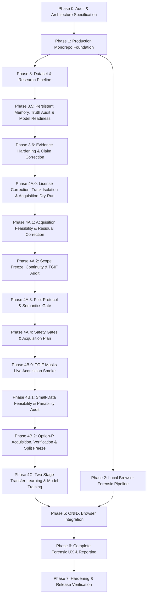

# Work Item Backlog & Dependency Matrix: Forensics Web Lab

## 1. Project Phase Roadmap

---

## 2. Granular Task Breakdown

### Phase 0: Audit & Specification (Hoàn thành - Commit `625e584`)
* [x] **TASK-001**: Audit repository status, git branch, verify `forensics-web-lab` workspace.
* [x] **TASK-002**: Create and switch to development branch `feat/production-ai-image-forensics`.
* [x] **TASK-003**: Formulate comprehensive architecture specification (`docs/ARCHITECTURE.md`).
* [x] **TASK-004**: Formulate research plan, hypotheses, baseline, and evaluation protocols (`docs/RESEARCH_PLAN.md`).
* [x] **TASK-005**: Author dataset specifications and anti-leakage guidelines (`docs/DATASETS.md`).
* [x] **TASK-006**: Document academic dataset licensing and terms (`docs/DATA_LICENSES.md`).
* [x] **TASK-007**: Define training pipeline, loss, and augmentation specs (`docs/TRAINING.md`).
* [x] **TASK-008**: Define evaluation suites, calibration metrics, and benchmarks (`docs/EVALUATION.md`).
* [x] **TASK-009**: Document zero-egress privacy architecture (`docs/PRIVACY.md`).
* [x] **TASK-010**: Document threat modeling and defensive security rules (`docs/SECURITY.md`, `docs/THREAT_MODEL.md`).
* [x] **TASK-011**: Document physical limitations, scope boundaries, and disclaimers (`docs/LIMITATIONS.md`).
* [x] **TASK-012**: Author deployment configurations and COOP/COEP guides (`docs/DEPLOYMENT.md`).
* [x] **TASK-013**: Detail reproducibility instructions (`docs/REPRODUCIBILITY.md`).
* [x] **TASK-014**: Document repository licensing decision considerations (`docs/LICENSING.md`).
* [x] **TASK-015**: Create Model Card specification (`models/MODEL_CARD.md`).
* [x] **TASK-016**: Create Model Registry config and schema (`models/registry.json`, `docs/schemas/model-registry.v1.schema.json`).
* [x] **TASK-017**: Author Architectural Decision Records (ADRs 0001 through 0005).
* [x] **TASK-018**: Define Analysis Output JSON Schema (`docs/schemas/analysis-output.v1.schema.json`).
* [x] **TASK-019**: Commit Phase 0 with commit message: `docs: define product and research architecture`.

---

### Phase 1: Production Monorepo Foundation (Hoàn thành - Commit `f2a7fb4`)
* [x] **TASK-101**: Configure monorepo root: `pnpm-workspace.yaml`, `.npmrc`, root `package.json`, `.gitignore`.
* [x] **TASK-102**: Configure `packages/shared` with TypeScript types, contracts, constants, and schema exports.
* [x] **TASK-103**: Configure `packages/provenance` package skeleton for EXIF/XMP parsing and C2PA adapter.
* [x] **TASK-104**: Configure `packages/forensics` package skeleton for 2D DSP signal processing.
* [x] **TASK-105**: Configure `packages/inference` package skeleton for ONNX Runtime Web session and worker abstractions.
* [x] **TASK-106**: Configure `packages/report` package skeleton for report generation.
* [x] **TASK-107**: Set up `apps/web` with Vite, React, TypeScript strict mode, CSS design tokens, and layout.
* [x] **TASK-108**: Set up `ml/` Python workspace: `pyproject.toml`, `requirements.txt`, directory layout (`configs/`, `datasets/`, `training/`, `evaluation/`, `export/`, `tests/`).
* [x] **TASK-109**: Configure ESLint, Prettier, TypeScript build configs across all packages.
* [x] **TASK-110**: Configure GitHub Actions CI workflow (`.github/workflows/ci.yml`) for lint, typecheck, test, build.
* [x] **TASK-111**: Configure reproducible Docker development / build container (`Dockerfile`, `docker-compose.yml`).
* [x] **TASK-112**: Commit Phase 1 with message: `build: establish production monorepo foundation`.

---

### Phase 2: Local Browser Forensic Pipeline (Hoàn thành - Commit `a882eee`)
* [x] **TASK-201**: Implement defensive file validation (magic byte audit, dimension cap, decompression bomb guard).
* [x] **TASK-202**: Implement pure-TS EXIF, XMP, and IPTC metadata parser with software signature matching.
* [x] **TASK-203**: Implement C2PA Content Credentials adapter interface with graceful `unsupported` handling.
* [x] **TASK-204**: Implement canvas preprocessing (orientation normalization, tensor extraction, letterbox).
* [x] **TASK-205**: Implement 2D-FFT / 2D-DCT azimuthal frequency energy analyzer in TypeScript.
* [x] **TASK-206**: Implement spatial noise residual variance analyzer.
* [x] **TASK-207**: Implement JPEG 8x8 block grid artifact analyzer and Error Level Analysis (ELA) generator.
* [x] **TASK-208**: Implement dedicated Web Worker (`forensics.worker.ts`) with progress events and cancellation protocol.
* [x] **TASK-209**: Write comprehensive unit tests for validation, metadata, and forensic signal extractors.
* [x] **TASK-210**: Commit Phase 2 with message: `feat: add local browser forensic pipeline`.

---

### Phase 3: Dataset & Research Pipeline (Hoàn thành - Commit `6555b02`)
* [x] **TASK-301**: Implement dataset manifest generator (`ml/datasets/manifest.py`) adhering to schema.
* [x] **TASK-302**: Implement adapters for GenImage, SAGI-D, RealHD, RAID, and traditional edit datasets.
* [x] **TASK-303**: Implement perceptual hashing (pHash) and SHA-256 duplicate detection script.
* [x] **TASK-304**: Implement strict `source_id` group-based splitting and unseen-generator holdout splitters.
* [x] **TASK-305**: Implement multi-stage realistic degradation augmentation pipeline (Albumentations/torchvision).
* [x] **TASK-306**: Implement model training engine with class-weighted focal loss and checkpointing.
* [x] **TASK-307**: Implement evaluation harness computing Macro F1, ECE, Brier score, and localization mIoU.
* [x] **TASK-308**: Write unit tests for ML dataset adapters, splitting, and augmentation transforms.
* [x] **TASK-309**: Commit Phase 3 with message: `feat: add reproducible dataset and experiment pipeline`.

---

### Phase 3.5: Persistent Memory, Implementation Truth Audit & Model Readiness (Hoàn thành - Commit `cd59136`)
* [x] **TASK-351**: Create root `AGENTS.md` establishing persistent memory rules and scientific truthfulness.
* [x] **TASK-352**: Create `docs/PROJECT_STATE.md` (historical, consolidated into `docs/continuity/CURRENT_STATE.md`).
* [x] **TASK-353**: Create `docs/CODE_MAP.md` (historical, consolidated into `docs/continuity/CODE_INDEX.md`).
* [x] **TASK-354**: Conduct and document Implementation Truth Audit (`docs/IMPLEMENTATION_TRUTH_AUDIT.md`).
* [x] **TASK-355**: Audit pretrained candidate checkpoints in `docs/PRETRAINED_MODEL_CANDIDATES.md`.
* [x] **TASK-356**: Define Model Acquisition Gate in `docs/MODEL_ACQUISITION_GATE.md`.
* [x] **TASK-357**: Create `docs/SESSION_HANDOFF.md` (historical, consolidated into `docs/continuity/STATUS_LEDGER.md`).
* [x] **TASK-358**: Refactor `FusionCalibrator` and worker to enforce honest no-model state (`uncertain`, `confidence: null`, `probabilities: null`, `modelAvailable: false`).
* [x] **TASK-359**: Update UI (`ResultVerdictCard`, `HeatmapViewer`, `ForensicsInspector`) to display "Model not installed" and classify heuristics as exploratory.
* [x] **TASK-360**: Implement automated registry integrity validation in `@forensics/shared` and add unit tests.
* [x] **TASK-361**: Verify all test suites (`pnpm test`, `pnpm build`, `pytest`) and create Phase 3.5 commits.

---

### Phase 3.6: Evidence Hardening & Claim Correction (Hoàn thành)
* [x] **TASK-362**: Conduct independent repository state audit and enforce clean Git baseline.
* [x] **TASK-363**: Audit and eliminate all absolute machine paths (`file:///`, `D:\`, `C:\`, `/Users/`, `/home/`) across documentation and code.
* [x] **TASK-364**: Correct overstated readiness claims: rename `CAND-C2-INHOUSE-MNV3` to `ARCH-C2-INHOUSE-MNV3`, mark size as `estimated`, parity as `pipeline-only`, weight license as `not-applicable`, and detection metrics as `unverified` / `not measured`.
* [x] **TASK-365**: Formalize 8 standardized evidence classifications across all project documentation.
* [x] **TASK-366**: Establish machine-readable Evidence Register (`docs/EVIDENCE_REGISTER.md`, `research/evidence/phase-3.6/evidence-manifest.json`) and JSON Schema (`docs/schemas/evidence-manifest.v1.schema.json`).
* [x] **TASK-367**: Implement automated manifest validator and expand registry validator to enforce 7 mandatory readiness gates with test coverage.
* [x] **TASK-368**: Expand `docs/MODEL_ACQUISITION_GATE.md` with 17 mandatory criteria before admitting any model to `ready` status.
* [x] **TASK-369**: Author `docs/DATA_FEASIBILITY.md` with dataset decision matrix and user authorization gate.
* [x] **TASK-370**: Execute genuine verification runs and capture execution summaries (`environment.json`, `test-summary.json`, `build-summary.json`).

---

### Phase 4A.0: Data License Correction, Track Isolation & Acquisition Dry-Run (Hoàn thành)
* [x] **TASK-4A01**: Re-audit dataset licenses for GenImage, RealHD, SAGI-D, and RAID against official author sources.
* [x] **TASK-4A02**: Correct GenImage terms (`CC BY-NC-SA 4.0 with additional dataset terms`, `research-only`, rename smoke samples to `Custom smoke subset sampled from GenImage`).
* [x] **TASK-4A03**: Set RealHD status to `unavailable-or-pending`, `license: unverified`, `decision: blocked`.
* [x] **TASK-4A04**: Establish formal Dual-Track Data & Model Isolation Policy in `docs/adr/0006-research-product-data-isolation.md`.
* [x] **TASK-4A05**: Establish directory conventions (`data/research/`, `data/product/`, `artifacts/research/`, `artifacts/product/`, `models/research/`, `models/product/`) and update `.gitignore`.
* [x] **TASK-4A06**: Create machine-checkable Dataset Registry (`datasets/registry.json`, `docs/schemas/dataset-registry.v1.schema.json`, `datasets/README.md`) with TypeScript and Python validators.
* [x] **TASK-4A07**: Create provenance tracking schema (`docs/schemas/dataset-manifest.v1.schema.json`).
* [x] **TASK-4A08**: Implement dataset acquisition CLI with dry-run mode (`ml/datasets/acquire.py`), rejecting blocked datasets and cross-track violations.
* [x] **TASK-4A09**: Implement synthetic geometric/noise smoke fixture generator (`ml/tests/fixtures/smoke_generator.py`) without external network downloads or copyright restrictions.
* [x] **TASK-4A10**: Implement automated contamination guards and unit tests in `@forensics/shared` and `ml/tests/test_contamination_guard.py`.
* [x] **TASK-4A11**: Correct zero-egress statement to `architecture-supported`, `runtime-network-verification: unverified` in `README.md`, `docs/PRIVACY.md`, `docs/continuity/CURRENT_STATE.md`.
* [x] **TASK-4A12**: Record 28.3 MB build WASM asset as engine runtime binary, not model weight.
* [ ] **TASK-WEB-001**: Measure compressed transfer size (gzip/brotli), lazy loading, cache behavior, WASM initialization time, inference latency and peak memory across browser targets.
* [ ] **TASK-E2E-001**: Implement browser E2E automated network logging to empirically confirm 0 outbound requests during image analysis.

---

### Phase 4A.1: Acquisition Feasibility & Residual Evidence Correction (Hoàn thành)
* [x] **TASK-4A101**: Re-classify GenImage derivative weights as `unclear` and project policy as `prohibited-by-project-policy`.
* [x] **TASK-4A102**: Re-classify `synthetic-smoke` to `fixture-only`, purpose `fixture`, commercialUse `internal-testing-only`.
* [x] **TASK-4A103**: Block unverified datasets (SAGI-D, RAID, RealHD) with `track: blocked`, `licenseStatus: unverified`, `acquisitionEnabled: false`.
* [x] **TASK-4A104**: Audit official GenImage Google Drive folder (`1jGt10bwTbhEZuGXLyvrCuxOI0cBqQ1FS`) and record remote metadata in `research/evidence/phase-4a.1/genimage-remote-inventory.json`.
* [x] **TASK-4A105**: Establish subset feasibility Conclusion B (must download official multi-part archive sequence; BigGAN archive is smallest at ~24 GB; no < 50 MB partial downloading).
* [x] **TASK-4A106**: Author 3-tier acquisition proposal `docs/GENIMAGE_ACQUISITION_PROPOSAL.md` (smoke, exploratory pilot, scientific benchmark).
* [x] **TASK-4A107**: Implement `--metadata-only` and external download lock in `ml/datasets/acquire.py` (fail-closed requiring user approval).
* [x] **TASK-4A108**: Update `.gitignore` statement to "verified against the tested extension and path matrix" and register local test fixture path.
* [x] **TASK-4A109**: Scan and verify 0 machine-local links across documentation.
* [x] **TASK-4A110**: Record Phase 4A.1 evidence items in `docs/EVIDENCE_REGISTER.md` and evidence manifest.

---

### Phase 4A.2: Research Scope Freeze, Continuity Documents & TGIF Feasibility Audit (Hoàn thành)
* [x] **TASK-4A201**: Establish unified three-file continuity protocol in `docs/continuity/` (`CODE_INDEX.md`, `CURRENT_STATE.md`, `STATUS_LEDGER.md`) and remove legacy tracking documents (`docs/CODE_MAP.md`, `docs/PROJECT_STATE.md`, `docs/SESSION_HANDOFF.md`).
* [x] **TASK-4A202**: Update `AGENTS.md` with explicit continuity reading order and maintenance rules.
* [x] **TASK-4A203**: Freeze three-class training scope (`authentic`, `fully_generated`, `ai_edited`) and define `uncertain` as post-calibration decision state in `docs/RESEARCH_PLAN.md`.
* [x] **TASK-4A204**: Codify 4 research questions (RQ1-RQ4) and testable hypotheses in `docs/RESEARCH_PLAN.md`.
* [x] **TASK-4A205**: Codify full multi-tier metric hierarchy (primary Macro-F1/Balanced Accuracy, calibration, localization, robustness, browser) in `docs/EVALUATION.md`.
* [x] **TASK-4A206**: Audit official TGIF and TGIF2 repository and Nextcloud storage shares (`xEeAzrY7ES9KA8o`, `KG48tLZZzifC5WE`, `GDGewtTFcHccaNj`), recording metadata in `research/evidence/phase-4a.2/tgif-remote-inventory.json`.
* [x] **TASK-4A207**: Register `tgif` and `tgif2` in `datasets/registry.json` under `research-only` with `CC BY-SA 4.0`.
* [x] **TASK-4A208**: Formulate research-data matrix, identify dataset-source shortcut risk, and specify anti-leakage controls in `docs/DATASETS.md`.
* [x] **TASK-4A209**: Clarify BigGAN as "first fully inventoried archive" in `docs/GENIMAGE_ACQUISITION_PROPOSAL.md`.
* [x] **TASK-4A210**: Formulate 3-tier pilot proposals and select Pilot B (Exploratory Three-Class, ~3,000 samples) as recommended option for thesis.
* [x] **TASK-4A211**: Record Phase 4A.2 evidence items in `docs/EVIDENCE_REGISTER.md` and `evidence-manifest.json`.

---

### Phase 4A.3: Scientific Pilot Protocol & Label-Semantics Gate (Hoàn thành)
* [x] **TASK-4A301**: Backfill missing Phase 4A.2 completion report in `research/evidence/phase-4a.2/PHASE_REPORT.md`.
* [x] **TASK-4A302**: Audit and freeze scientific definitions for `authentic`, `fully_generated`, and `ai_edited` in `docs/PILOT_PROTOCOL.md`.
* [x] **TASK-4A303**: Audit TGIF components: verify `sp` as `ai_edited` with ground-truth mask, verify `fr` canvas as conditioned on real photo and strictly prohibit assignment to `fully_generated`.
* [x] **TASK-4A304**: Design two-branch pilot architecture: Pilot A (authentic vs ai_edited + localization on matched MS-COCO pairs) and Pilot B (authentic vs fully_generated on GenImage pairs).
* [x] **TASK-4A305**: Author `docs/PILOT_PROTOCOL.md` codifying anti-shortcut (dedup, group-split, class profile, metadata-only baseline guard) and anti-leakage invariants.
* [x] **TASK-4A306**: Author machine-readable pilot configurations: `ml/configs/pilot_tgif_edit.yaml` and `ml/configs/pilot_genimage_generated.yaml`.
* [x] **TASK-4A307**: Implement automated pilot configuration validator `ml/configs/validator.py` enforcing schema, label taxonomy, and semantics rules.
* [x] **TASK-4A308**: Implement pytest test suite `ml/tests/test_pilot_protocol.py` (8 tests passing).
* [x] **TASK-4A309**: Enhance `ml/datasets/acquire.py` with specialized `--pilot pilot-a` and `--pilot pilot-b` dry-run reporting all 12 required fields.
* [x] **TASK-4A310**: Verify Zero-Egress network invariance: 0 external dataset bytes, 0 model bytes, 0 training runs.
* [x] **TASK-4A311**: Record Phase 4A.3 evidence items in `docs/EVIDENCE_REGISTER.md` and `research/evidence/phase-4a.3/`.

---

### Phase 4A.4: Evidence Correction & Acquisition Safety Gate (Hoàn thành)
* [x] **TASK-4A401**: Correct Phase 4A.3 commit references to `9ab0e67`, starting `0c42f3c`, main `460f6d5`, working tree clean; remove placeholder references.
* [x] **TASK-4A402**: Calibrate scientific claims across code and docs: tone down absolute shortcut elimination statements to nuanced matched-pair risk reduction.
* [x] **TASK-4A403**: Formulate statistical Metadata-Only Baseline Guard via Paired Stratified Bootstrap 95% CI; eliminate arbitrary 15% threshold.
* [x] **TASK-4A404**: Audit TGIF cardinality (`tgif-cardinality-audit.json`), classifying verified (3,124 orig, 18,744 sd2-sp), estimated (~6,248 masks, filename, source extraction) and unverified fields.
* [x] **TASK-4A405**: Create machine-readable auditable acquisition plan `datasets/acquisition-plans/pilot-a-tgif.v1.json` and schema `docs/schemas/acquisition-plan.v1.schema.json`; compute SHA-256 (`7da36f450fe424970e4676fc0c35047ea756385843dd2fb1c656f1fa45deac4e`).
* [x] **TASK-4A406**: Implement safety gates in `ml/datasets/acquire.py` (free disk, .part file, resume capability, checksum mismatch, zip slip/symlink protection, staging isolation, acquisition receipt).
* [x] **TASK-4A407**: Author offline unit test suite `ml/tests/test_acquisition_safety.py` (15 tests passing, zero external network requests).
* [x] **TASK-4A408**: Record Phase 4A.4 evidence items in `docs/EVIDENCE_REGISTER.md` and `research/evidence/phase-4a.4/`.

---

### Phase 4B.0: TGIF Masks Live Acquisition Smoke (Hoàn thành - Phase 4B.0)
* [x] **TASK-4B001**: Implement component-scoped acquisition `--component` and hard network ceiling `--max-download-bytes` in `ml/datasets/acquire.py`.
* [x] **TASK-4B002**: Implement `HostnameRestrictedRedirectHandler` enforcing redirect restriction strictly to `cloud.ilabt.imec.be`.
* [x] **TASK-4B003**: Author 8 additional safety tests in `ml/tests/test_acquisition_safety.py` (23 tests passing total).
* [x] **TASK-4B004**: Record machine-readable user approval in `research/evidence/phase-4b.0/user-approval.json`.
* [x] **TASK-4B005**: Execute live acquisition smoke for `tgif-masks` (42,327,429 bytes, SHA-256 `62c89a65...`, receipt generated).
* [x] **TASK-4B006**: Build and execute mask inventory auditor `ml/datasets/audit_masks.py` scanning 31,238 mask PNG files (141,559,934 bytes uncompressed).
* [x] **TASK-4B007**: Generate local mask manifest `masks-manifest.jsonl` (31,238 records) and evidence summaries (`tgif-masks-inventory.json`, `tgif-masks-validation.json`, `mask-manifest-summary.json`).
* [x] **TASK-4B008**: Verify zero binary files tracked in Git; publish Phase 4B.0 report.
* [x] **TASK-4B009**: Author Phase 4B.0 completion report and register evidence.

---

### Phase 4B.1: Small-Data Feasibility and Pairability Audit (Hoàn thành)
* [x] **TASK-4B101**: Audit mask cardinality mismatch (31,238 files across 2,242 `source_id`).
* [x] **TASK-4B102**: Codify small-data protocol (`docs/SMALL_DATA_PROTOCOL.md`) with $N \in \{50, 100, 250, 500, 1000\}$.
* [x] **TASK-4B103**: Formulate Option P (Pilot A split-based acquisition: 4 archives, 5.88 GB).
* [x] **TASK-4B104**: Verify remote Nextcloud HTTP Range resume and ETag support.
* [x] **TASK-4B105**: Publish Phase 4B.1 report and evidence manifest.

---

### Phase 4B.2: Controlled Option-P Acquisition, Verification and Split Freeze (Hoàn thành)
* [x] **TASK-4B201**: Implement HTTP Range resume, ETag matching, and safe tar extraction in `ml/datasets/acquire.py`.
* [x] **TASK-4B202**: Execute controlled download of 4 split archives (5,879,502,782 bytes) from `cloud.ilabt.imec.be`.
* [x] **TASK-4B203**: Safely extract 6,156 images into `data/research/tgif/orig/` and `data/research/tgif/sd2-sp/`.
* [x] **TASK-4B204**: Execute 100.0% Pillow decodability audit across all 6,156 images (0 corrupt).
* [x] **TASK-4B205**: Execute tripartite pairability audit (`pairabilityStatus: verified`, 684 matched task instances).
* [x] **TASK-4B206**: Freeze deterministic splits (seed 42): `development_train` (250), `inner_validation` (91), `locked_test` (343); cross-split overlap = 0.
* [x] **TASK-4B207**: Generate nested learning curves $N=50 \subset N=100 \subset N=250$; seal with SHA-256 `519e7a0e...` in `split-lock.json`.
* [x] **TASK-4B208**: Implement Class-Coverage Guard (2-class runnable; 3-class blocked as `not-runnable-missing-fully-generated-data`).
* [x] **TASK-4B209**: Implement 11 unit tests in `ml/tests/test_option_p_protocol.py` (66/66 Python tests passing).
* [x] **TASK-4B210**: Update continuity files, evidence register, and docs; publish Phase 4B.2 report.

---

### Phase 4C: Two-Stage Transfer Learning & Model Training (Chờ thực thi)
* [ ] **TASK-4C01**: Implement DataLoader reading `manifest_pilot_a_option_p.csv` respecting `split-lock.json`.
* [ ] **TASK-4C02**: Implement Stage 1 frozen backbone transfer learning (MobileNetV3-Small) across $N=50, 100, 250$ nested train splits.
* [ ] **TASK-4C03**: Evaluate against 6 mandatory baselines (Dummy, Metadata-Only, DSP-Only, Frozen Backbone, Fine-Tuned, Multimodal Fusion).
* [ ] **TASK-4C04**: Fit temperature scaling calibration on `inner_validation` (91 sources).
* [ ] **TASK-4C05**: Evaluate locked test split (`locked_test`, 343 sources) once configurations are frozen.
* [ ] **TASK-4C06**: Record genuine experimental metrics in `models/MODEL_CARD.md` and research logs.
* [ ] **TASK-4C07**: Commit Phase 4C with message: `research: train and evaluate small-data pilot-a detector`.

---

### Phase 5: ONNX Browser Integration (Chờ Phase 4)
* [ ] **TASK-501**: Implement PyTorch -> ONNX export script with dynamic batching and Opset 17.
* [ ] **TASK-502**: Implement numerical contract tests verifying PyTorch vs ONNX Runtime CPU outputs.
* [ ] **TASK-503**: Implement INT8 post-training quantization and verify quantized accuracy and size.
* [ ] **TASK-504**: Compute SHA-256 checksum and register exported model in `models/registry.json`.
* [ ] **TASK-505**: Implement ONNX Runtime Web session loader in `packages/inference` with WASM/WebGPU orchestration.
* [ ] **TASK-506**: Implement overlapping patch batching and Gaussian-weighted heatmap accumulation in Web Worker.
* [ ] **TASK-507**: Implement browser benchmark runner measuring WASM vs WebGPU latencies.
* [ ] **TASK-508**: Commit Phase 5 with message: `feat: integrate calibrated ONNX inference`.

---

### Phase 6: Complete Forensic UX & Reporting
* [ ] **TASK-601**: Build responsive, professional forensic landing interface with drag-and-drop ingestion.
* [ ] **TASK-602**: Build real-time multi-stage analysis progress indicator with cancellation support.
* [ ] **TASK-603**: Build interactive results dashboard: 4-state verdict, calibrated confidence, probabilities.
* [ ] **TASK-604**: Build high-performance canvas heatmap viewer with opacity slider, colormap picker, and region boxes.
* [ ] **TASK-605**: Build forensic signal inspector (frequency spectrum, noise variance, JPEG block grid, ELA preview).
* [ ] **TASK-606**: Build metadata and C2PA provenance explorer.
* [ ] **TASK-607**: Build structured JSON report exporter conforming to JSON Schema v1.0.0.
* [ ] **TASK-608**: Build printable HTML / Save-as-PDF report view with dedicated `@media print` styles.
* [ ] **TASK-609**: Build privacy controls: "Clear Session" memory purge and cache manager.
* [ ] **TASK-610**: Commit Phase 6 with message: `feat: complete forensic analysis experience`.

---

### Phase 7: Hardening & Release Verification
* [ ] **TASK-701**: Conduct end-to-end security review (XSS escaping audit, decompression bomb testing, malformed file stress).
* [ ] **TASK-702**: Conduct cross-browser tests and fallback validation (WebGPU -> WASM fallback).
* [ ] **TASK-703**: Verify zero memory leaks across consecutive analysis cycles.
* [ ] **TASK-704**: Run Playwright end-to-end smoke test suite on production build.
* [ ] **TASK-705**: Verify documentation consistency, license notices, and reproducibility instructions.
* [ ] **TASK-706**: Commit Phase 7 with message: `chore: harden system for production release`.
