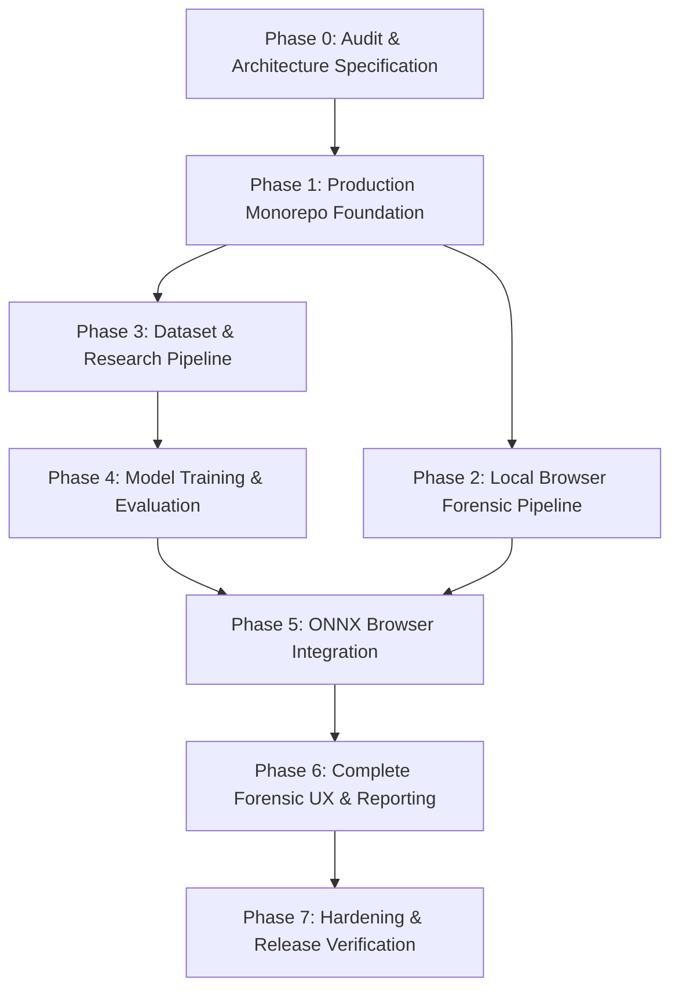

# Work Item Backlog & Dependency Matrix: Forensics Web Lab

## 1. Project Phase Roadmap

---

## 2. Granular Task Breakdown

### Phase 0: Audit & Specification (Current Phase)
* [x] **TASK-001**: Audit repository status, git branch, verify `forensics-web-lab` workspace.
* [x] **TASK-002**: Create and switch to development branch `feat/production-ai-image-forensics`.
* [x] **TASK-003**: Formulate comprehensive architecture specification (`docs/ARCHITECTURE.md`).
* [x] **TASK-004**: Formulate research plan, hypotheses, baseline, and evaluation protocols (`docs/RESEARCH_PLAN.md`).
* [x] **TASK-005**: Author dataset specifications and anti-leakage guidelines (`docs/DATASETS.md`).
* [x] **TASK-006**: Document academic dataset licensing and terms (`docs/DATA_LICENSES.md`).
* [x] **TASK-007**: Define training pipeline, loss, and augmentation specs (`docs/TRAINING.md`).
* [x] **TASK-008**: Define evaluation suites, calibration metrics, and benchmarks (`docs/EVALUATION.md`).
* [x] **TASK-009**: Document zero-egress privacy architecture (`docs/PRIVACY.md`).
* [x] **TASK-010**: Document threat modeling and defensive security rules (`docs/SECURITY.md`, `docs/THREAT_MODEL.md`).
* [x] **TASK-011**: Document physical limitations, scope boundaries, and disclaimers (`docs/LIMITATIONS.md`).
* [x] **TASK-012**: Author deployment configurations and COOP/COEP guides (`docs/DEPLOYMENT.md`).
* [x] **TASK-013**: Detail reproducibility instructions (`docs/REPRODUCIBILITY.md`).
* [x] **TASK-014**: Document repository licensing decision considerations (`docs/LICENSING.md`).
* [x] **TASK-015**: Create Model Card specification (`models/MODEL_CARD.md`).
* [x] **TASK-016**: Create Model Registry config and schema (`models/registry.json`, `docs/schemas/model-registry.v1.schema.json`).
* [x] **TASK-017**: Author Architectural Decision Records (ADRs 0001 through 0005).
* [x] **TASK-018**: Define Analysis Output JSON Schema (`docs/schemas/analysis-output.v1.schema.json`).
* [ ] **TASK-019**: Commit Phase 0 with commit message: `docs: define product and research architecture`.

---

### Phase 1: Production Monorepo Foundation
* [ ] **TASK-101**: Configure monorepo root: `pnpm-workspace.yaml`, `.npmrc`, root `package.json`, `.gitignore`.
* [ ] **TASK-102**: Configure `packages/shared` with TypeScript types, contracts, constants, and schema exports.
* [ ] **TASK-103**: Configure `packages/provenance` package skeleton for EXIF/XMP parsing and C2PA adapter.
* [ ] **TASK-104**: Configure `packages/forensics` package skeleton for 2D DSP signal processing.
* [ ] **TASK-105**: Configure `packages/inference` package skeleton for ONNX Runtime Web session and worker abstractions.
* [ ] **TASK-106**: Configure `packages/report` package skeleton for report generation.
* [ ] **TASK-107**: Set up `apps/web` with Vite, React, TypeScript strict mode, CSS design tokens, and layout.
* [ ] **TASK-108**: Set up `ml/` Python workspace: `pyproject.toml`, `requirements.txt`, directory layout (`configs/`, `datasets/`, `training/`, `evaluation/`, `export/`, `tests/`).
* [ ] **TASK-109**: Configure ESLint, Prettier, TypeScript build configs across all packages.
* [ ] **TASK-110**: Configure GitHub Actions CI workflow (`.github/workflows/ci.yml`) for lint, typecheck, test, build.
* [ ] **TASK-111**: Configure reproducible Docker development / build container (`Dockerfile`, `docker-compose.yml`).
* [ ] **TASK-112**: Commit Phase 1 with message: `build: establish production monorepo foundation`.

---

### Phase 2: Local Browser Forensic Pipeline
* [ ] **TASK-201**: Implement defensive file validation (magic byte audit, dimension cap, decompression bomb guard).
* [ ] **TASK-202**: Implement pure-TS EXIF, XMP, and IPTC metadata parser with software signature matching.
* [ ] **TASK-203**: Implement C2PA Content Credentials adapter interface with graceful `unsupported` handling.
* [ ] **TASK-204**: Implement canvas preprocessing (orientation normalization, tensor extraction, letterbox).
* [ ] **TASK-205**: Implement 2D-FFT / 2D-DCT azimuthal frequency energy analyzer in TypeScript.
* [ ] **TASK-206**: Implement spatial noise residual variance analyzer.
* [ ] **TASK-207**: Implement JPEG 8x8 block grid artifact analyzer and Error Level Analysis (ELA) generator.
* [ ] **TASK-208**: Implement dedicated Web Worker (`forensics.worker.ts`) with progress events and cancellation protocol.
* [ ] **TASK-209**: Write comprehensive unit tests for validation, metadata, and forensic signal extractors.
* [ ] **TASK-210**: Commit Phase 2 with message: `feat: add local browser forensic pipeline`.

---

### Phase 3: Dataset & Research Pipeline
* [ ] **TASK-301**: Implement dataset manifest generator (`ml/datasets/manifest.py`) adhering to schema.
* [ ] **TASK-302**: Implement adapters for GenImage, SAGI-D, RealHD, RAID, and traditional edit datasets.
* [ ] **TASK-303**: Implement perceptual hashing (pHash) and SHA-256 duplicate detection script.
* [ ] **TASK-304**: Implement strict `source_id` group-based splitting and unseen-generator holdout splitters.
* [ ] **TASK-305**: Implement multi-stage realistic degradation augmentation pipeline (Albumentations/torchvision).
* [ ] **TASK-306**: Implement model training engine with class-weighted focal loss and checkpointing.
* [ ] **TASK-307**: Implement evaluation harness computing Macro F1, ECE, Brier score, and localization mIoU.
* [ ] **TASK-308**: Write unit tests for ML dataset adapters, splitting, and augmentation transforms.
* [ ] **TASK-309**: Commit Phase 3 with message: `feat: add reproducible dataset and experiment pipeline`.

---

### Phase 4: Model Training & Evaluation
* [ ] **TASK-401**: Check data/compute authorization (Stop and confirm if large data download required).
* [ ] **TASK-402**: Train and log baseline model with reproducible configs and deterministic seeds.
* [ ] **TASK-403**: Run full evaluation suite across in-domain, unseen generator, and degradation matrices.
* [ ] **TASK-404**: Fit temperature scaling calibration on held-out calibration split.
* [ ] **TASK-405**: Record genuine experimental metrics in `models/MODEL_CARD.md` and research logs (no fake numbers).
* [ ] **TASK-406**: Commit Phase 4 with message: `research: train and evaluate lightweight detector`.

---

### Phase 5: ONNX Browser Integration
* [ ] **TASK-501**: Implement PyTorch -> ONNX export script with dynamic batching and Opset 17.
* [ ] **TASK-502**: Implement numerical contract tests verifying PyTorch vs ONNX Runtime CPU outputs.
* [ ] **TASK-503**: Implement INT8 post-training quantization and verify quantized accuracy and size.
* [ ] **TASK-504**: Compute SHA-256 checksum and register exported model in `models/registry.json`.
* [ ] **TASK-505**: Implement ONNX Runtime Web session loader in `packages/inference` with WASM/WebGPU orchestration.
* [ ] **TASK-506**: Implement overlapping patch batching and Gaussian-weighted heatmap accumulation in Web Worker.
* [ ] **TASK-507**: Implement browser benchmark runner measuring WASM vs WebGPU latencies.
* [ ] **TASK-508**: Commit Phase 5 with message: `feat: integrate calibrated ONNX inference`.

---

### Phase 6: Complete Forensic UX & Reporting
* [ ] **TASK-601**: Build responsive, professional forensic landing interface with drag-and-drop ingestion.
* [ ] **TASK-602**: Build real-time multi-stage analysis progress indicator with cancellation support.
* [ ] **TASK-603**: Build interactive results dashboard: 4-state verdict, calibrated confidence, probabilities.
* [ ] **TASK-604**: Build high-performance canvas heatmap viewer with opacity slider, colormap picker, and region boxes.
* [ ] **TASK-605**: Build forensic signal inspector (frequency spectrum, noise variance, JPEG block grid, ELA preview).
* [ ] **TASK-606**: Build metadata and C2PA provenance explorer.
* [ ] **TASK-607**: Build structured JSON report exporter conforming to JSON Schema v1.0.0.
* [ ] **TASK-608**: Build printable HTML / Save-as-PDF report view with dedicated `@media print` styles.
* [ ] **TASK-609**: Build privacy controls: "Clear Session" memory purge and cache manager.
* [ ] **TASK-610**: Commit Phase 6 with message: `feat: complete forensic analysis experience`.

---

### Phase 7: Hardening & Release Verification
* [ ] **TASK-701**: Conduct end-to-end security review (XSS escaping audit, decompression bomb testing, malformed file stress).
* [ ] **TASK-702**: Conduct cross-browser tests and fallback validation (WebGPU -> WASM fallback).
* [ ] **TASK-703**: Verify zero memory leaks across consecutive analysis cycles.
* [ ] **TASK-704**: Run Playwright end-to-end smoke test suite on production build.
* [ ] **TASK-705**: Verify documentation consistency, license notices, and reproducibility instructions.
* [ ] **TASK-706**: Commit Phase 7 with message: `chore: harden system for production release`.
