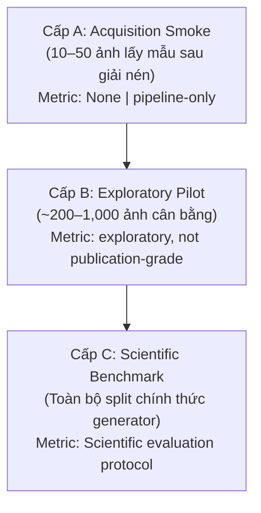

# Đề xuất Thu nhận Dữ liệu GenImage (GenImage Acquisition Proposal)

> **Cập nhật**: 2026-09-21 (Phase 4A.1)  
> **Áp dụng chính sách**: Dual-Track Quản trị Dữ liệu (ADR-0006)  
> **Trạng thái phê duyệt**: `pending-user-approval` (Khóa tải mạng, 0 byte external data)

---

## 1. Bối cảnh và Ràng buộc Pháp lý

Bộ dữ liệu **GenImage** ([GenImage-Dataset/GenImage](https://github.com/GenImage-Dataset/GenImage)) là benchmark học thuật quy mô lớn (>1 triệu cặp ảnh) phục vụ nghiên cứu phát hiện ảnh tạo sinh AI.

### Điều khoản bản quyền chính thức
- **Dataset License**: `CC BY-NC-SA 4.0 with additional dataset terms`.
- **Điều khoản bổ sung**: Tác giả quy định dữ liệu chỉ phục vụ mục đích phi thương mại (nghiên cứu, giảng dạy, học thuật). Nghiêm cấm sử dụng dataset và mọi derivative works (tác phẩm phái sinh) cho mục đích thương mại.
- **Tình trạng trọng số mô hình (Derivative Weights)**: Hiện tại pháp lý chưa có kết luận thống nhất liệu trọng số mạng nơ-ron học từ ảnh có cấu thành derivative work của dataset hay không. Do đó, dự án áp dụng chính sách bảo thủ nghiêm ngặt:
  - `source_terms.dataset_derivative_works`: `prohibited_for_commercial_use`
  - `legal_interpretation.trained_weights_status`: `unclear`
  - `project_policy.production_use`: `prohibited`
  - `project_policy.research_use`: `allowed_subject_to_terms`
  - `productionPromotion`: `prohibited-by-project-policy`
- **Phân luồng**: Quarantined 100% trong **Research Track** (`data/research/genimage/`, `models/research/`). Tuyệt đối không đưa checkpoint hoặc trọng số phái sinh từ GenImage vào bản web sản phẩm (`models/product/` hoặc `apps/web/`).

---

## 2. Kết luận Khảo sát Metadata và Khả năng Lấy Tập con

Từ kết quả khảo sát trực tiếp thư mục Google Drive chính thức `1jGt10bwTbhEZuGXLyvrCuxOI0cBqQ1FS` ghi nhận tại `research/evidence/phase-4a.1/genimage-remote-inventory.json`:

### Kết luận: **B. Phải tải archive chính thức rồi mới lấy mẫu**

**Minh chứng kỹ thuật:**
1. Thư mục gốc Google Drive gồm 8 thư mục con đại diện cho 8 generator: `ADM`, `BigGAN`, `glide`, `Midjourney`, `stable_diffusion_v_1_4`, `stable_diffusion_v_1_5`, `VQDM`, `wukong`.
2. Kiểm tra chi tiết thư mục `BigGAN` (`1ajlTuN34gLyJWxRQ6NyUcnkfrS8QEVKt`) cho thấy dữ liệu được lưu trữ dưới dạng **chuỗi file nén phân mảnh nhiều phần (multi-part split zip)**:
   - `imagenet_ai_0419_biggan.z01`
   - `imagenet_ai_0419_biggan.z02`
   - `imagenet_ai_0419_biggan.z03`
   - `imagenet_ai_0419_biggan.z04`
   - `imagenet_ai_0419_biggan.z05`
   - `imagenet_ai_0419_biggan.z06`
   - `imagenet_ai_0419_biggan.z07`
   - `imagenet_ai_0419_biggan.zip`
3. Nguồn chính thức không cung cấp API tải từng ảnh rời rạc hay tập con nhỏ. Phần mềm giải nén yêu cầu tải toàn bộ chuỗi từ `.z01` đến `.zip` vào cùng thư mục trước khi giải nén.
4. **Không tiếp tục sử dụng con số `<50 MB`** cho việc thu nhận dữ liệu GenImage từ nguồn chính thức.

---

## 3. Phân định Ba Cấp Nghiên cứu

Dự án thiết lập ranh giới rõ ràng giữa ba cấp độ tiếp nhận dữ liệu:

### Cấp A — Acquisition Smoke
- **Mục tiêu**: Kiểm tra tính toàn vẹn của download adapter, giải nén multi-part, kiểm tra mã băm SHA-256, chuẩn hóa manifest 14 trường và đường dẫn lưu trữ tại `data/research/genimage/`.
- **Quy mô đề xuất**: 10–50 ảnh (được trích xuất từ archive đã tải).
- **Trạng thái khoa học**: `pipeline-only` (không tính toán metric phân loại, không đánh giá accuracy).
- **Trọng số**: Không tạo checkpoint.

### Cấp B — Exploratory Pilot
- **Mục tiêu**: Chạy thử một vòng training loop tối thiểu trên PyTorch, đo lường thời gian thực tế CPU/GPU, phát hiện sớm các lỗi về mất cân bằng mẫu (class imbalance), rò rỉ nhóm ảnh gốc (`source_id` leakage) và xác minh khả năng xuất mô hình PyTorch sang ONNX.
- **Quy mô đề xuất**: 500–1,000 ảnh (250 fake + 250 real ImageNet, phân bổ đều 5–10 lớp ảnh).
- **Trạng thái khoa học**: `exploratory, not publication-grade` (mọi chỉ số độ chính xác chỉ mang tính chẩn đoán kỹ thuật nội bộ).
- **Trọng số**: Checkpoint lưu tại `models/research/pilot-checkpoint.pt`, nghiêm cấm đưa vào sản phẩm.

### Cấp C — Scientific Benchmark
- **Mục tiêu**: Đánh giá năng lực khoa học thực tế: in-domain detection, cross-generator generalizability, độ bền vững trước suy giảm chất lượng (JPEG compression, blur, resize), và độ tin cậy hiệu chuẩn xác suất (ECE).
- **Quy mô**: Toàn bộ split kiểm thử chính thức của tác giả (ví dụ: test split của BigGAN hoặc SDv1.4).
- **Trạng thái khoa học**: Đánh giá khoa học chính thức kèm protocol công bố trước, tính toán khoảng tin cậy (confidence interval).
- **Trọng số**: Checkpoint nghiên cứu học thuật được lưu trữ kèm báo cáo đánh giá trong `research/experiments/`.

---

## 4. Archive Đầu tiên Được Kiểm kê Toàn diện (First Fully Inventoried Archive)

Khi chưa có bảng kích thước chi tiết của toàn bộ tám generator, BigGAN được xác lập là archive đầu tiên đã được kiểm kê toàn diện qua metadata Google Drive:

| Tiêu chí | Thông số kiểm kê | Trạng thái minh chứng |
|---|---|---|
| **Generator được kiểm kê** | **BigGAN** (`imagenet_ai_0419_biggan`) | `verified` (khảo sát trực tiếp thư mục `1ajlTuN34gLyJWxRQ6NyUcnkfrS8QEVKt`) |
| **Cấu trúc lưu trữ** | 8 tệp split zip (`.z01` .. `.z07`, `.zip`) | `verified` |
| **Dung lượng nén tải về chính xác** | **23,516,377,048 bytes** (~23.52 GB / ~24 GB) | `verified` (tổng kích thước 8 file multi-part) |
| **Dung lượng giải nén dự kiến** | **~26 GB** | `estimated` (tính toán dựa trên tỷ lệ nén ảnh JPEG/PNG) |
| **Không gian ổ đĩa an toàn đề xuất** | **Tối thiểu 55 GB** trống trên ổ đĩa chứa repo | `estimated` (chứa đồng thời archive nén và thư mục giải nén) |
| **Tổng số ảnh dự kiến** | ~16,000–20,000 ảnh (bao gồm cả real và BigGAN fake) | `estimated` (ước tính theo quy mô val split ImageNet) |
| **Tập chia (Split)** | Tập `train` và `val` | `reported` |
| **Thời gian tải dự kiến** | `unknown` (tùy thuộc băng thông mạng thực tế và quota Google Drive) | `unverified` |

---

## 5. Quy trình Thu nhận Khi Được Phê duyệt

1. **Khóa tải tự động hiện tại**:
   - `ml.datasets.acquire` chạy ở chế độ `--metadata-only` hoặc `--dry-run`.
   - Cờ `--execute` bị từ chối với thông báo:
     `Acquisition is prepared. User approval with exact archive and byte size is required.`
2. **Điều kiện mở khóa tải thật**:
   - Người dùng xác nhận phê duyệt tải archive `imagenet_ai_0419_biggan` (~24 GB).
   - Máy có sẵn tối thiểu 55 GB không gian đĩa trống.
   - Thao tác tải được thực hiện vào đúng thư mục `data/research/genimage/biggan/`.
   - Chạy lệnh hash SHA-256 đối chiếu ngay sau khi tải.
