# Đánh Giá Thực Nghiệm Mô Hình Nhẹ và Kết Hợp Tín Hiệu Pháp Chứng Số Trong Phát Hiện Hình Ảnh Chỉnh Sửa Bởi AI: Kiểm Định Độc Lập Trên Tập Mẫu TGIF N=400

> **Bản thảo nghiên cứu khoa học (Research Manuscript)**
> **Dự án**: `Forensics Web Lab`
> **Trạng thái tài liệu**: Hoàn thiện từ kết quả kiểm định độc lập Phase 4C.7B đã được kiểm toán (Audit Pass)
> **Ngôn ngữ**: Tiếng Việt
> **Ngày hoàn thiện**: 2026-10-10
>
> **Thông tin tác giả và công bố (Cần tác giả bổ sung thông tin chính thức)**:
> - **Tác giả chính**: `[Cần tác giả bổ sung: Họ và tên tác giả]`
> - **Đồng tác giả / Hướng dẫn khoa học**: `[Cần tác giả bổ sung: Họ và tên đồng tác giả / cán bộ hướng dẫn]`
> - **Đơn vị công tác**: `[Cần tác giả bổ sung: Khoa/Bộ môn, Trường Đại học / Viện nghiên cứu]`
> - **Email liên hệ**: `[Cần tác giả bổ sung: email@domain.edu.vn]`
> - **Tài trợ / Funding**: `[Cần tác giả bổ sung: Thông tin đề tài tài trợ hoặc ghi Không có]`
> - **Nơi công bố / Hội nghị / Tạp chí mục tiêu**: `[Cần tác giả bổ sung: Tên hội nghị hoặc tạp chí khoa học]`

---

## Tóm Tắt (Abstract)

Sự phát triển nhanh chóng của các mô hình tạo sinh hình ảnh, đặc biệt là kỹ thuật vẽ bù có điều khiển bằng văn bản (*text-guided inpainting*), đặt ra thách thức nghiêm trọng đối với tính xác thực của thông tin số và đặt nặng yêu cầu về các công cụ phát hiện nhẹ, bảo vệ quyền riêng tư, có khả năng vận hành trực tiếp trên trình duyệt web của người dùng (mô hình *zero-egress client-side*). Trong công trình này, chúng tôi nghiên cứu việc kết hợp mạng nơ-ron tích chập nhẹ (backbone MobileNetV3-small) với phương pháp hiệu chuẩn nhiệt độ (*Temperature Scaling*) và 16 đặc trưng phân tích xử lý tín hiệu số (DSP: phổ tần số 2D FFT, hệ số DCT, phương sai nhiễu dư và dấu vết lưới nén JPEG 8×8) thông qua bộ phân loại kết hợp muộn (*Late Fusion Stacker*). Trong giai đoạn phát triển mô hình trên tập dữ liệu nội bộ (341 nguồn ảnh từ MS-COCO thuộc benchmark TGIF), phương pháp kết hợp DSP tăng cường (*Late Fusion DSP Augmented*) ghi nhận mức cải thiện lớn về Macro-F1 tại điều kiện nén JPEG chất lượng 75 ($\Delta \text{Macro-F1} = +0.1363$ [95% CI: $+0.1057, +0.1681$]), giải cứu hiệu năng của nhánh thị giác vốn suy giảm sâu trên tập đó. Nhằm kiểm chứng tính khái quát hóa thực sự, chúng tôi thiết lập một giao thức kiểm định độc lập tiền đăng ký nghiêm ngặt (*preregistered independent evaluation protocol*) trên tập mẫu độc lập gồm 400 cặp nguồn ảnh hoàn toàn mới (800 ảnh) từ split training của TGIF, được bảo vệ bởi cơ chế phòng chống rò rỉ đa tầng (Disjoint Guard) với 0 xung đột về định danh nguồn, mã băm SHA-256 và mã băm tri giác dHash 64-bit so với toàn bộ dữ liệu lịch sử. Kết quả kiểm định độc lập thực nghiệm qua 48.000 lượt chấm điểm từ 5 mô hình outer-fold đóng băng cho thấy: tại endpoint sơ cấp tiền đăng ký `jpeg_q75`, mô hình Visual Calibrated đạt Macro-F1 là $0.5624 \pm 0.0060$, trong khi mô hình Late Fusion DSP Augmented đạt $0.5596 \pm 0.0126$, tương ứng với độ chênh lệch điểm ước lượng $\Delta = -0.0027$. Khoảng tin cậy 95% Percentile Bootstrap (10.000 lượt tái lấy mẫu phân tầng theo cụm nguồn) là $[-0.0126, +0.0072]$, hoàn toàn bao trùm giá trị 0.0, và tỷ lệ số lượt bootstrap dương chỉ đạt $30.29\%$. Phán quyết khoa học chính thức được xác lập là **`INDEPENDENT_JPEG75_INCONCLUSIVE`**: kiểm định độc lập chưa xác nhận mức cải thiện quan sát trên tập phát triển, đồng thời chưa chứng minh được sự cải thiện của việc kết hợp đặc trưng DSP tại điều kiện nén này. Nghiên cứu không tuyên bố bác bỏ cải thiện hay tương đương thống kê, đồng thời làm rõ tính chất đánh giá là trên nguồn mới trong cùng phân phối benchmark (in-distribution unseen sources), phân tích các giả thuyết cơ chế kỹ thuật chưa kiểm chứng cô lập, và thiết lập các giới hạn nghiêm ngặt chống lại việc sử dụng kết quả học thuật để cam kết hiệu năng cho sản phẩm thương mại. Toàn bộ mã nguồn, cấu hình đóng băng, biên nhận thực thi và bảng dữ liệu dự đoán được công bố minh bạch nhằm bảo đảm tính tái lập khoa học tuyệt đối.

**Từ khóa (Keywords)**: Pháp chứng hình ảnh số (Digital Image Forensics), Phát hiện ảnh chỉnh sửa bởi AI (AI Inpainting Detection), Mạng nơ-ron tích chập nhẹ (Lightweight CNN), Xử lý tín hiệu số (DSP Evidence Fusion), Kiểm định độc lập (Independent Evaluation), Hiệu chuẩn độ tin cậy (Confidence Calibration), Trung thực khoa học (Scientific Honesty).

---

## 1. Giới Thiệu (Introduction)

### 1.1. Bối cảnh và Thách thức
Sự bùng nổ của các mô hình tạo sinh hình ảnh hiện đại dựa trên mô hình khuếch tán tiềm ẩn (*Latent Diffusion Models* như Stable Diffusion \cite{mareen2024tgif,giakoumoglou2025sagi}) đã hạ thấp đáng kể rào cản kỹ thuật trong việc chỉnh sửa và giả mạo nội dung hình ảnh số. Khác với bài toán phát hiện ảnh được tạo sinh toàn phần (*fully-generated image detection* \cite{wang2020cnndetection,zhu2023genimage}), kỹ thuật chỉnh sửa cục bộ có điều khiển bằng văn bản (*text-guided inpainting forgery*) chỉ thay thế một vùng không gian có chọn lọc trong bức ảnh gốc, trong khi vẫn giữ nguyên phần lớn bối cảnh xung quanh \cite{mareen2024tgif,mareen2026tgif2}. Thao tác này tạo ra các sản phẩm giả mạo có độ chân thực ngữ nghĩa rất cao, xóa bỏ ranh giới thị giác tự nhiên và gây khó khăn lớn cho công tác giám định pháp chứng truyền thống.

Để phát hiện các dạng giả mạo này, phần lớn các giải pháp học sâu hiện nay dựa trên các kiến trúc mạng nơ-ron có tham số lớn như ResNet-50, ViT, hoặc CLIP \cite{wang2020cnndetection,ojha2023universal,wang2023dire,guillaro2023trufor}. Các mô hình này đòi hỏi năng lực tính toán đồ họa chuyên dụng (GPU) trên máy chủ, dẫn đến hai hạn chế căn bản trong ứng dụng thực tế:
1. **Xâm phạm quyền riêng tư số**: Việc bắt buộc người dùng tải ảnh cá nhân lên hạ tầng máy chủ đám mây để phân tích tạo ra nguy cơ rò rỉ dữ liệu nhạy cảm.
2. **Chi phí hạ tầng và độ trễ**: Việc duy trì cụm máy chủ GPU để phục vụ phân tích ảnh trực tuyến đòi hỏi chi phí vận hành lớn, không phù hợp cho các kịch bản kiểm tra nhanh diện rộng.

Dự án `Forensics Web Lab` được định hướng nhằm nghiên cứu một giải pháp cân bằng: phát triển công cụ nhẹ vận hành hoàn toàn trên trình duyệt web của người dùng (*Zero-Egress Client-Side Runtime*), tận dụng công nghệ WebAssembly (WASM SIMD) \cite{onnxRuntimeWebDocs} và mạng nơ-ron tích chập nhẹ MobileNetV3-small \cite{howard2019mobilenetv3}, kết hợp các đặc trưng pháp chứng xử lý tín hiệu số (DSP) truyền thống và kỹ thuật hiệu chuẩn xác suất \cite{guo2017calibration}.

### 1.2. Câu hỏi Nghiên cứu (Research Questions)
Hồ sơ nghiên cứu của đề tài được đóng băng với 4 câu hỏi trọng tâm và 1 câu hỏi phụ:
* **RQ1 (Three-Class Generalization on Unseen Data)**: *Mô hình tích chập gọn nhẹ có phân biệt được ba lớp `authentic`, `fully_generated` và `ai_edited` trên dữ liệu chưa thấy với độ chính xác vượt trội baseline ngẫu nhiên hay không?*
* **RQ2 (Multi-Modal Evidence Fusion vs Visual-Only Baseline)**: *Việc kết hợp kết quả mô hình thị giác với siêu dữ liệu xuất xứ và tín hiệu pháp chứng số (DSP frequency/noise/JPEG) có cải thiện Macro-F1 hoặc độ hiệu chuẩn xác suất (ECE) so với mô hình thị giác đơn lẻ hay không?*
* **RQ3 (ONNX Quantization Trade-Offs)**: *Quá trình xuất sang ONNX và lượng tử hóa INT8 ảnh hưởng như thế nào đến chất lượng phân loại, dung lượng lưu trữ và thời gian suy luận?*
* **RQ4 (Browser CPU/WASM Execution Feasibility)**: *Mô hình tối ưu hóa có thể vận hành ổn định trong môi trường trình duyệt web thông qua CPU/WASM với độ trễ và mức chiếm dụng bộ nhớ đáp ứng trải nghiệm tương tác hay không?*
* **Auxiliary RQ5 (Patch-Based Localization Feasibility)**: *Khi có ground-truth mask nhị phân, phương pháp nội suy patch scores từ backbone phân loại có đạt được mức độ định vị chấp nhận được so với mask thật hay không?*

### 1.3. Đóng góp Thực nghiệm Có Căn cứ (Grounded Scientific Contributions)
Tuân thủ nguyên tắc trung thực khoa học (*Scientific Honesty*), bài báo này không đưa ra các tuyên bố vượt quá phạm vi bằng chứng thực nghiệm đã thu thập. Các đóng góp cụ thể của bài báo bao gồm:
1. **Quy trình kiểm định độc lập tiền đăng ký và cơ chế Disjoint Guard nghiêm ngặt**: Xây dựng quy trình tuyển chọn tập kiểm định độc lập TGIF $N=400$ cặp nguồn (800 ảnh) với cơ chế bảo vệ rò rỉ đa tầng, bảo đảm 100% không trùng lặp định danh nguồn ảnh (`source_id`), không trùng lặp mã băm byte SHA-256, và không trùng lặp mã băm tri giác dHash 64-bit so với 684 nguồn dữ liệu lịch sử và 336 nguồn phát triển.
2. **Bằng chứng thực nghiệm đối chứng về sự phân rã của cải thiện DSP tại endpoint sơ cấp `jpeg_q75`**: Báo cáo kết quả kiểm định độc lập giữa nhánh thị giác đã hiệu chuẩn (Visual Calibrated) và nhánh kết hợp DSP (Late Fusion DSP Augmented) qua 48.000 lượt dự đoán từ 5 mô hình outer-fold đóng băng. Bằng chứng thực nghiệm xác lập phán quyết chính thức `INDEPENDENT_JPEG75_INCONCLUSIVE`: mức cải thiện lớn quan sát được trên tập phát triển ($\Delta = +0.1363$) không được xác nhận trên tập kiểm định độc lập ($\Delta = -0.0027$, 95% CI $[-0.0126, +0.0072]$ bao trùm 0.0, $P(\Delta^* > 0) = 30.29\%$).
3. **Phân định rạch ròi trạng thái nghiên cứu và cảnh báo ranh giới sản phẩm**: Làm rõ các giới hạn bản chất của kiểm định (unseen sources trong cùng phân phối benchmark TGIF/SD2; không phải bằng chứng khái quát ngoài phân phối OOD); định danh các giải thích cơ chế kỹ thuật là các giả thuyết chưa kiểm chứng cô lập (*unverified hypotheses*); nghiêm cấm sử dụng kết quả học thuật để cam kết tính năng sản phẩm; và minh bạch hóa trạng thái của các mục tiêu chưa đo lường (3 lớp, localization, INT8 runtime) trong ma trận câu hỏi nghiên cứu.

---

## 2. Các Công Trình Liên Quan (Related Work)

### 2.1. Phát hiện Ảnh Tạo Sinh Toàn Phần và Chỉnh Sửa Cục Bộ
Các nghiên cứu tiên phong trong lĩnh vực pháp chứng ảnh tạo sinh thường tập trung vào ảnh sinh toàn phần từ GAN hoặc Diffusion Models. Wang et al. \cite{wang2020cnndetection} chứng minh rằng các mô hình CNN thương mại để lại các dấu vết phổ tần số đặc trưng (spectral artifacts) do quá trình upsampling, cho phép một bộ phân loại ResNet-50 huấn luyện trên ProGAN có thể phát hiện nhiều kiến trúc GAN khác. Tuy nhiên, sự xuất hiện của mô hình khuếch tán (*Diffusion Models*) đã làm suy giảm đáng kể độ nhạy của các bộ phát hiện trên miền tần số thuần túy. Wang et al. (DIRE) \cite{wang2023dire} đề xuất đo lường sai số tái cấu trúc qua quá trình khuếch tán ngược để phát hiện ảnh Diffusion, đạt độ chính xác cao nhưng đòi hỏi chi phí tính toán rất lớn khi cần nhiều bước suy luận mô hình khuếch tán cho mỗi ảnh đầu vào. Ojha et al. \cite{ojha2023universal} sử dụng không gian đặc trưng biểu diễn sẵn của CLIP để xây dựng bộ phát hiện phổ quát, cho thấy năng lực khái quát hóa tốt nhưng kích thước mô hình vượt quá ngưỡng khả thi cho môi trường trình duyệt client-side.

Đối với bài toán chỉnh sửa cục bộ (*inpainting forgery*), việc phát hiện phức tạp hơn nhiều do tỷ lệ diện tích bị can thiệp có thể rất nhỏ trên nền ảnh tự nhiên. Mareen et al. \cite{mareen2024tgif,mareen2026tgif2} xây dựng bộ dữ liệu chuẩn TGIF và TGIF2 dựa trên ảnh MS-COCO và mô hình inpainting Stable Diffusion 2, cung cấp ground-truth mask chuẩn hóa và chỉ ra rằng các bộ phát hiện ảnh toàn phần bị sụt giảm nghiêm trọng khi đối mặt với ảnh inpainting. Guillaro et al. (TruFor) \cite{guillaro2023trufor} kết hợp đặc trưng học sâu với trích xuất nhiễu Noiseprint++ để vừa phân loại vừa định vị vùng giả mạo, đạt hiệu năng ấn tượng trên máy chủ nhưng kiến trúc nặng nề. Giakoumoglou et al. (SAGI) \cite{giakoumoglou2025sagi} phân tích sự bất định và căn chỉnh ngữ nghĩa trong inpainting, nhấn mạnh tính chất tinh vi của các biên giới ghép đè thế hệ mới.

### 2.2. Pháp Chứng Tín Hiệu Số (DSP) và Mô Hình Học Sâu Gọn Nhẹ
Việc khai thác các đặc trưng pháp chứng số truyền thống (như phân tích phổ 2D FFT, hệ số biến đổi Cosine rời rạc 2D DCT, phương sai nhiễu cục bộ và dấu vết ô lưới nén JPEG 8×8) từ lâu đã là trụ cột của phân tích ảnh pháp chứng. Chivaran và Ni (LAID) \cite{chivaran2025laid} khảo sát việc kết hợp miền không gian và miền phổ trên các kiến trúc nhẹ nhằm cân bằng giữa độ chính xác và chi phí tính toán. Về mặt kiến trúc, MobileNetV3 \cite{howard2019mobilenetv3} được tối ưu hóa thông qua tìm kiếm kiến trúc mạng (NAS) kết hợp các khối Hard-Swish và Squeeze-and-Excitation, trở thành ứng viên hàng đầu cho các tác vụ thị giác biên (edge devices) và môi trường trình duyệt.

### 2.3. Hiệu Chuẩn Độ Tin Cậy và Suy Luận Phía Trình Duyệt
Trong ứng dụng pháp chứng số, việc đưa ra kết luận tự tin nhưng sai sót (*overconfident error*) gây ra hậu quả nghiêm trọng hơn nhiều so với việc thừa nhận hệ thống không đủ bằng chứng. Guo et al. \cite{guo2017calibration} chỉ ra rằng các mạng nơ-ron hiện đại có xu hướng mất hiệu chuẩn (miscalibrated) và đề xuất kỹ thuật Temperature Scaling như một phương pháp hậu kỳ đơn giản nhưng hiệu quả để đưa xác suất đầu ra về gần với độ chính xác thực tế mà không làm thay đổi thứ tự phân loại.

Về hạ tầng triển khai, Microsoft ONNX Runtime Web \cite{onnxRuntimeWebDocs} cung cấp môi trường thực thi WebAssembly (WASM SIMD) cho phép chạy các mô hình mạng nơ-ron trực tiếp trong luồng Web Worker của trình duyệt, bảo đảm tiêu chuẩn Zero Server Egress: hình ảnh của người dùng không bao giờ rời khỏi thiết bị cục bộ, loại bỏ hoàn toàn rủi ro rò rỉ quyền riêng tư trên môi trường mạng.

---

## 3. Phương Pháp Nghiên Cứu (Methods)

### 3.1. Dữ Liệu Phát Triển (Development Cohort — Option P)
Giai đoạn phát triển và lựa chọn mô hình được thực hiện trên tập dữ liệu Option P gồm **341 nguồn ảnh MS-COCO** (682 ảnh: 341 ảnh gốc `authentic` và 341 ảnh chỉnh sửa `ai_edited` bằng Stable Diffusion 2 `sd2-sp`) trích xuất từ tập validation của TGIF \cite{mareen2024tgif}. Toàn bộ 341 cặp ảnh đã trải qua kiểm toán ghép bộ ba hoàn hảo (*Tripartite Pairability Audit*: authentic ↔ ai_edited ↔ ground-truth mask).

Để ngăn chặn rò rỉ thông tin trong quá trình phát triển, chúng tôi áp dụng giao thức phân chia 5 outer folds (5×4 nested cross-validation) cố định theo `source_id`:
- Trong mỗi fold, 80% số nguồn được dùng để huấn luyện bộ phân loại (*outer-train*), 20% số nguồn độc lập được dùng để đánh giá ngoài mẫu (*outer-validation / out-of-fold - OOF*).
- Tập kiểm định độc lập lịch sử (*locked-test* gồm 343 nguồn) được niêm phong hoàn toàn và sau đó cho về hưu (*retired*), chỉ sử dụng danh sách `source_id` để làm chốt chặn chống trùng lặp.

### 3.2. Kiến Trúc Mô Hình và Cơ Chế Kết Hợp Tín Hiệu (Fusion Architecture)
Hệ thống phân loại được cấu thành từ hai nhánh trích xuất đặc trưng độc lập và một bộ phân loại kết hợp:

```mermaid
graph LR
  subgraph Inputs [Đầu vào Ảnh 512x512]
    Img[Ảnh Đầu Vào RGB]
  end

  subgraph Visual_Branch [Nhánh Thị Giác - Visual Branch]
    Img --> Backbone[MobileNetV3-small Backbone Đóng Băng]
    Backbone --> Pool[Adaptive Avg Pool: 576-d]
    Pool --> LogRegV[Logistic Classifier W_v, b_v]
    LogRegV --> LogitV[Visual Logit: z_v]
    LogitV --> TempV[Temperature Scaling: T_v]
    TempV --> ScaledV[Logit Đã Hiệu Chuẩn: z_v / T_v]
  end

  subgraph DSP_Branch [Nhánh Pháp Chứng Số - DSP Branch]
    Img --> DSPFeat[Trích Xuất 16 Đặc Trưng DSP Chuẩn Tắc]
    DSPFeat --> ScalerD[Standard Scaler: mean_d, scale_d]
    ScalerD --> LogRegD[Logistic Classifier W_d, b_d]
    LogRegD --> LogitD[DSP Logit: z_d]
    LogitD --> TempD[Temperature Scaling: T_d]
    TempD --> ScaledD[Logit Đã Hiệu Chuẩn: z_d / T_d]
  end

  subgraph Stacker_Fusion [Bộ Kết Hợp Muộn - Late Fusion Stacker]
    ScaledV --> Stacker[Logistic Regression Stacker]
    ScaledD --> Stacker
    Stacker --> FinalLogit[Fusion Logit: z_f]
    FinalLogit --> Sigmoid[Hàm Sigmoid: p >= 0.5]
    Sigmoid --> Decision[Quyết Định Phân Loại]
  end
```



#### 1. Nhánh Thị Giác (Visual Branch)
- **Backbone**: MobileNetV3-small tiền huấn luyện trên ImageNet-1K (`MobileNet_V3_Small_Weights.IMAGENET1K_V1`, mã băm SHA-256 tệp trọng số: `047dcff4addef86ea5bc2eff13c9614dc11f47ab1160d0a71a25e7db994f4e1f`). Toàn bộ trọng số backbone được **đóng băng 100%** (zero gradient updates) để tránh hiện tượng học vẹt trên tập dữ liệu nhỏ.
- **Trích xuất đặc trưng**: Vector đặc trưng 576 chiều trích xuất sau lớp Adaptive Average Pooling.
- **Bộ phân loại**: Bộ phân loại hồi quy logic (Logistic Regression với chuẩn hóa $L_2$, tham số điều hòa $C$).
- **Hiệu chuẩn xác suất**: Tối ưu hóa tham số nhiệt độ $T_v > 0$ trên tập inner-validation bằng hàm mất mát Negative Log-Likelihood (NLL) \cite{guo2017calibration}. Logit đầu ra sau hiệu chuẩn là $z_v / T_v$.

#### 2. Nhánh Pháp Chứng Số (DSP Branch)
Trích xuất một vector 16 chiều đặc trưng chuẩn tắc (`canonical DSP features`) bao gồm:
1. *Đặc trưng phổ tần số 2D FFT* (6 chiều): Năng lượng tích lũy trên các dải bán kính tần số thấp, trung bình, cao và các góc phương vị chính nhằm nắm bắt bất thường đối xứng phổ.
2. *Đặc trưng năng lượng miền tần số 2D DCT* (4 chiều): Phân bố năng lượng trên các khối biến đổi cosine rời rạc $8 \times 8$.
3. *Đặc trưng phương sai nhiễu dư (Noise Residual)* (4 chiều): Phương sai và độ lệch chuẩn của phần dư sau khi lọc thông cao bằng bộ lọc Laplacian và wavelet Haar.
4. *Đặc trưng lưới nén JPEG (JPEG Grid Alignment)* (2 chiều): Đo lường sự sai lệch cấu trúc ô lưới $8 \times 8$ giữa vùng bị chỉnh sửa và nền ảnh gốc.

Vector 16 chiều được chuẩn hóa bằng `StandardScaler` (học trên dữ liệu ảnh gốc của outer-train), phân loại qua mô hình Logistic Regression và hiệu chuẩn nhiệt độ độc lập thu được logit $z_d / T_d$.

#### 3. Bộ Kết Hợp Muộn (Late Fusion Stacker) và Tăng Cường DSP (Phase 4C.6B)
Bộ kết hợp muộn là một mô hình hồi quy logic 2 đầu vào, nhận cặp logit đã hiệu chuẩn:
$$\mathbf{x}_{\text{stack}} = \left[ \frac{z_v}{T_v}, \frac{z_d}{T_d} \right]$$
Trong Phase 4C.6B (*Controlled DSP Augmentation*), để chống lại hiện tượng sụt giảm nghiêm trọng của các đặc trưng DSP khi gặp ảnh nén JPEG (hiện tượng logit bị kéo sâu về phía âm khiến mô hình dự đoán nhầm hàng loạt ảnh chỉnh sửa thành ảnh thật), bộ stacker được huấn luyện với dữ liệu tăng cường gồm 4 biến thể DSP (`original`, `jpeg_q75`, `jpeg_q50`, `resize_0.5`) kèm trọng số mẫu. Mô hình này được định danh là **Late Fusion DSP Augmented**, đối chiếu trực tiếp với mô hình đối chứng chỉ dùng nhánh thị giác là **Visual Calibrated**.

### 3.3. Tập Kiểm Định Độc Lập (Independent Cohort — TGIF N=400)

#### 1. Nguồn Gốc và Quy Trình Tiếp Nhận Dữ Liệu
Để kiểm chứng mô hình một cách khách quan, tập kiểm định độc lập `TGIF-Train-Clean-Subset` ($N=400$ cặp nguồn, tương đương 800 ảnh) được tuyển chọn từ split `training` gốc của benchmark TGIF \cite{mareen2024tgif,mareen2026tgif2}.
- **Cơ chế ghép bộ ba**: Mỗi mẫu kiểm định gồm đúng 1 ảnh gốc `authentic` (lấy từ archive `orig_training.tar.gz` của TGIF), 1 ảnh `ai_edited` (lấy từ archive `sd2-sp_training.tar.gz`, tạo bởi Stable Diffusion 2 inpainting biến thể 0), và 1 mặt nạ phân đoạn ground-truth mask (`..._mask_segm.png_ps_mask.png`).
- **Phòng chống rò rỉ dữ liệu (Disjoint Guard)**: Toàn bộ 400 nguồn ảnh được kiểm toán đối chiếu với:
  - 684 nguồn Option P lịch sử (val và test): **0 xung đột source ID (100% disjoint)**.
  - 336 nguồn dùng trong phát triển phương pháp: **0 xung đột source ID**.
  - 1.368 tệp ảnh Option P lịch sử: **0 xung đột mã băm byte SHA-256**.
  - Kiểm toán mã băm tri giác (*Perceptual Hash Audit* qua `dHash` 64-bit, ngưỡng khoảng cách Hamming $\le 3$): Runner độc lập thực hiện 1.094.400 phép so sánh đối chiếu với Option P, 319.200 phép so sánh cross-source nội bộ N=400, và 84.800 phép so sánh với các ảnh pilot/chẩn đoán. Kết quả: **0 xung đột trên toàn bộ các phép đo (khoảng cách Hamming nhỏ nhất ghi nhận là 7)** ([`tgif_train_phash_leakage_audit_receipt.json`](research/evidence/phase-4c.7b/tgif_train_phash_leakage_audit_receipt.json)).

#### 2. Phân Tầng Diện Tích và Lưu Ý Về Nhóm Large ($n=14$)
Tập mẫu được phân tầng thành 3 khoảng diện tích mặt nạ chỉnh sửa trên canvas $512 \times 512$:
- **Tầng Small** ($1\% \le \text{Diện tích} < 10\%$): 165 cặp nguồn ($41.25\%$).
- **Tầng Medium** ($10\% \le \text{Diện tích} < 30\%$): 221 cặp nguồn ($55.25\%$).
- **Tầng Large** ($\text{Diện tích} \ge 30\%$): 14 cặp nguồn ($3.50\%$).

> **Lưu ý khoa học quan trọng**: Khảo sát toàn diện trên toàn bộ 2.179 tác vụ inpainting của split training TGIF cho thấy chỉ tồn tại duy nhất 14 nguồn ảnh có diện tích mặt nạ phân đoạn $\ge 30\%$. Do đó, tỷ lệ $14 / 221 / 165$ phản ánh giới hạn cấu trúc tự nhiên của benchmark TGIF chứ **không phải tỷ lệ tự nhiên của các hành vi chỉnh sửa ảnh trong thực tế**. Nghiên cứu giữ vững nguyên tắc trung thực khoa học, không gộp mặt nạ hình chữ nhật bao quanh (`bbox`) hay nới lỏng tiêu chuẩn để bù đắp số lượng. Nhóm Large ($n=14$) chỉ mang tính chất báo cáo mô tả; nghiên cứu không đưa ra kết luận kiểm định riêng cho nhóm này và từ bỏ cam kết biên độ sai số $ME < 0.01$ (vốn chỉ xác lập cho thiết kế cân bằng 4 strata $\times 100$ cặp trong Phase 4C.7A).

#### 3. Tiền Xử Lý Chuẩn Hóa và Bảo Toàn Nguyên Bản Pixel
- Ảnh RGB được cắt trung tâm (*center-crop*) về kích thước $512 \times 512$ bằng thuật toán nội suy Lanczos.
- Mặt nạ được nội suy Nearest-neighbor về $512 \times 512$ và nhị phân hóa về $\{0, 255\}$.
- Kiểm toán mảng pixel tại chỗ xác nhận: bên trong mặt nạ có độ lệch trung bình $L_1 = 52.85$ (đạt Technical QC), bên ngoài mặt nạ có độ lệch $L_1 = 0.01$ phản ánh đúng phương sai nén tự nhiên của benchmark. Nghiên cứu **tuyệt đối không thực hiện ghép đè nhân tạo (zero recompositing)** làm sai lệch dữ liệu gốc.

### 3.4. Giao Thức Đánh Giá Độc Lập Tiền Đăng Ký (Preregistered Evaluation Protocol)

#### 1. Đóng Băng Mô Hình và Cấu Hình Thực Thi
- **Mô hình đánh giá**: Đúng 5 mô hình outer-fold (`fold_model.json`, mỗi tệp ~58 KB) từ Phase 4C.6B nạp qua `load_candidate_models()`, kết hợp với trọng số backbone MobileNetV3-small cố định. Zero training, zero retraining, zero recalibration, zero threshold tuning.
- **6 điều kiện thực nghiệm chuẩn tắc**:
  1. `original`: Ảnh PNG $512 \times 512$ không suy giảm.
  2. `jpeg_q95`: Nén JPEG mức chất lượng cao $Q=95$.
  3. `jpeg_q75`: Nén JPEG mức chất lượng trung bình $Q=75$ (**Primary Endpoint**).
  4. `jpeg_q50`: Nén JPEG mức chất lượng thấp $Q=50$.
  5. `resize_0.5`: Thu nhỏ kích thước xuống $0.5\times$ (Bicubic) rồi phóng to lại về $512 \times 512$.
  6. `resize_0.5_jpeg_q75`: Biến đổi kết hợp thu nhỏ $0.5\times$ kèm nén JPEG $Q=75$.
- **Ngưỡng quyết định**: Cố định $\tau = 0.5$ cho mọi mô hình ($p \ge 0.5 \implies \text{ai\_edited}$).

#### 2. Estimand và Quy Tắc Tổng Hợp
- **Estimand chính**: Trung bình số học không trọng số của chỉ số Macro-F1 qua 5 outer-fold models:
  $$\overline{\text{Macro-F1}} = \frac{1}{5} \sum_{k=0}^4 \text{Macro-F1}^{(k)}$$
  Hệ thống **tuyệt đối không lấy trung bình xác suất** (probability averaging) hay kết hợp mô hình (ensemble) ở thời điểm suy luận.

#### 3. Endpoint Sơ Cấp và Kế Hoạch Bootstrap Phân Tầng Theo Cụm Nguồn
- **Endpoint sơ cấp**: Độ chênh lệch Macro-F1 giữa hai mô hình tại điều kiện `jpeg_q75`:
  $$\Delta \text{Macro-F1} = \overline{\text{Macro-F1}}_{\text{Late Fusion DSP Augmented}} - \overline{\text{Macro-F1}}_{\text{Visual Calibrated}}$$
- **Thuật toán tái lấy mẫu**: **Stratified Paired Source Cluster Bootstrap**:
  - *Đơn vị tái lấy mẫu*: `source_cluster` (mỗi cụm chứa cả ảnh authentic và ảnh edited của cùng một nguồn).
  - *Bảo toàn phân tầng*: Trong mỗi replicate bootstrap, rút mẫu có hoàn lại độc lập chính xác 14 cụm từ tầng Large ($N=14$), 221 cụm từ tầng Medium ($N=221$), và 165 cụm từ tầng Small ($N=165$).
  - *Chia sẻ chỉ số*: Toàn bộ 5 checkpoints và cả 2 mô hình (Visual vs Augmented) dùng chung các chỉ số bootstrap trong từng replicate để loại bỏ phương sai tái lấy mẫu giữa các mô hình.
  - *Quy mô*: 10.000 bootstrap replicates sử dụng bộ sinh số ngẫu nhiên PCG64 với seed cố định `20261007`.
  - *Khoảng tin cậy*: Percentile Bootstrap 95% CI $[q_{0.025}, q_{0.975}]$.
- **Lưu ý về bất định thống kê**: Khoảng tin cậy bootstrap phản ánh sự biến thiên khi tái lấy mẫu các cụm nguồn ảnh trên **5 mô hình outer-fold đã cố định**. Khoảng tin cậy này không bao quát toàn bộ sự bất định sinh ra nếu toàn bộ quy trình huấn luyện mô hình được lặp lại từ đầu (*retraining variance*).

---

## 4. Kết Quả Thực Nghiệm (Results)

### 4.1. Phân Biệt Kết Quả Giai Đoạn Phát Triển và Kiểm Định Độc Lập
Nhằm bảo đảm tính khách quan, bảng dưới đây phân định rạch ròi giữa quan sát trong giai đoạn phát triển mô hình (Phase 4C.6B trên 341 nguồn Option P thuộc inner-validation) và kết quả kiểm định độc lập chính thức (Phase 4C.7B trên 400 nguồn TGIF hoàn toàn mới):

| Giai Đoạn Thực Nghiệm | Dữ Liệu Đánh Giá | Visual Calibrated | Late Fusion DSP Aug | Độ Chênh Lệch $\Delta$ | 95% Bootstrap CI | Phán Quyết Khoa Học |
| :--- | :--- | :---: | :---: | :---: | :---: | :--- |
| **Phát Triển (Phase 4C.6B)** | 341 nguồn Option P (inner-val) | $0.4401$ | $0.5764$ | **$+0.1363$** | $[+0.1057, +0.1681]$ | `EXPLORATORY_JPEG75_IMPROVEMENT` |
| **Kiểm Định Độc Lập (Phase 4C.7B)**| 400 nguồn TGIF mới (800 ảnh) | **$0.5624 \pm 0.0060$** | **$0.5596 \pm 0.0126$** | **$-0.0027$** | **$[-0.0126, +0.0072]$** | **`INDEPENDENT_JPEG75_INCONCLUSIVE`** |

Trong giai đoạn phát triển, nhánh thị giác bị suy giảm nghiêm trọng khi gặp nén JPEG $Q=75$ (Macro-F1 tụt xuống $0.4401$), và việc kết hợp các đặc trưng DSP tăng cường đã tạo ra mức cải thiện rất lớn ($+0.1363$). Tuy nhiên, trên tập kiểm định độc lập nguồn mới, nhánh thị giác duy trì hiệu năng ổn định hơn nhiều ($0.5624$), trong khi nhánh kết hợp DSP không tạo ra sự cải thiện nào vượt trội ($\Delta = -0.0027$).

### 4.2. Bảng Kết Quả Chi Tiết Trên 6 Điều Kiện Thực Nghiệm (TGIF N=400 Cohort)
Bảng kết quả dưới đây được **sinh tự động 100% bằng mã nguồn máy đọc** (`scripts/research/generate_manuscript_results_and_figures.py`) trực tiếp từ tệp lưu trữ dự đoán chi tiết 48.000 bản ghi (`tgif_train_independent_evaluation_predictions.json`, SHA-256 `703d40a2...`), biên nhận thực thi (`tgif_train_independent_evaluation_receipt.json`, SHA-256 `720c9a3a...`) và biên nhận kiểm toán (`tgif_independent_evaluation_results_audit_receipt.json`). Tuyệt đối không nhập hoặc chép tay số liệu:

| Điều Kiện (Condition) | Mô Hình (Recipe) | Macro-F1 (Mean ± Std) | Balanced Acc (Mean ± Std) | AUROC (Mean ± Std) | Brier Score (Mean ± Std) | ECE (Mean ± Std) | $\Delta \text{Macro-F1}$ | 95% Bootstrap CI |
| :--- | :--- | :---: | :---: | :---: | :---: | :---: | :---: | :---: |
| `original` | Visual Calibrated | 0.5611 ± 0.0084 | 0.5613 ± 0.0085 | 0.5858 ± 0.0025 | 0.2456 ± 0.0007 | 0.0246 ± 0.0104 | Ref | — |
| `original` | Late Fusion DSP Aug | 0.5681 ± 0.0076 | 0.5685 ± 0.0076 | 0.5973 ± 0.0027 | 0.2439 ± 0.0007 | 0.0204 ± 0.0063 | +0.0070 | *(không đăng ký)* |
| `jpeg_q95` | Visual Calibrated | 0.5598 ± 0.0090 | 0.5603 ± 0.0092 | 0.5856 ± 0.0025 | 0.2456 ± 0.0007 | 0.0236 ± 0.0076 | Ref | — |
| `jpeg_q95` | Late Fusion DSP Aug | 0.5664 ± 0.0081 | 0.5675 ± 0.0078 | 0.5978 ± 0.0028 | 0.2440 ± 0.0007 | 0.0233 ± 0.0067 | +0.0066 | *(không đăng ký)* |
| **`jpeg_q75` (Primary)** | **Visual Calibrated** | **0.5624 ± 0.0060** | **0.5628 ± 0.0064** | **0.5851 ± 0.0025** | **0.2456 ± 0.0007** | **0.0206 ± 0.0099** | **Ref** | **—** |
| **`jpeg_q75` (Primary)** | **Late Fusion DSP Aug** | **0.5596 ± 0.0126** | **0.5647 ± 0.0098** | **0.5983 ± 0.0029** | **0.2443 ± 0.0006** | **0.0354 ± 0.0053** | **-0.0027** | **[-0.0126, +0.0072]** |
| `jpeg_q50` | Visual Calibrated | 0.5580 ± 0.0033 | 0.5585 ± 0.0035 | 0.5841 ± 0.0028 | 0.2458 ± 0.0007 | 0.0221 ± 0.0117 | Ref | — |
| `jpeg_q50` | Late Fusion DSP Aug | 0.5485 ± 0.0098 | 0.5613 ± 0.0042 | 0.5971 ± 0.0030 | 0.2452 ± 0.0005 | 0.0477 ± 0.0093 | -0.0095 | *(không đăng ký)* |
| `resize_0.5` | Visual Calibrated | 0.5586 ± 0.0065 | 0.5588 ± 0.0066 | 0.5864 ± 0.0028 | 0.2453 ± 0.0007 | 0.0242 ± 0.0096 | Ref | — |
| `resize_0.5` | Late Fusion DSP Aug | 0.5657 ± 0.0049 | 0.5690 ± 0.0046 | 0.5976 ± 0.0026 | 0.2441 ± 0.0005 | 0.0263 ± 0.0052 | +0.0071 | *(không đăng ký)* |
| `resize_0.5_jpeg_q75` | Visual Calibrated | 0.5510 ± 0.0059 | 0.5523 ± 0.0058 | 0.5814 ± 0.0030 | 0.2458 ± 0.0006 | 0.0275 ± 0.0146 | Ref | — |
| `resize_0.5_jpeg_q75` | Late Fusion DSP Aug | 0.5375 ± 0.0124 | 0.5517 ± 0.0073 | 0.5935 ± 0.0039 | 0.2456 ± 0.0006 | 0.0484 ± 0.0095 | -0.0135 | *(không đăng ký)* |

*Ghi chú quy ước kỹ thuật và thống kê*:
1. **Độ lệch chuẩn qua 5 fold**: Sử dụng độ lệch chuẩn mẫu ($N-1=4$, `ddof=1`) nhất quán cho toàn bộ các cột Mean ± Std.
2. **Expected Calibration Error (ECE)**: Tính toán phân loại nhị phân trên 10 khoảng đều (uniform bins $[0.0, 1.0]$) theo công thức: $\text{ECE} = \sum_{m=1}^{10} \frac{|B_m|}{N} |\text{acc}(B_m) - \text{conf}(B_m)|$.
3. **Phân định rõ endpoint sơ cấp và phân tích phụ**: Khoảng tin cậy 95% Percentile Bootstrap chỉ áp dụng duy nhất cho endpoint sơ cấp tiền đăng ký tại `jpeg_q75`. 5 điều kiện còn lại là phân tích phụ khám phá, chỉ báo cáo độ chênh lệch điểm ước lượng $\Delta$, loại bỏ toàn bộ khoảng tin cậy chưa được đăng ký trước.
4. **Dung sai số học máy**: Toàn bộ chỉ số tái tính toán từ dữ liệu dự đoán chi tiết khớp với biên nhận thực thi trong dung sai số học dấu phẩy động $\le 1.11 \times 10^{-16}$.

### 4.3. Phân Tích Primary Endpoint tại `jpeg_q75`


*Hình 1: Đồ thị vector khoa học biểu diễn độ chênh lệch điểm ước lượng $\Delta \text{Macro-F1}$ giữa mô hình Late Fusion DSP Augmented và Visual Calibrated tại endpoint sơ cấp `jpeg_q75` trên tập kiểm định độc lập TGIF $N=400$ cặp nguồn (800 ảnh). Thanh sai số thể hiện khoảng tin cậy 95% Percentile Bootstrap qua 10.000 lượt tái lấy mẫu phân tầng theo cụm nguồn. Đường nét đứt màu đỏ biểu thị ngưỡng Zero Effect ($\Delta = 0.0$). Phán quyết chính thức: `INDEPENDENT_JPEG75_INCONCLUSIVE`.*

#### Các Thông Số Thống Kê Chi Tiết tại Endpoint Sơ Cấp:
- **Ước lượng điểm ($\Delta \text{Macro-F1}$)**: $-0.0027$ ($-0.00273615$).
- **Trung bình số học qua 5 fold**:
  - Visual Calibrated: $0.5624 \pm 0.0060$ (các fold: `[0.5726, 0.5595, 0.5573, 0.5600, 0.5623]`).
  - Late Fusion DSP Augmented: $0.5596 \pm 0.0126$ (các fold: `[0.5702, 0.5588, 0.5416, 0.5547, 0.5728]`).
- **Phân phối Bootstrap 10.000 lượt (PCG64 seed `20261007`)**:
  - Trung bình $\Delta^*$: $-0.0027$.
  - Trung vị $\Delta^*$: $-0.0027$.
  - 95% Percentile Bootstrap CI: **$[-0.0126, +0.0072]$** ($[-0.012586, +0.007152]$).
  - Khoảng CI bao trùm giá trị 0.0: **TRUE** (cận dưới $-0.0126 < 0 < +0.0072$ cận trên).
  - Tỷ lệ lượt bootstrap có $\Delta^* > 0$: **$30.29\%$** (3.029 / 10.000 replicates; lưu ý: tỷ lệ này **không được diễn giải** là xác suất giả thuyết nghiên cứu đúng).
- **Phán quyết khoa học chính thức**: **`INDEPENDENT_JPEG75_INCONCLUSIVE`**.
  - **Kết luận khoa học**: Chưa chứng minh được sự cải thiện (*unproven improvement*) của phương pháp Late Fusion DSP Augmented so với Visual Calibrated trên tập kiểm định độc lập nguồn mới trong TGIF tại endpoint sơ cấp `jpeg_q75`.
  - **Quy chuẩn trung thực**: Nghiên cứu không tuyên bố là bác bỏ hoàn toàn sự cải thiện (*rejection*), đồng thời không tuyên bố hai phương pháp tương đương nhau (*equivalence*) khi chưa có kiểm định non-inferiority chính thức.

---

## 5. Thảo Luận (Discussion)

### 5.1. DSP Fusion Chưa Chứng Minh Được Cải Thiện Trên Dữ Liệu Độc Lập
Phát hiện thực nghiệm quan trọng nhất của công trình này là sự tương phản rõ rệt giữa kết quả trong giai đoạn phát triển và kết quả kiểm định độc lập. Trong Phase 4C.6B, việc bổ sung các đặc trưng DSP tăng cường đã tạo ra một mức nhảy vọt về hiệu năng trên tập 341 nguồn phát triển tại điều kiện nén JPEG $Q=75$ ($\Delta = +0.1363$). Tuy nhiên, khi chuyển sang tập kiểm định độc lập gồm 400 nguồn ảnh mới chưa từng thấy, kết quả kiểm định độc lập chưa xác nhận mức cải thiện quan sát trên tập phát triển.

Tại sao điều này lại xảy ra?
1. Trên tập kiểm định độc lập, nhánh thị giác MobileNetV3-small kết hợp hiệu chuẩn nhiệt độ thể hiện độ bền bỉ cao hơn nhiều so với dự đoán (Macro-F1 đạt $0.5624$ thay vì sụp đổ xuống $0.4401$ như trong tập phát triển).
2. Nhánh kết hợp Late Fusion DSP Augmented chỉ đạt Macro-F1 là $0.5596$, dẫn đến mức chênh lệch âm nhẹ ($-0.0027$) với khoảng tin cậy 95% bao trùm giá trị 0.0.
3. Điều này nhấn mạnh sự cần thiết tuyệt đối của các giao thức kiểm định độc lập tiền đăng ký: việc tối ưu hóa và đánh giá lặp lại trên cùng một tập phát triển (dù đã chia fold OOF) vẫn có thể dẫn đến việc lựa chọn các cơ chế thích nghi quá mức với đặc thù phương sai của tập dữ liệu đó.

### 5.2. Các Giả Thuyết Cơ Chế Kỹ Thuật (Unverified Hypotheses)
Một số giả thuyết kỹ thuật có thể được đặt ra nhằm lý giải sự suy giảm hiệu quả của các đặc trưng DSP trên tập kiểm định độc lập:

1. **Giả thuyết về độ phân giải không gian của đặc trưng DSP toàn cục**:
   Các đặc trưng DSP trong nghiên cứu (phổ 2D FFT, hệ số DCT, phương sai nhiễu) được tính toán trên toàn bộ khung ảnh $512 \times 512$. Trong bài toán inpainting cục bộ, vùng bị can thiệp chỉ chiếm từ $1\%$ đến $50\%$ diện tích ảnh (trong đó $41.25\%$ số mẫu có diện tích dưới $10\%$). Phần lớn diện tích còn lại là ảnh tự nhiên nguyên bản. Khi toàn bộ bức ảnh bị nén JPEG ($Q=75$), lưới nén $8 \times 8$ xuất hiện đồng nhất trên toàn bộ ảnh, lấn át hoàn toàn các dấu vết bất thường cục bộ ở biên giới inpainting.
2. **Giả thuyết về shortcut learning trong tập phát triển**:
   Trong 341 nguồn ảnh phát triển, bộ phân loại Late Fusion có thể đã vô tình học được một số tương quan ngẫu nhiên giữa phân bố nhiễu toàn cục và nhãn phân loại. Khi chuyển sang 400 nguồn ảnh mới có nội dung bối cảnh khác biệt, các tương quan này phân rã, khiến việc cộng thêm 16 đặc trưng DSP toàn cục không mang lại thêm lượng thông tin hữu ích nào so với biểu diễn ngữ nghĩa của CNN.
3. **Giả thuyết về tính bền vững tương đối của biểu diễn thị giác**:
   Mặc dù MobileNetV3-small chỉ được huấn luyện tuyến tính trên các đặc trưng ImageNet đóng băng, các bộ lọc không gian của mạng tích chập dường như đã duy trì được một mức độ bất biến nhất định trước nhiễu nén JPEG nhẹ và trung bình, vượt trội hơn so với các chỉ số thống kê tần số bậc thấp.

> **Cảnh báo trung thực khoa học**: Tác giả nhấn mạnh rằng **toàn bộ các giải thích cơ chế nêu trên hiện tại chỉ là giả thuyết quan sát chưa được kiểm chứng (unverified hypotheses)**. Nghiên cứu hiện tại chưa tiến hành các thí nghiệm đối chứng cô lập (chẳng hạn như trích xuất DSP trên từng cửa sổ trượt nhỏ hoặc cô lập từng băng tần cụ thể) để xác lập mối quan hệ nhân quả đối với các hiện tượng này.

### 5.3. Bản Chất Của Kiểm Định: Nguồn Mới Trong Cùng Phân Phối Benchmark
Cần phân định rạch ròi phạm vi dữ liệu: Tập kiểm định $N=400$ là kiểm định trên **ảnh nguồn mới (unseen sources)** nhưng **trong cùng họ benchmark TGIF** \cite{mareen2024tgif,mareen2026tgif2} và **cùng kiến trúc mô hình tạo sinh Stable Diffusion 2 (SD2)**.
- **Tuyệt đối không gọi đây là bằng chứng khái quát ngoài phân phối (out-of-distribution - OOD)**.
- Kết quả này chỉ phản ánh năng lực khái quát hóa cấp độ nguồn ảnh trong cùng điều kiện phân phối dữ liệu (in-distribution / in-benchmark).
- Năng lực tổng quát hóa ngoài phân phối trên các kiến trúc tạo sinh khác (như Adobe Firefly, SDXL, Midjourney, hoặc các mô hình dựa trên autoregressive / flow-matching) vẫn là câu hỏi mở chưa được đo lường thực nghiệm trên cohort này \cite{wang2023dire,ojha2023universal}.

### 5.4. Ranh Giới Nghiên Cứu và Cảnh Báo Sản Phẩm (Product Disclaimers)
Công trình này là một nghiên cứu thực nghiệm học thuật nhằm đánh giá các giới hạn phương pháp. **Tuyệt đối không được sử dụng các kết quả này để đưa ra bất kỳ cam kết thương mại hay cam kết vận hành sản phẩm nào**:
1. Không cam kết ứng dụng web sẽ tự động giảm độ tin cậy một cách đáng tin cậy khi người dùng tải lên ảnh nén trên mạng xã hội.
2. Không cam kết hệ thống sẽ trả về nhãn `uncertain` chuẩn xác trong môi trường triển khai thực tế.
3. Không cam kết kiểm soát được tỷ lệ dương tính giả (*false positive rate*) hay rủi ro chọn lọc (*selective risk*) trên dữ liệu thực tế ngoài môi trường kiểm định.

Trong kiến trúc của `Forensics Web Lab`, ứng dụng web vận hành theo nguyên tắc Zero-Egress client-side đóng vai trò là một **công cụ hỗ trợ điều tra sơ bộ (investigative aid)** chứ không phải trọng tài phán quyết chân lý tối hậu. Trạng thái `uncertain` được thiết kế như một cơ chế an toàn đóng (*fail-closed*) khi phát hiện tín hiệu mâu thuẫn hoặc khi chưa cài đặt mô hình, hoàn toàn không tương đương với một sự đảm bảo toán học về kiểm soát sai số trong môi trường sản xuất.

---

## 6. Hạn Chế Nghiên Cứu (Limitations)

1. **DSP Fusion Chưa Chứng Minh Được Cải Thiện tại Primary Endpoint (`jpeg_q75`)**:
   Kết quả kiểm định độc lập chính thức là `INCONCLUSIVE` ($\Delta = -0.0027$, 95% CI $[-0.0126, +0.0072]$, $P(\Delta^* > 0) = 30.29\%$). Mức cải thiện lớn quan sát được trong giai đoạn phát triển không tái lập được trên tập kiểm định độc lập nguồn mới.
2. **Các Cơ Chế Kỹ Thuật Chỉ Là Giả Thuyết Chưa Kiểm Chứng Cô Lập**:
   Các lý giải về tác động của lưới nén JPEG lên đặc trưng DSP toàn cục hay sự phân rã của shortcut learning chỉ là các giả thuyết quan sát, chưa được kiểm chứng qua các thí nghiệm bóc tách cô lập (*isolated ablation experiments*).
3. **Không Cam Kết Hành Vi Vận Hành Sản Phẩm**:
   Nghiên cứu không bảo đảm tính năng ứng dụng web tự động giảm độ tin cậy, trả `uncertain` chuẩn xác, hay kiểm soát false positives trong môi trường vận hành thực tế.
4. **Phân Bổ Lệch Của Tầng Large ($n=14$, 3.5%) và Việc Từ Bỏ Cam Kết $ME < 0.01$**:
   Do giới hạn cấu trúc tự nhiên của benchmark TGIF gốc \cite{mareen2024tgif}, số lượng ảnh có vùng chỉnh sửa lớn ($\ge 30\%$ diện tích) chỉ có đúng 14 nguồn khả dụng ($3.5\%$). Do đó, nhóm Large chỉ mang tính chất báo cáo mô tả; nghiên cứu không đưa ra kết luận kiểm định riêng cho nhóm này và từ bỏ cam kết biên độ sai số $ME < 0.01$.
5. **Chưa Đánh Giá Khái Quát Ngoài Phân Phối (OOD Cross-Generator) và Giới Hạn Không Gian 2 Lớp**:
   Tập kiểm định độc lập chỉ bao gồm bài toán phân loại nhị phân 2 lớp (`authentic` vs `ai_edited`) trên cùng một generator SD2. Nghiên cứu chưa đo đạc thực nghiệm năng lực tổng quát hóa ngoài phân phối trên các kiến trúc tạo sinh khác (Adobe Firefly, Midjourney, SDXL \cite{wang2023dire,ojha2023universal}) hay không gian 3 lớp toàn diện kèm ảnh tạo sinh toàn phần (`fully_generated` \cite{zhu2023genimage}).
6. **Khoảng Tin Cậy Cố Định 5 Mô Hình Checkpoints**:
   Khoảng tin cậy bootstrap được tính toán dựa trên việc tái lấy mẫu cụm nguồn ảnh với 5 mô hình outer-fold đã cố định, do đó chưa bao quát toàn bộ sự bất định sinh ra từ quá trình huấn luyện lại mô hình từ đầu (*retraining variance*).

---

## 7. Đối Chiếu Câu Hỏi Nghiên Cứu và Bằng Chứng Thực Nghiệm

Bảng dưới đây đối chiếu toàn diện giữa 5 câu hỏi nghiên cứu ban đầu và bằng chứng thực nghiệm thu thập được trong dự án:

| Câu Hỏi Nghiên Cứu (RQ) | Phương Pháp Đã Đăng Ký | Bằng Chứng Thực Nghiệm Hiện Có | Kết Luận Khoa Học Đạt Được | Giới Hạn / Trạng Thái Chưa Đánh Giá |
| :--- | :--- | :--- | :--- | :--- |
| **RQ1 (3-Class Generalization on Unseen Data)** | Phân loại 3 lớp: `authentic`, `fully_generated`, `ai_edited` bằng CNN nhẹ | Chưa có dữ liệu huấn luyện/kiểm định 3 lớp đồng thời; mới thực hiện 2 lớp nhị phân trên TGIF (Option P và N=400) | Đã chứng minh mô hình nhẹ phân biệt được authentic vs ai_edited trên tập kiểm định độc lập với Macro-F1 ~0.56 | **Chưa đánh giá (Not Evaluated)**: Chưa có dữ liệu `fully_generated` (GenImage) tích hợp; chưa kiểm định không gian 3 lớp |
| **RQ2 (Multimodal Evidence Fusion vs Visual-Only)** | Kết hợp nhánh thị giác MobileNetV3 với đặc trưng DSP (16-d) và siêu dữ liệu | Kiểm định độc lập TGIF N=400 (Phase 4C.7B): Visual Macro-F1 = 0.5624, Augmented = 0.5596, $\Delta = -0.0027$ [-0.0126, +0.0072] | **Chưa chứng minh cải thiện (Inconclusive)** tại primary endpoint `jpeg_q75`; không cải thiện Brier Score đáng kể | Tín hiệu siêu dữ liệu C2PA/EXIF chưa được đánh giá thực nghiệm định lượng; các cơ chế DSP chỉ là giả thuyết |
| **RQ3 (ONNX INT8 Quantization Trade-Offs)** | Xuất mô hình sang ONNX và lượng tử hóa tĩnh INT8; đo độ trễ và độ sụt giảm Macro-F1 | Đã xây dựng pipeline xuất mô hình (`ml/export/export_onnx.py`) và test hợp đồng số học | Pipeline chuyển đổi khả thi về mặt kỹ thuật | **Chưa đánh giá (Not Evaluated)**: Chưa benchmark định lượng độ sụt giảm Macro-F1 và độ trễ INT8 trên mô hình thực |
| **RQ4 (Browser CPU/WASM Execution Feasibility)** | Thực thi ONNX Runtime Web qua Web Worker sử dụng CPU/WASM SIMD, Zero-Egress | Đã hiện thực hóa kiến trúc Web Worker client-side và giao diện `Forensics Web Lab` | Kiến trúc Zero-Egress client-side vận hành được trên trình duyệt | **Chưa đo lường (Not Measured)**: Chưa đo đạc định lượng độ trễ P95 (ms) và đỉnh bộ nhớ heap RAM (MB) với mô hình thật |
| **Auxiliary RQ5 (Patch-Based Localization Feasibility)** | Nội suy điểm số phân loại sliding window patch để sinh heatmap đối chiếu mask thật | Đã xây dựng giao diện hiển thị `HeatmapViewer.tsx` và cơ chế trượt patch | Bản đồ nhiệt hiển thị được về mặt giao diện | **Chưa đánh giá (Not Evaluated)**: Bản đồ nhiệt mới là heuristic khám phá; chưa đo mIoU, Dice Score hay Pixel AUROC với mask |

---

## 8. Kết Luận và Hướng Nghiên Cứu Tương Lai (Conclusion & Future Work)

### 8.1. Kết Luận Cốt Lõi
Công trình nghiên cứu này trình bày việc thiết kế, phát triển và kiểm định độc lập một hệ thống nhẹ phát hiện hình ảnh chỉnh sửa bởi AI kết hợp xử lý tín hiệu số trong khuôn khổ dự án `Forensics Web Lab`. Thông qua quy trình kiểm định độc lập tiền đăng ký nghiêm ngặt trên 400 cặp nguồn ảnh độc lập từ benchmark TGIF (800 ảnh), nghiên cứu rút ra các kết luận nền tảng:
1. **Tính chất bất định của việc kết hợp DSP**: Mặc dù việc kết hợp đặc trưng DSP tăng cường mang lại sự cải thiện rất lớn trên tập phát triển nội bộ ($\Delta = +0.1363$), kết quả này hoàn toàn không được xác nhận trên tập kiểm định độc lập nguồn mới tại endpoint sơ cấp `jpeg_q75` ($\Delta = -0.0027$, 95% CI $[-0.0126, +0.0072]$, phán quyết `INDEPENDENT_JPEG75_INCONCLUSIVE`).
2. **Sự cần thiết của kiểm định độc lập có chốt chặn rò rỉ**: Nghiên cứu minh chứng rằng các cải thiện ghi nhận trên tập phát triển (dù đã chia cross-validation) có nguy cơ phản ánh việc học quá mức các đặc thù nguồn dữ liệu; việc kiểm định trên nguồn ảnh mới với cơ chế Disjoint Guard đa tầng là điều kiện tiên quyết để bảo đảm tính trung thực khoa học.
3. **Minh bạch hóa giới hạn ứng dụng**: Nghiên cứu làm rõ ranh giới giữa một công cụ hỗ trợ điều tra sơ bộ trên trình duyệt web và các cam kết bảo đảm độ chính xác trong sản phẩm thực tế, thiết lập chuẩn mực trung thực khoa học trong công bố kết quả học máy.

### 8.2. Hướng Nghiên Cứu Tương Lai
Dựa trên các bài học kinh nghiệm từ công trình này, các hướng phát triển tiếp theo bao gồm:
1. **Nghiên cứu đặc trưng DSP cục bộ theo patch trượt**: Thay vì trích xuất đặc trưng DSP trên toàn bộ canvas ảnh $512 \times 512$, cần khảo sát việc tính toán phổ 2D FFT và phương sai nhiễu cục bộ trên từng cửa sổ trượt nhỏ ($64 \times 64$ hoặc $128 \times 128$) để cô lập dấu vết biên giới inpainting khỏi ảnh hưởng của lưới nén JPEG toàn cục.
2. **Mở rộng không gian phân loại 3 lớp và đánh giá Cross-Generator (OOD)**: Tích hợp tập dữ liệu GenImage \cite{zhu2023genimage} để huấn luyện và kiểm định không gian 3 lớp hoàn chỉnh; đồng thời kiểm định mô hình trên các kiến trúc tạo sinh thế hệ mới như Adobe Firefly, Midjourney và các mô hình flow-matching \cite{wang2023dire,ojha2023universal}.
3. **Đánh giá thực nghiệm định lượng năng lực định vị (RQ5)**: Đo đạc chỉ số mIoU, Dice Score và Pixel AUROC của bản đồ nhiệt sinh ra từ sliding window patch so với mặt nạ phân đoạn ground-truth trên tập TGIF.
4. **Đo đạc benchmark hiệu năng runtime trên trình duyệt (RQ3 & RQ4)**: Thực hiện xuất mô hình sang ONNX INT8 và đo lường độ trễ suy luận thực tế (ms) cũng như đỉnh bộ nhớ RAM (MB) trên các trình duyệt web phổ biến thông qua ONNX Runtime Web WASM SIMD \cite{onnxRuntimeWebDocs}.

---

## 9. Hướng Dẫn Tái Lập Thực Nghiệm (Reproducibility Guide)

Nhằm bảo đảm tính tái lập khoa học tuyệt đối (*Scientific Reproducibility*), toàn bộ dữ liệu, mã nguồn và cấu hình của đợt kiểm định độc lập TGIF $N=400$ được lưu trữ cố định trong repository với các mã băm mật mã ràng buộc:

### 9.1. Danh Mục Tệp và Mã Băm Cốt Lõi
- **Mã nguồn thực thi kiểm định**: [`scripts/research/run_tgif_independent_evaluation.py`](file:///d:/Documents/forensics-web-lab/scripts/research/run_tgif_independent_evaluation.py) (Commit thực thi: `528015837d76af286f4290afe0f958b3b896889b`).
- **Cấu hình kiểm định máy đọc**: [`research/evidence/phase-4c.7b/tgif_independent_evaluation_execution_config.json`](file:///d:/Documents/forensics-web-lab/research/evidence/phase-4c.7b/tgif_independent_evaluation_execution_config.json) (SHA-256: `dd1b0cfdf16008420d32b8747a4d27fbd3caaefa8d964744cc439b7c3b67ae73`).
- **Danh mục 400 mẫu đã khóa**: [`research/evidence/phase-4c.7b/tgif_train_clean_subset_manifest_locked_n400.json`](file:///d:/Documents/forensics-web-lab/research/evidence/phase-4c.7b/tgif_train_clean_subset_manifest_locked_n400.json) (SHA-256: `53a6ee472fe840a42abd97ccb7475932e0720f5788f745f57f7a2bcfbc32cc8c`).
- **Gói dữ liệu ảnh tiếp nhận**: `data/research/local-artifacts/phase-4c.7b/tgif_train_clean_subset_package.zip` (320,519,898 bytes, SHA-256: `27046ec2c10b92942cd1ef0acd10e3fdac37d55c7f2fa919ede0242d96b5ff66`).
- **Biên nhận kiểm toán pHash**: [`research/evidence/phase-4c.7b/tgif_train_phash_leakage_audit_receipt.json`](file:///d:/Documents/forensics-web-lab/research/evidence/phase-4c.7b/tgif_train_phash_leakage_audit_receipt.json) (SHA-256: `597a21c64e2628d537296954bd58b51cdb08ee95da57654b7af45deb45d0ff60`).
- **Biên nhận thực thi chính thức**: [`research/evidence/phase-4c.7b/tgif_train_independent_evaluation_receipt.json`](file:///d:/Documents/forensics-web-lab/research/evidence/phase-4c.7b/tgif_train_independent_evaluation_receipt.json) (SHA-256: `720c9a3a4f7f6ed1d13f7aa3f3e77efc82af5544dbc04cfcbae238a0e4aef54a`).
- **Bảng dữ liệu dự đoán chi tiết (48.000 bản ghi)**: [`research/evidence/phase-4c.7b/tgif_train_independent_evaluation_predictions.json`](file:///d:/Documents/forensics-web-lab/research/evidence/phase-4c.7b/tgif_train_independent_evaluation_predictions.json) (SHA-256: `703d40a2186710b10c6c8f4c17e9e7d7960fc4733943f10b158967b6a65aa4a6`).
- **Biên nhận kiểm toán kết quả**: [`research/evidence/phase-4c.7b/tgif_independent_evaluation_results_audit_receipt.json`](file:///d:/Documents/forensics-web-lab/research/evidence/phase-4c.7b/tgif_independent_evaluation_results_audit_receipt.json).

### 9.2. Lệnh Tái Lập Kết Quả Mà Không Cần Chạy Lại Mô Hình
Bất kỳ nhà nghiên cứu nào cũng có thể kiểm toán và tái tính toán toàn bộ chỉ số từ các bản ghi dự đoán đã lưu trong vài giây trên máy tính cá nhân (yêu cầu môi trường Python của dự án):

```bash
# 1. Chạy kiểm toán kết quả độc lập (0 detector calls, 0 feature extraction)
ml/.venv/Scripts/python scripts/research/audit_tgif_independent_evaluation_results.py

# 2. Sinh lại bảng kết quả manuscript và các đồ thị vector/raster xuất bản
ml/.venv/Scripts/python scripts/research/generate_manuscript_results_and_figures.py

# 3. Chạy bộ kiểm thử tự động xác thực tính toàn vẹn
ml/.venv/Scripts/python -m pytest ml/tests/test_tgif_independent_evaluation.py -v
```

---

## 10. Tài Liệu Tham Khảo (References)

Danh mục tài liệu tham khảo được trích dẫn chuẩn xác từ tệp thư mục chính thức [`docs/references.bib`](file:///d:/Documents/forensics-web-lab/docs/references.bib):

1. **\cite{howard2019mobilenetv3}**: Howard, A., Sandler, M., Chu, G., Chen, L.-C., Chen, B., Tan, M., Wang, W., Zhu, Y., Pang, R., Vasudevan, V., Le, Q. V., & Adam, H. (2019). Searching for MobileNetV3. *Proceedings of the IEEE/CVF International Conference on Computer Vision (ICCV)*, pp. 1314–1324.
2. **\cite{guo2017calibration}**: Guo, C., Pleiss, G., Sun, Y., & Weinberger, K. Q. (2017). On Calibration of Modern Neural Networks. *Proceedings of the 34th International Conference on Machine Learning (ICML)*, PMLR 70, pp. 1321–1330.
3. **\cite{mareen2024tgif}**: Mareen, H., Karageorgiou, D., Van Wallendael, G., Lambert, P., & Papadopoulos, S. (2024). TGIF: Text-Guided Inpainting Forgery Dataset. *2024 IEEE International Workshop on Information Forensics and Security (WIFS)*, pp. 1–6. DOI: 10.1109/WIFS61860.2024.10810690.
4. **\cite{mareen2026tgif2}**: Mareen, H., Karageorgiou, D., Giakoumoglou, P., Lambert, P., Papadopoulos, S., & Van Wallendael, G. (2026). TGIF2: Extended Text-Guided Inpainting Forgery Dataset and Benchmark. *Journal on Information Security*, Vol. 2026, No. 13. DOI: 10.1186/s13635-026-00235-9.
5. **\cite{wang2020cnndetection}**: Wang, S.-Y., Wang, O., Zhang, R., Owens, A., & Efros, A. A. (2020). CNN-Generated Images Are Surprisingly Easy to Spot... for Now. *Proceedings of the IEEE/CVF Conference on Computer Vision and Pattern Recognition (CVPR)*, pp. 8695–8704.
6. **\cite{ojha2023universal}**: Ojha, U., Li, Y., & Lee, Y. J. (2023). Towards Universal Fake Image Detectors That Generalize Across Generative Models. *Proceedings of the IEEE/CVF Conference on Computer Vision and Pattern Recognition (CVPR)*, pp. 24480–24489.
7. **\cite{wang2023dire}**: Wang, Z., Bao, J., Zhou, W., Wang, W., Hu, H., Chen, H., & Li, H. (2023). DIRE for Diffusion-Generated Image Detection. *Proceedings of the IEEE/CVF International Conference on Computer Vision (ICCV)*, pp. 22445–22455.
8. **\cite{zhu2023genimage}**: Zhu, M., Chen, H., Yan, Q., Huang, X., Lin, G., Li, W., Tu, Z., Hu, H., Hu, J., & Wang, Y. (2023). GenImage: A Million-Scale Benchmark for Detecting AI-Generated Image. *Advances in Neural Information Processing Systems (NeurIPS)*, Vol. 36. DOI: 10.52202/075280-3398.
9. **\cite{guillaro2023trufor}**: Guillaro, F., Cozzolino, D., Sud, A., Dufour, N., & Verdoliva, L. (2023). TruFor: Leveraging All-Round Clues for Trustworthy Image Forgery Detection and Localization. *Proceedings of the IEEE/CVF Conference on Computer Vision and Pattern Recognition (CVPR)*, pp. 20606–20615.
10. **\cite{giakoumoglou2025sagi}**: Giakoumoglou, P., Karageorgiou, D., Papadopoulos, S., & Petrantonakis, P. C. (2025). SAGI: Semantically Aligned and Uncertainty Guided AI Image Inpainting. *Proceedings of the IEEE/CVF International Conference on Computer Vision (ICCV)*, pp. 16090–16101.
11. **\cite{chivaran2025laid}**: Chivaran, N., & Ni, J. (2025). LAID: Lightweight AI-Generated Image Detection in Spatial and Spectral Domains. *arXiv preprint arXiv:2507.05162*.
12. **\cite{onnxRuntimeWebDocs}**: Microsoft. (2026). Get Started with ONNX Runtime Web. *Official software documentation*, onnxruntime-web 1.30.0. URL: https://onnxruntime.ai/docs/get-started/with-javascript/web.html.
