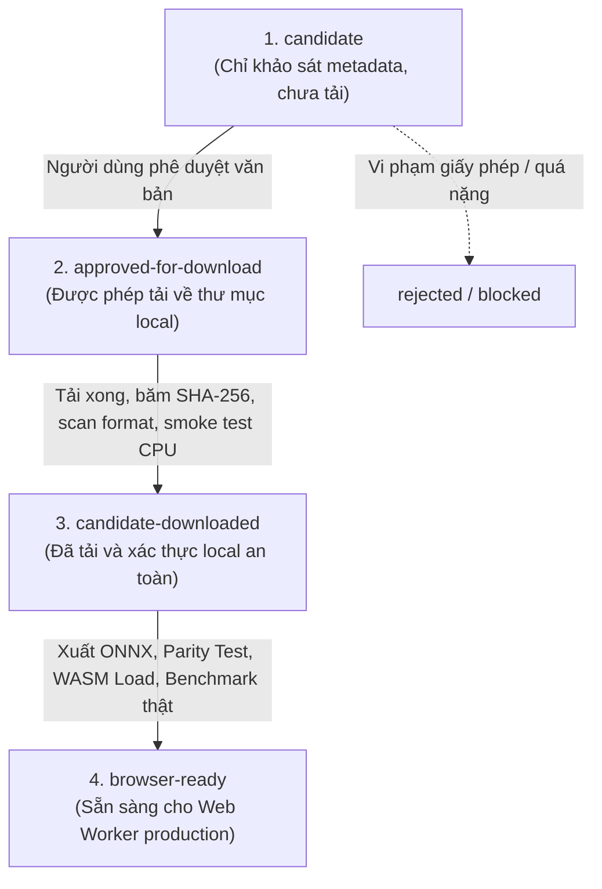

# Cổng Kiểm định và Tiếp nhận Mô hình (Model Acquisition Gate)

> **Mục đích**: Thiết lập quy trình kiểm định nghiêm ngặt, minh bạch và an toàn trước khi bất kỳ checkpoint mô hình nào được tải về, xuất bản hoặc đưa vào runtime trình duyệt của sản phẩm `Forensics Web Lab`.  
> **Nguyên tắc tối thượng**:  
> - **Không bao giờ tự ý tải file trọng số binary lớn** khi chưa có sự phê duyệt bằng văn bản từ người dùng.  
> - **Không bao giờ commit file nhị phân mô hình vào Git repository**.  
> - Kiểm tra an toàn mã độc (Pickle injection), xác thực mã băm SHA-256 và đo lường tính đúng đắn trước khi tích hợp vào Web Worker.

---

## 1. Vòng đời Trạng thái Mô hình (Model Lifecycle States)

Mọi checkpoint mô hình trong dự án phải tuân theo vòng đời trạng thái 4 cấp độ:



1. `candidate`: Mới khảo sát metadata, thông số kỹ thuật và giấy phép từ tài liệu khoa học/kho lưu trữ chính thức. Trạng thái tải: `not-downloaded`.
2. `candidate-downloaded`: Đã tải về máy local theo đúng nguồn duyệt, đã tính SHA-256, quét định dạng an toàn và load thành công trên CPU PyTorch.
3. `browser-ready`: Đã xuất sang định dạng ONNX, vượt qua kiểm thử sai số parity với PyTorch ($L_\infty < 10^{-4}$), load thành công vào ONNX Runtime Web (WASM), có benchmark độ trễ thực tế, Model Card và `registry.json` được cập nhật đầy đủ checksum và dung lượng thật.
4. `rejected` / `blocked-license` / `blocked-missing-weights`: Bị từ chối hoặc bị chặn do không đáp ứng tiêu chuẩn.

---

## 2. Tiêu chuẩn Hồ sơ Phê duyệt Tải xuống (Download Approval Dossier)

Trước khi người dùng cho phép tải bất kỳ checkpoint nào, phải lập hồ sơ phê duyệt gồm đủ 13 tiêu chí bắt buộc:

1. **URL chính thức**: Phải là URL trực tiếp từ trang phát hành chính thức của nhóm tác giả (GitHub Releases, Hugging Face chính chủ, kho lưu trữ trường đại học). Tuyệt đối không dùng link rút gọn hoặc link trung gian không rõ nguồn gốc.
2. **Tên file gốc**: Tên file nhị phân kèm phần mở rộng (`.pth`, `.pt`, `.onnx`, `.safetensors`).
3. **Dung lượng tải (Download size)**: Ước tính chính xác dung lượng nén cần tải (MB).
4. **Dung lượng sau giải nén (Extracted size)**: Dung lượng sau khi bung nén hoặc chuyển đổi (MB).
5. **Giấy phép mã nguồn (Code license)**: Phải rõ ràng (MIT, Apache-2.0, BSD, hoặc tương đương).
6. **Giấy phép trọng số (Weights license)**: Phải xác minh rõ điều khoản (cho phép sử dụng nghiên cứu hoặc sản phẩm, lưu ý các điều khoản NC/SA).
7. **Tác vụ hỗ trợ**: Xác định rõ hỗ trợ phân loại toàn ảnh (2 lớp hay 3 lớp) hay định vị bản đồ nhiệt (localization).
8. **Kiến trúc mô hình**: Chi tiết backbone (MobileNetV3, ShuffleNet, EfficientNet...), số lượng tham số ($\le 15\text{M}$).
9. **Tiền xử lý (Preprocessing contract)**: Kích thước tensor đầu vào, chuẩn hóa màu (mean/std), thứ tự kênh (RGB/BGR), phạm vi giá trị ([0, 1] hay [-1, 1]).
10. **Hợp đồng đầu ra (Output contract)**: Số lượng logits đầu ra, thứ tự nhãn lớp, ánh xạ sang 4 trạng thái giám định của hệ thống.
11. **Rủi ro kỹ thuật & an toàn**: Rủi ro thực thi mã độc qua deserialization (PyTorch pickle), rủi ro sai lệch phân phối miền tạo sinh (domain gap), hiện tượng ảo giác hoặc overconfidence.
12. **Phương án gỡ bỏ (Rollback / Deletion plan)**: Lệnh xóa file local và làm sạch cache nếu kiểm định thất bại.
13. **Nơi lưu trữ cục bộ (Local storage path)**: Phải nằm trong thư mục tạm không commit vào Git (ví dụ: `models/checkpoints/` hoặc `.cache/`), đã được cấu hình trong `.gitignore`.

---

## 3. Cổng 1: Chuyển sang `candidate-downloaded`

Chỉ chuyển trạng thái sang `candidate-downloaded` khi hoàn thành tuần tự tất cả các bước:

1. **Tải file từ nguồn đã duyệt**: Sử dụng script Python hoặc `curl` ghi vào thư mục local được chỉ định.
2. **Tính toán mã băm SHA-256**:
   ```bash
   python -c "import hashlib; print(hashlib.sha256(open('path/to/file', 'rb').read()).hexdigest())"
   ```
   Đối chiếu với mã băm do tác giả công bố (nếu có). Ghi mã băm này vào hồ sơ kiểm toán.
3. **Quét định dạng an toàn (Safe Format Scan)**:
   - Ưu tiên cao nhất cho định dạng `safetensors` hoặc `onnx` thuần tensor.
   - Nếu là file `.pth` hoặc `.pt` của PyTorch (vốn dùng `pickle`), bắt buộc phải load với cờ `weights_only=True`:
     ```python
     torch.load('checkpoint.pth', map_location='cpu', weights_only=True)
     ```
   - Từ chối ngay lập tức nếu file yêu cầu nạp custom module hoặc chứa mã thực thi tùy biến chưa được kiểm duyệt.
4. **Kiểm tra Smoke Test trên CPU**:
   - Nạp thành công vào mô hình PyTorch trên CPU (không yêu cầu GPU).
   - Truyền dummy tensor $[1, 3, 224, 224]$, xác nhận trả về tensor logits hợp lệ không chứa `NaN` hoặc `Inf`.
5. **Đối chiếu Output Contract**:
   - Xác nhận shape đầu ra khớp chính xác với thiết kế hệ thống ($[1, 3]$ hoặc tương thích với bộ chuyển đổi).

---

## 4. Cổng 2: Chuyển sang `browser-ready`

Chỉ chuyển trạng thái sang `browser-ready` và đưa vào Web Worker khi hoàn thành tất cả các yêu cầu sau:

1. **Xuất sang ONNX chuẩn hóa**:
   - Sử dụng script `ml/export/export_onnx.py` với `opset_version=17`.
   - Cấu hình dynamic batch size hoặc fixed input $[1, 3, 224, 224]$.
2. **Kiểm tra sai số Parity (PyTorch vs ONNX)**:
   - Chạy `ml/export/validate_contract.py`.
   - Sai số tuyệt đối lớn nhất giữa đầu ra PyTorch và ONNX trên 100 mẫu thử ngẫu nhiên phải thỏa mãn:
     $$\max |y_{\text{pytorch}} - y_{\text{onnx}}| < 10^{-4}$$
3. **Lượng tử hóa INT8 (INT8 Quantization)**:
   - Lượng tử hóa trọng số bằng `onnxruntime.quantization` (dynamic quantization hoặc static calibration).
   - Tổng dung lượng file `.onnx` thành phẩm phải $\le 15\text{ MB}$ (mục tiêu tối ưu $\le 5\text{ MB}$).
4. **Kiểm thử Tải và Thực thi trên Trình duyệt (WASM Smoke Test)**:
   - Nạp file ONNX vào `OnnxSessionManager.initializeSession()` trong môi trường test browser/Node.
   - Xác nhận khởi tạo thành công với backend `wasm`, không phát sinh lỗi bộ nhớ hoặc thiếu operator.
5. **Đo đạc Benchmark Thực tế**:
   - Đo thời gian suy luận trung bình trên 10 ảnh:
     - Toàn ảnh: $\le 150\text{ ms}$ (WASM CPU đa luồng).
     - Quét bản đồ nhiệt (24–36 patches): $\le 1500\text{ ms}$.
   - Đo bộ nhớ RAM tăng thêm trong browser tab: $\le 60\text{ MB}$.
6. **Cập nhật Model Card & Registry**:
   - Điền đầy đủ thông số thật vào `models/MODEL_CARD.md`.
   - Cập nhật `models/registry.json`:
     - `path`: đường dẫn tương đối tới file ONNX assets.
     - `sha256`: chuỗi băm 64 ký tự hex thật của file ONNX.
     - `sizeBytes`: kích thước byte thật $> 0$.
     - `status`: chuyển từ `"not-trained"` sang `"ready"` hoặc `"quantized"`.

---

## 5. Quy tắc Kiểm tra Tính toàn vẹn của Registry (Registry Integrity Guard)

Hệ thống CI/CD và test suite tự động kiểm tra các ràng buộc sau đối với `models/registry.json`:

1. **Ràng buộc trạng thái `ready`**: Bất kỳ model nào khai báo `status: "ready"` hoặc `status: "quantized"` bắt buộc:
   - File nhị phân tại `path` phải tồn tại thực tế trên ổ đĩa.
   - `sizeBytes` phải là số nguyên dương $> 0$.
   - `sha256` phải khớp chính xác với mã băm tính từ nội dung file.
2. **Ràng buộc trạng thái `not-trained` / `not-installed`**:
   - Bắt buộc `path: ""` hoặc `sizeBytes: 0`.
   - Tuyệt đối không khai báo đường dẫn file giả lập không tồn tại.
3. **Ngăn chặn Checkpoint Giả trong Production Build**:
   - Kiểm tra bundle production không chứa các file `.onnx` giả mạo (zero-byte hoặc dummy payload).
   - Các mock fixture chỉ được phép tồn tại trong thư mục test (`packages/*/src/__tests__/fixtures/`).

> **CẢNH BÁO CHO PHASE 3.5**: Trong giai đoạn này, `models/registry.json` **bắt buộc giữ nguyên trạng thái `not-trained`**; không được phép chuyển sang `ready` hay khai báo path giả.
