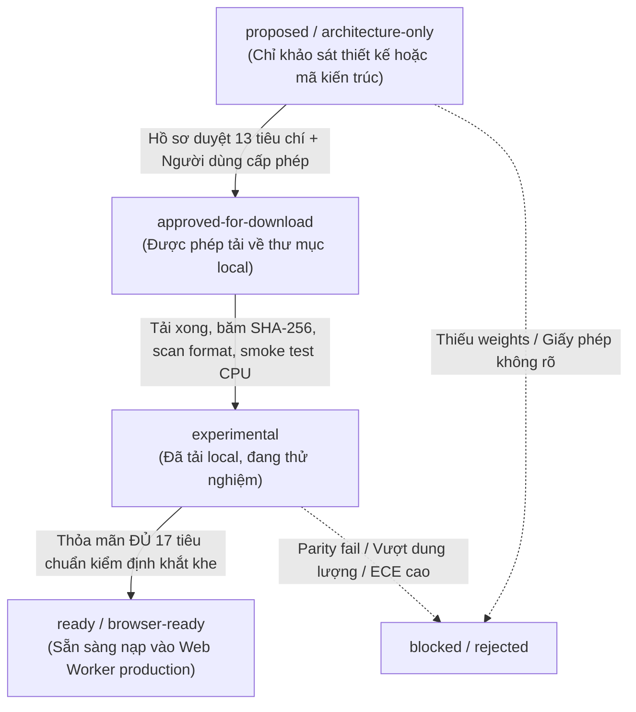

# Cổng Kiểm định và Tiếp nhận Mô hình (Model Acquisition Gate)

> **Mục đích**: Thiết lập quy trình kiểm định nghiêm ngặt, minh bạch và an toàn trước khi bất kỳ checkpoint mô hình nào được tải về, xuất bản hoặc đưa vào runtime trình duyệt của sản phẩm `Forensics Web Lab`.  
> **Nguyên tắc tối thượng**:  
> - **Không bao giờ tự ý tải file trọng số binary lớn** khi chưa có sự phê duyệt bằng văn bản từ người dùng.  
> - **Không bao giờ commit file nhị phân mô hình vào Git repository**.  
> - Kiểm tra an toàn mã độc (Pickle injection), xác thực mã băm SHA-256 và đo lường tính đúng đắn trước khi tích hợp vào Web Worker.  
> - **Phải thỏa mãn đầy đủ 17 tiêu chuẩn bắt buộc** mới được phép gắn nhãn `ready`. Nếu thiếu bất kỳ tiêu chí nào, model chỉ được mang một trong các trạng thái: `proposed`, `architecture-only`, `blocked`, `experimental`, `rejected`.

---

## 1. Vòng đời Trạng thái Mô hình (Model Lifecycle States)

Mọi đề xuất mô hình trong dự án phải tuân theo vòng đời trạng thái phân cấp nghiêm ngặt:



### Các trạng thái hợp lệ:
* `proposed`: Mô hình được đề xuất dựa trên tài liệu khoa học, chưa tải.
* `architecture-only`: Thiết kế kiến trúc và mã nguồn mạng nơ-ron (như `ARCH-C2-INHOUSE-MNV3`), chưa có trọng số huấn luyện.
* `experimental`: Đã tải về máy local để kiểm thử kỹ thuật, chưa đạt đủ 17 tiêu chuẩn để phát hành.
* `blocked`: Bị chặn do thiếu dữ liệu, thiếu file trọng số, hoặc giấy phép không rõ ràng.
* `rejected`: Bị từ chối do không đáp ứng tiêu chuẩn sản phẩm (kích thước quá lớn, latency cao, vi phạm bản quyền).
* `ready` (`browser-ready`): Đã vượt qua toàn bộ 17 tiêu chuẩn kiểm định thực tế.

---

## 2. Tiêu chuẩn Hồ sơ Phê duyệt Tải xuống (Download Approval Dossier)

Trước khi người dùng cho phép tải bất kỳ checkpoint nào, phải lập hồ sơ phê duyệt gồm đủ 13 tiêu chí bắt buộc:

1. **URL chính thức**: Phải là URL trực tiếp từ trang phát hành chính thức của nhóm tác giả (GitHub Releases, Hugging Face chính chủ, kho lưu trữ trường đại học). Tuyệt đối không dùng link rút gọn hoặc link trung gian không rõ nguồn gốc.
2. **Tên file gốc**: Tên file nhị phân kèm phần mở rộng (`.pth`, `.pt`, `.onnx`, `.safetensors`).
3. **Dung lượng tải (Download size)**: Ước tính chính xác dung lượng nén cần tải (MB).
4. **Dung lượng sau giải nén (Extracted size)**: Dung lượng sau khi bung nén hoặc chuyển đổi (MB).
5. **Giấy phép mã nguồn (Code license)**: Phải rõ ràng (MIT, Apache-2.0, BSD, hoặc tương đương).
6. **Giấy phép trọng số (Weights license)**: Phải xác minh rõ điều khoản (cho phép sử dụng nghiên cứu hoặc sản phẩm, lưu ý các điều khoản NC/SA).
7. **Tác vụ hỗ trợ**: Xác định rõ hỗ trợ phân loại toàn ảnh (2 lớp hay 3 lớp) hay định vị bản đồ nhiệt (localization).
8. **Kiến trúc mô hình**: Chi tiết backbone (MobileNetV3, ShuffleNet, EfficientNet...), số lượng tham số ($\le 15\text{M}$).
9. **Tiền xử lý (Preprocessing contract)**: Kích thước tensor đầu vào, chuẩn hóa màu (mean/std), thứ tự kênh (RGB/BGR), phạm vi giá trị ([0, 1] hay [-1, 1]).
10. **Hợp đồng đầu ra (Output contract)**: Số lượng logits đầu ra, thứ tự nhãn lớp, ánh xạ sang 4 trạng thái giám định của hệ thống.
11. **Rủi ro kỹ thuật & an toàn**: Rủi ro thực thi mã độc qua deserialization (PyTorch pickle), rủi ro sai lệch phân phối miền tạo sinh (domain gap), hiện tượng ảo giác hoặc overconfidence.
12. **Phương án gỡ bỏ (Rollback / Deletion plan)**: Lệnh xóa file local và làm sạch cache nếu kiểm định thất bại.
13. **Nơi lưu trữ cục bộ (Local storage path)**: Phải nằm trong thư mục tạm không commit vào Git (ví dụ: `models/checkpoints/` hoặc `.cache/`), đã được cấu hình trong `.gitignore`.

---

## 3. Cổng 1: Chuyển sang `experimental` (Local Validation Gate)

Chỉ chuyển trạng thái sang `experimental` khi hoàn thành tuần tự tất cả các bước:

1. **Tải file từ nguồn đã duyệt**: Ghi vào thư mục local được chỉ định.
2. **Tính toán mã băm SHA-256**:
   ```bash
   python -c "import hashlib; print(hashlib.sha256(open('path/to/file', 'rb').read()).hexdigest())"
   ```
   Đối chiếu với mã băm do tác giả công bố (nếu có). Ghi mã băm này vào hồ sơ kiểm toán.
3. **Quét định dạng an toàn (Safe Format Scan)**:
   - Ưu tiên cao nhất cho định dạng `safetensors` hoặc `onnx` thuần tensor.
   - Nếu là file `.pth` hoặc `.pt` của PyTorch (vốn dùng `pickle`), bắt buộc phải load với cờ `weights_only=True`:
     ```python
     torch.load('checkpoint.pth', map_location='cpu', weights_only=True)
     ```
   - Từ chối ngay lập tức nếu file yêu cầu nạp custom module hoặc chứa mã thực thi tùy biến chưa được kiểm duyệt.
4. **Kiểm tra Smoke Test trên CPU**:
   - Nạp thành công vào mô hình PyTorch trên CPU (không yêu cầu GPU).
   - Truyền dummy tensor $[1, 3, 224, 224]$, xác nhận trả về tensor logits hợp lệ không chứa `NaN` hoặc `Inf`.
5. **Đối chiếu Output Contract**:
   - Xác nhận shape đầu ra khớp chính xác với thiết kế hệ thống ($[1, 3]$ hoặc tương thích với bộ chuyển đổi).

---

## 4. Cổng 2: 17 Tiêu chuẩn Bắt buộc để Chuyển sang `ready` (Production Gate)

Để một model được cấp phép mang trạng thái `ready` (hoặc `browser-ready`) trong `models/registry.json`, **bắt buộc phải thỏa mãn đồng thời toàn bộ 17 tiêu chuẩn sau**:

| STT | Tiêu chuẩn Kiểm định | Tiêu chí Đạt (Pass Criteria) | Trạng thái Hiện tại |
| :--- | :--- | :--- | :--- |
| 1 | **Nguồn và version rõ ràng** | Có commit hash / release URL chính thức; version tuân thủ SemVer | `unverified` (chưa có model) |
| 2 | **License của code** | Giấy phép mã nguồn mở permissive (MIT/Apache-2.0/BSD) được xác thực | `verified` (mã nguồn dự án) |
| 3 | **License của weights** | Giấy phép cho phép phân phối và tích hợp client-side hợp pháp | `not-applicable` (chưa có weights) |
| 4 | **License & Provenance của dữ liệu** | Báo cáo nguồn gốc tập train, xác nhận không vi phạm bản quyền dữ liệu | `unverified` |
| 5 | **Checksum của artifact** | Mã băm SHA-256 (64 ký tự hex) khớp chính xác với file ONNX thành phẩm | `not measured` |
| 6 | **Kích thước file đo thực tế** | Dung lượng file nhị phân đo thực tế trên đĩa $\le 35\text{ MB}$ (mục tiêu $\le 10\text{ MB}$) | `not measured` (chỉ có `estimated`) |
| 7 | **Input/Output contract** | Input $[1, 3, 224, 224]$, output 3 logits ánh xạ 4 trạng thái chuẩn | `architecture-only` |
| 8 | **ONNX export trên checkpoint thật** | Xuất thành công file `.onnx` hợp lệ opset 17 từ checkpoint thật | `unverified` |
| 9 | **Numerical parity trên checkpoint thật** | Sai số lớn nhất $\max \|y_{\text{pytorch}} - y_{\text{onnx}}\| < 10^{-4}$ trên dữ liệu thật | `unverified` (mới test `pipeline-only`) |
| 10 | **WASM runtime test thực tế** | Load và chạy suy luận thành công trong Web Worker trên Chrome, Edge, Firefox, Safari | `unverified` (mới test `pipeline-only`) |
| 11 | **CPU latency & peak memory đo thật** | Latency toàn ảnh $\le 150\text{ ms}$, RAM tăng thêm $\le 60\text{ MB}$ đo trên máy thật | `not measured` |
| 12 | **In-domain evaluation** | Macro F1 $\ge 0.85$, AUC $\ge 0.90$ trên tập test cùng phân phối | `not evaluated` |
| 13 | **Cross-dataset evaluation** | Đánh giá độc lập trên ít nhất 2 dataset khác nguồn huấn luyện | `not evaluated` |
| 14 | **Unseen-generator evaluation** | Đánh giá độ nhạy trên generator chưa từng thấy trong tập train | `not evaluated` |
| 15 | **Calibration evaluation** | Expected Calibration Error (ECE) $\le 0.10$ sau khi fit Temperature Scaling | `not evaluated` |
| 16 | **Known limitations rõ ràng** | Tài liệu hóa các trường hợp suy giảm (JPEG nén nặng, resize nhỏ, screenshot) | `verified` (trong Model Card) |
| 17 | **Model card hoàn chỉnh** | Cập nhật đầy đủ số liệu đo thật vào `models/MODEL_CARD.md`, không để trống | `unverified` |

> **Quy tắc tuyệt đối**: Nếu thiếu bất kỳ tiêu chuẩn nào trong số 17 tiêu chuẩn trên, mô hình **KHÔNG ĐƯỢC PHÉP** chuyển sang `ready` hay `quantized` trong `models/registry.json`. Mô hình phải giữ trạng thái `proposed`, `architecture-only`, `blocked`, hoặc `experimental`.

---

## 5. Ràng buộc Tự động cho Registry Integrity

Hệ thống test suite tự động kiểm tra các ràng buộc sau đối với `models/registry.json`:

1. **Ràng buộc trạng thái `ready`**: Bất kỳ model nào khai báo `status: "ready"` hoặc `status: "quantized"` bắt buộc:
   - File nhị phân tại `path` phải tồn tại thực tế trên ổ đĩa.
   - `sizeBytes` phải là số nguyên dương $> 0$.
   - `sha256` phải là chuỗi 64 ký tự hex thật khớp nội dung file.
   - Model ID không được chứa từ khóa test/mock/dummy.
2. **Ràng buộc trạng thái `not-trained` / `not-installed`**:
   - Bắt buộc `path: ""` và `sizeBytes: 0` và `sha256: ""`.
   - Tuyệt đối cấm khai báo đường dẫn file giả lập không tồn tại.
3. **Ngăn chặn Checkpoint Giả trong Production Build**:
   - Kiểm tra bundle production không chứa các file `.onnx` giả mạo (zero-byte hoặc dummy payload).
