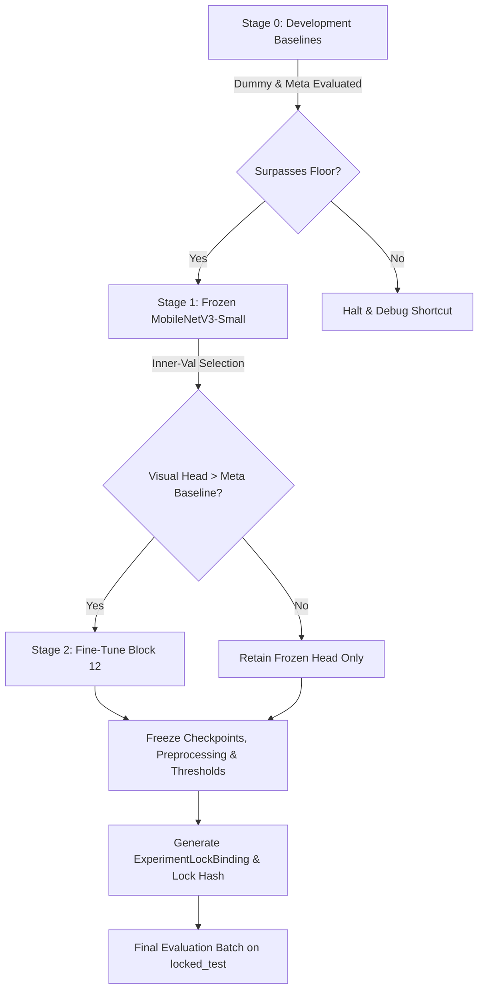

# Phase 4C Scientific Preregistration: Pilot A Binary Classification Protocol

> **Document Type**: Scientific Protocol Preregistration & Experiment Contract  
> **Status**: **`PREREGISTERED`** (Phase 4B.3)  
> **Target Execution Phase**: Phase 4C  
> **Repository**: `nomozer/forensics-web-lab`  
> **Working Branch**: `feat/production-ai-image-forensics`  
> **Dataset**: TGIF SD2-sp Option P (`data/research/tgif/`)  
> **Target Task**: Binary Classification — `authentic` vs `ai_edited`  
> **Independent Statistical Unit**: **`source_id`** (MS-COCO 12-digit zero-padded ID)  
> **Locked Split Seal**: `519e7a0e6815e781d1cefa95971e5221ac1f25656837374d8dc4ba41401fded9`  
> **Preregistered Config**: `ml/configs/pilot_a_binary_preregistered.yaml` (SHA-256: `839531a700b211e5adc4a145e811c4533dbb45a044b63e816c474a462e88ddd1`)  

---

## 1. Scope Locking & Boundary Conditions

1. **Classification Space**: Strictly binary classification: `authentic` (Class 0) vs `ai_edited` (Class 1).
2. **Fully-Generated Absence**: Option P contains 0 samples of `fully_generated` imagery.
3. **Three-Class Gate**: The full 3-class classification pipeline (`authentic` / `fully_generated` / `ai_edited`) remains in status **`not-runnable-missing-fully-generated-data`**. It will not be triggered in Phase 4C.
4. **Inpainting Localization**: Treated as a secondary auxiliary experiment on paired masks; not a gating requirement for binary classification.
5. **Web Deployment & ONNX Export**: Production web deployment and INT8 quantization are deferred until the scientific baseline passes all stage gates.

---

## 2. Sampling Strategy & Anti-Pseudoreplication Protocol

To prevent pseudoreplication and variant imbalance, Phase 4C adopts **Strategy A: Pair-Aware Sampler**:

```text
Each Epoch (2N samples):
├── For each source_id in partition (N unique sources):
│   ├── Sample 1 Authentic Image: Native resolution variant (orig_native)
│   └── Sample 1 AI-Edited Image: Deterministically cycled variant (sd2_bbox or sd2_segm)
└── Exact 1:1 Class Balance per Source & Epoch (zero statistical distortion)
```

* **Equal Source Contribution**: Every `source_id` contributes exactly 1 authentic and 1 edited sample per epoch. Sources with multiple variants never receive higher statistical weight.
* **Variant Cycling**: The edited variant index is cycled deterministically across epochs:
  $$\text{variant\_idx} = (\text{epoch} + \text{offset}(\text{source\_id})) \pmod 6$$
* **Source-Level Metric Aggregation**: For evaluation, predicted probabilities across all tested variants of the same `source_id` are averaged to produce a single prediction score $P(\text{ai\_edited} \mid \text{source\_id})$. All primary metrics are calculated on these aggregated scores.

---

## 3. Dataset Partitions & Learning Curves

The dataset partitions are strictly frozen from Phase 4B.2:

| Partition | Role | Unique `source_id` Count | Access Rule |
| :--- | :--- | :---: | :--- |
| `development_train` | Model parameter optimization | 250 | Open for training loader |
| `inner_validation` | Hyperparameter selection, checkpointing & threshold calibration | 91 | Open for dev evaluator |
| `locked_test` | Final sealed confirmatory evaluation | 343 | Protected by `LockedTestAccessGuard` (Seal: `519e7a...`) |

### Nested Learning Curve Subsets ($N \in \{50, 100, 250\}$)
To evaluate sample efficiency in the low-data regime:
* **$N = 50$**: 50 sources (100 samples/epoch, 50 authentic : 50 edited)
* **$N = 100$**: 100 sources (200 samples/epoch, 100 authentic : 100 edited)
* **$N = 250$**: 250 sources (500 samples/epoch, 250 authentic : 250 edited)
* **Invariance**: $N=50 \subset N=100 \subset N=250$.
* **Over-capacity Guard**: $N=500$ and $N=1000$ are locked as `not_runnable`.

---

## 4. Preregistered Model Baselines

Six baselines will be evaluated under identical source splits:

1. **Stratified Dummy**: Random uniform / class-frequency dummy classifier (establishes chance performance floor).
2. **Metadata-Only**: Logistic regression / decision tree on EXIF, XMP, JPEG markers, image dimensions, and format headers (proves visual features capture more than metadata shortcuts).
3. **DSP-Only**: Linear classifier on handcrafted frequency features (2D FFT radial profile, DCT block energy, noise residual variance, ELA).
4. **Frozen MobileNetV3-Small**: Pretrained ImageNet-1k backbone frozen; only linear classification head trained.
5. **Fine-Tuned MobileNetV3-Small**: Last convolutional block (`features.12`) unfrozen; trained with lower learning rate ($5 \times 10^{-5}$).
6. **Calibrated Multimodal Fusion**: Visual model head fused with DSP features and metadata indicators via logistic calibrator.

---

## 5. Metrics & Statistical Protocol

### 5.1 Primary Metrics (Source-Level)
All primary metrics are computed on predictions aggregated by unique `source_id`:
* **Macro-F1**: $\frac{1}{2} (F1_{\text{auth}} + F1_{\text{edit}})$
* **Balanced Accuracy**: $\frac{1}{2} (\text{TPR} + \text{TNR})$
* **AUROC**: Area under ROC curve over aggregated continuous scores
* **Brier Score**: Mean squared difference between predicted probabilities and ground truth
* **Expected Calibration Error (ECE)**: 10-bin equal-width ECE
* **Selective Risk & Coverage**: Accuracy and coverage trade-off under confidence thresholding (abstention / `uncertain` state)

### 5.2 Secondary Metrics (Diagnostic)
* Variant-level Macro-F1 and Balanced Accuracy
* Confusion matrix
* Per-edit-type performance (bbox inpainting vs segm inpainting)
* Per-resolution degradation sensitivity (native vs 512 vs 1024)
* JPEG recompression robustness (Q=95, Q=80, Q=60)
* Auxiliary localization: mIoU, Dice coefficient, Pixel AUROC on masks

### 5.3 Statistical Significance Protocol
* **Seeds**: 5 preregistered seeds: `[42, 1337, 2025, 3407, 9001]`.
* **Reporting**: Report mean $\pm$ standard deviation across 5 seeds.
* **Paired Stratified Bootstrap**: 1,000 bootstrap iterations resampling by `source_id` to generate 95% Confidence Intervals for $\Delta \text{Macro-F1} = \text{Model} - \text{Baseline}$.

---

## 6. Stage Gates & Transition Rules



1. **Stage 0**: Train and evaluate Dummy, Metadata-only, and DSP-only on `development_train` and `inner_validation`.
2. **Stage 1**: Train MobileNetV3-Small classification head with frozen backbone. Select best epoch by `inner_validation` Macro-F1.
3. **Stage 2**: Unfreeze `features.12` only if Stage 1 Macro-F1 statistically significantly exceeds Dummy and is not fully explained by Metadata-only.
4. **Final Sealed Evaluation**:
   * Freeze all model checkpoints, preprocessing configurations, temperature scaling parameters, and decision thresholds.
   * Generate `ExperimentLockBinding` with config hash, checkpoint hash, preprocessing hash, and calibration hash.
   * Run locked test evaluation strictly once under role `final_evaluator`.
   * Never use locked test results for tuning or model selection.

---

## 7. Pretrained Weights Accounting & Resource Plan

### 7.1 Pretrained Weights Specification (Planned)
* **Model**: MobileNetV3-Small
* **Library / Source**: `torchvision.models.mobilenet_v3_small`
* **Weights Enum**: `torchvision.models.MobileNet_V3_Small_Weights.IMAGENET1K_V1`
* **Weights URL**: `https://download.pytorch.org/models/mobilenet_v3_small-047dcff4.pth`
* **Download Size**: ~10.3 MB (10,830,000 bytes)
* **Parameter Count**: 1,782,648 (feature backbone), 2,542,856 (full ImageNet model)
* **License**: BSD 3-Clause (PyTorch / torchvision)
* **Integrity Guarantee**: Expected SHA-256 will be measured upon approved download and bound into the receipt.
* **Phase 4B.3 Status**: **0 bytes downloaded, 0 training runs executed**.

### 7.2 Compute Plan
* **Training Compute**: Local CPU or optional CUDA GPU acceleration for Stage 1/2.
* **Estimated Compute Time**:
  * $N=50$ (5 seeds $\times$ 25 epochs $\times$ 100 images): ~3 minutes CPU.
  * $N=100$ (5 seeds $\times$ 25 epochs $\times$ 200 images): ~7 minutes CPU.
  * $N=250$ (5 seeds $\times$ 25 epochs $\times$ 500 images): ~18 minutes CPU.
  * Total Stage 0–2 training time: $< 45$ minutes on CPU.
* **Web Product Runtime**: Web inference strictly uses browser CPU/WASM SIMD with zero server communication (Zero-Egress).

---

## 8. Explicit Phase 4C Approval Requests

Phase 4B.3 concludes by submitting the following explicit approval requests for user review before Phase 4C begins:

1. **Pretrained Weights Download Approval**:
   * Permission to download PyTorch official pretrained weights for MobileNetV3-Small (~10.3 MB from `download.pytorch.org`).
2. **Stage 0 Execution Approval**:
   * Permission to train and evaluate Dummy, Metadata-only, and DSP-only baselines on `development_train` (250 sources) and `inner_validation` (91 sources).
3. **Stage 1 Training Approval**:
   * Permission to train the MobileNetV3-Small frozen backbone visual head across the 3 learning curve points ($N=50, 100, 250$) across 5 seeds.
