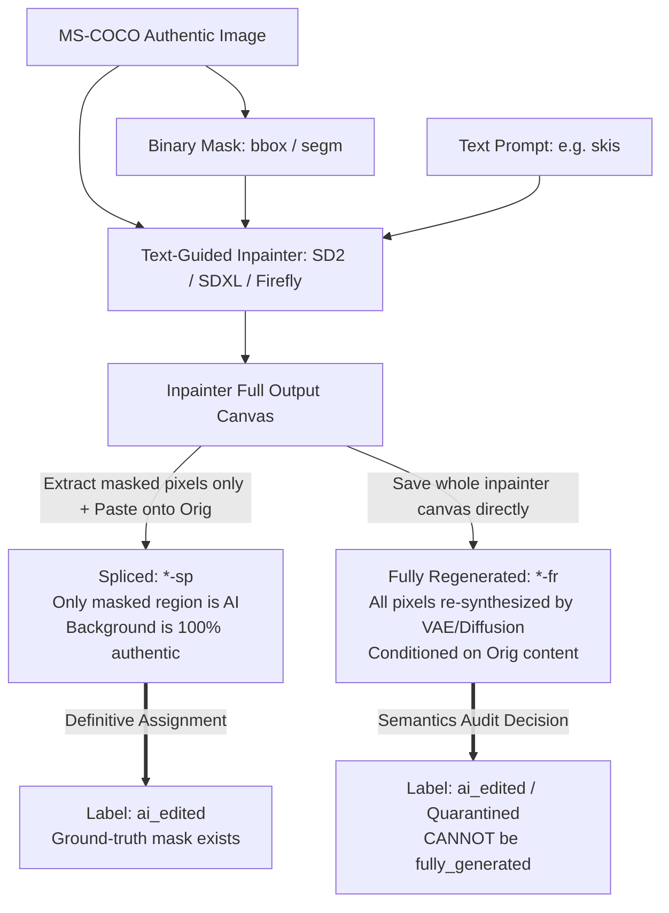
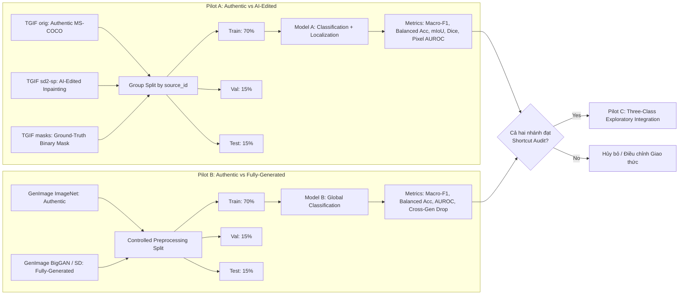

# Giao thức Thí nghiệm Pilot và Cổng Thẩm định Nhãn Khoa học (Scientific Pilot Protocol & Label-Semantics Gate)

> **Mục tiêu**: Chuẩn hóa định nghĩa nhãn, thẩm định cấu trúc ngữ nghĩa dataset TGIF/GenImage, thiết lập kiến trúc pilot hai nhánh độc lập và quy định kiểm soát shortcut/leakage trước khi tải dữ liệu hay huấn luyện.  
> **Nguyên tắc**: Trung thực khoa học (*Scientific Honesty*), bảo vệ trước hội đồng, 0 byte dữ liệu bên ngoài khi chưa có phê duyệt.

---

## 1. Cổng Thẩm định Ngữ nghĩa Nhãn (Label-Semantics Gate)

Nhằm đảm bảo tính chuẩn xác và không bị phản biện về mặt phương pháp luận, dự án đóng băng định nghĩa của 3 nhãn phân loại:

### 1.1. Định nghĩa Chuẩn tắc 3 Nhãn

| Nhãn khoa học | Định nghĩa chuẩn mực | Tiêu chuẩn chấp thuận | Tiêu chuẩn loại trừ |
| :--- | :--- | :--- | :--- |
| **`authentic`** | Ảnh chụp từ cảm biến máy ảnh thực tế hoặc ảnh gốc có xuất xứ rõ ràng, không chứa bất kỳ pixel nào được sinh hoặc chỉnh sửa bởi mô hình tạo sinh (generative AI) trong pipeline của dataset. | Ảnh MS-COCO nguyên bản (`orig`), ảnh ImageNet val nguyên bản. | Ảnh đã qua inpainting AI, ảnh do GAN/Diffusion sinh từ đầu. |
| **`fully_generated`** | Toàn bộ nội dung ảnh ($100\%$ pixel) được sinh từ mô hình tạo sinh (GAN, Diffusion, Flow-Matching) từ nhiễu hoặc văn bản, **không bắt đầu từ một ảnh thật cần giữ nguyên danh tính nội dung hay bố cục không gian**. | Ảnh text-to-image (SDv1.4, SDXL, Midjourney) hoặc unconditional/class-conditional (BigGAN, ADM) trong GenImage. | Ảnh inpainting, ảnh image-to-image giữ bố cục ảnh chụp thật, ảnh spliced. |
| **`ai_edited`** | Ảnh bắt đầu từ một ảnh thật hoặc nội dung nguồn, sau đó một phần (cục bộ) hoặc toàn bộ ảnh được biến đổi bằng generative editing, inpainting, object removal/replacement, splicing hoặc full regeneration có điều kiện từ ảnh nguồn (*conditional regeneration*). | Ảnh inpainting có mask (TGIF `ps-sp`, `sd2-sp`), ảnh chỉnh sửa có đối chiếu ảnh gốc. | Ảnh chụp thật nguyên bản, ảnh sinh từ đầu không có ảnh gốc đối chiếu. |

---

## 2. Kiểm toán Chi tiết Ngữ nghĩa Thành phần Dataset TGIF / TGIF2

Dựa trên bài báo chính thức [TGIF WIFS 2024 (arXiv:2407.11566)](https://arxiv.org/abs/2407.11566) và kho mã nguồn [IDLabMedia/tgif-dataset](https://github.com/IDLabMedia/tgif-dataset):

### 2.1. Bảng Kiểm toán Từng Thành phần TGIF

| Thành phần | Định nghĩa từ tác giả nguồn | Nhãn đề xuất | Mức độ chắc chắn | Nguồn đối chiếu | Ảnh hưởng đến thiết kế thí nghiệm |
| :--- | :--- | :--- | :--- | :--- | :--- |
| **`orig`** | Authentic images from MS-COCO (resolutions up to 1024x1024 px, CC BY 4.0). | **`authentic`** | **100% Verified** | [README / COCO](https://github.com/IDLabMedia/tgif-dataset) | Dùng làm lớp `authentic` cơ sở, ghép cặp 1-1 với ảnh chỉnh sửa. |
| **`masks`** | Binary masks demarcating inpainting region (segmentation, bounding box, random). | **`ground_truth_mask`** | **100% Verified** | [README](https://github.com/IDLabMedia/tgif-dataset) | Dùng làm ground-truth để đánh giá định vị (mIoU, Dice, Pixel AUROC). |
| **`ps-sp`** | Adobe Photoshop/Firefly inpainting spliced back into original image. | **`ai_edited`** | **100% Verified** | [arXiv:2407.11566](https://arxiv.org/abs/2407.11566) | Vùng ngoài mask là ảnh thật $100\%$, vùng trong mask là Firefly. Cực kỳ chuẩn xác cho bài toán localization. |
| **`sd2-sp`** | Stable Diffusion 2 inpainting spliced back into original image. | **`ai_edited`** | **100% Verified** | [arXiv:2407.11566](https://arxiv.org/abs/2407.11566) | Vùng ngoài mask là ảnh thật $100\%$, vùng trong mask là SD2 inpaint. Chuẩn xác cho `ai_edited`. |
| **`sd2-fr`** | SD2 inpainting fully-regenerated canvas without splicing. | **`ai_edited` (Conditional Regeneration)** | **Verified: NOT fully_generated** | [arXiv:2407.11566](https://arxiv.org/abs/2407.11566) | Toàn bộ ảnh đi qua diffusion nhưng **có điều kiện từ ảnh MS-COCO**. Cấm gán là `fully_generated`. |
| **`sdxl-fr`** | SDXL inpainting fully-regenerated canvas without splicing. | **`ai_edited` (Conditional Regeneration)** | **Verified: NOT fully_generated** | [arXiv:2407.11566](https://arxiv.org/abs/2407.11566) | Tương tự `sd2-fr`, giữ nguyên bố cục MS-COCO. Quarantined khỏi manifest Pilot 3 lớp ban đầu. |
| **`flux1*-sp`** | TGIF2 FLUX.1 inpainting spliced back into original MS-COCO. | **`ai_edited`** | **100% Verified** | [arXiv:2603.28613](https://arxiv.org/abs/2603.28613) | Spliced inpainting với generator hiện đại (FLUX.1). |
| **`flux1*-fr`** | TGIF2 FLUX.1 fully regenerated canvas. | **`ai_edited` (Conditional Regeneration)** | **Verified: NOT fully_generated** | [arXiv:2603.28613](https://arxiv.org/abs/2603.28613) | Quarantined khỏi tập huấn luyện `fully_generated`. |

### 2.2. Kết luận then chốt về `sp` và `fr`
1. **`sp` (Spliced)**: Là inpainting kinh điển — chỉ các pixel bên trong mask được sinh ra bởi AI và ghép đè lên ảnh gốc MS-COCO, nền xung quanh là ảnh máy ảnh thật $100\%$. Đây là đại diện mẫu mực cho nhãn **`ai_edited`** và bài toán định vị (localization).
2. **`fr` (Fully Regenerated)**: Mô hình inpainter xuất toàn bộ canvas mà không ghép lại vào ảnh gốc. Mặc dù mọi pixel đều mang dấu vết khử nhiễu/VAE của diffusion, ảnh này **vẫn bắt đầu từ một ảnh thật và duy trì cấu trúc/danh tính nội dung của ảnh thật đó**. Do đó:
   - **`fr` KHÔNG ĐỦ CĂN CỨ để gọi là `fully_generated`**.
   - Nếu gán `fr` là `fully_generated`, mô hình sẽ bị mâu thuẫn nhận thức: cùng một người trượt tuyết trên núi Athos, phiên bản ghép thì gọi là "ảnh chỉnh sửa", phiên bản xuất toàn canvas thì lại gọi là "ảnh sinh từ đầu hoàn toàn".
   - **Quyết định phương pháp luận**: Toàn bộ nhãn `fully_generated` phải được lấy từ các tập sinh từ đầu hoàn toàn (text-to-image hoặc unconditional GAN như trong GenImage). Thành phần `fr` của TGIF được phân loại là `ai_edited (conditional regeneration)` và **tạm thời giữ ngoài manifest huấn luyện ban đầu** để tránh làm nhiễu nhãn.

---

## 3. Kiến trúc Thí nghiệm Pilot Hai Nhánh Độc lập

Nhằm giảm đáng kể nguy cơ mô hình học đặc trưng riêng của dataset (*dataset shortcut*), dự án thiết kế hai nhánh pilot độc lập trước khi mở rộng sang 3 lớp:

### 3.1. Pilot A — Authentic vs AI-Edited và Localization
* **Mục tiêu**: Đánh giá năng lực phân loại nhị phân giữa ảnh thật và ảnh chỉnh sửa cục bộ, đồng thời đo lường năng lực định vị vùng can thiệp bằng sliding window heatmap so với mask thật.
* **Tập dữ liệu**:
  - `authentic`: TGIF `orig` (3,124 ảnh MS-COCO verified).
  - `ai_edited`: TGIF `sd2-sp` (18,744 ảnh chỉnh sửa verified).
  - `masks`: TGIF `masks` (~6,248 binary masks ước tính, 2 masks per source image: segm & bbox).
* **Ưu điểm khoa học**: Thiết kế matched-pair làm giảm đáng kể nguy cơ mô hình học đặc trưng nguồn dữ liệu vì ảnh gốc và ảnh chỉnh sửa chia sẻ cùng source image. Các nguy cơ shortcut từ codec, quy trình sinh ảnh, preprocessing, số lượng biến thể và artifacts của mô hình tạo sinh vẫn phải được đo bằng baseline và source-held-out evaluation.
* **Ràng buộc cách ly rò rỉ (Zero-Leakage Group Split)**:
  - `source_id`: Danh tính ảnh MS-COCO gốc (dùng làm group key duy nhất).
  - `variant_id`: Danh tính từng phiên bản chỉnh sửa (`orig`, `sd2_v1`, `sd2_v2`, ...).
  - `mask_id`: Danh tính mask tương ứng (`mask_segm`, `mask_bbox`).
  - Mọi `variant_id` có cùng `source_id` **bắt buộc phải nằm trong cùng một split** (Train, Val hoặc Test). Tuyệt đối không bao giờ chia tách các biến thể của cùng một ảnh gốc sang các split khác nhau.
* **Chỉ số đánh giá**:
  - Phân loại: Macro-F1, Balanced Accuracy, AUROC, Confusion Matrix.
  - Định vị: Mean IoU (mIoU), Dice Score, Pixel AUROC.

### 3.2. Pilot B — Authentic vs Fully-Generated
* **Mục tiêu**: Đánh giá năng lực phân loại nhị phân giữa ảnh thật và ảnh sinh toàn phần từ đầu, kiểm tra khả năng phát hiện dấu vết upsampling/spectral checkerboard của GAN/Diffusion.
* **Tập dữ liệu**: GenImage (ImageNet val authentic vs BigGAN hoặc Stable Diffusion fake).
* **Kiểm soát nguồn**: Real và Fake được lấy từ cùng một bộ phân phối dữ liệu ImageNet của tác giả GenImage.
* **Chỉ số đánh giá**: Macro-F1, Balanced Accuracy, AUROC, sụt giảm khi kiểm thử trên generator chưa thấy (cross-generator drop).

### 3.3. Pilot C — Thử nghiệm Khám phá Ba Lớp (Three-Class Exploratory)
* **Điều kiện kích hoạt**: Chỉ được mở khi cả Pilot A và Pilot B đều có manifest hợp lệ và vượt qua bài kiểm toán shortcut.
* **Ba lớp**:
  1. `authentic`: TGIF `orig` (hoặc tập hợp kiểm soát).
  2. `fully_generated`: GenImage BigGAN / SD.
  3. `ai_edited`: TGIF `sd2-sp`.
* **Giao thức Metadata-Only Baseline Guard**:
  - Metadata-only baseline là diagnostic baseline, không phải bằng chứng duy nhất để loại trừ shortcut.
  - Tính hiệu suất vượt trội: $\Delta\text{Macro-F1} = \text{Macro-F1}_{\text{visual}} - \text{Macro-F1}_{\text{metadata}}$.
  - Ước lượng khoảng tin cậy $95\%$ bằng phương pháp Paired Stratified Bootstrap ($1,000$ resamples) trên tập test set.
  - Báo cáo đầy đủ:
    1. Macro-F1 của visual model;
    2. Macro-F1 của metadata-only baseline;
    3. $\Delta\text{Macro-F1}$;
    4. Bootstrap $95\%$ Confidence Interval $[CI_{\text{lower}}, CI_{\text{upper}}]$;
    5. Balanced accuracy;
    6. Confusion matrix;
    7. Số lượng mẫu (sample count) từng lớp.
  - **Quy tắc nghiệm thu**: Kết quả chỉ được xem là có bằng chứng visual model vượt metadata baseline khi **cận dưới $95\%$ CI của $\Delta\text{Macro-F1}$ lớn hơn $0$** ($CI_{\text{lower}} > 0.0$).
  - Kết luận vẫn phải ghi nhận khả năng tồn tại các dạng shortcut khác (codec artifacts, perceptual patterns).
* **Trạng thái khoa học**: Gắn nhãn bắt buộc là `exploratory pilot`, chưa dùng làm kết luận khẳng định cho đến khi kiểm chứng cross-dataset.

---

## 4. Giao thức Kiểm soát Shortcut và Chống Rò rỉ Dữ liệu (Anti-Shortcut Protocol)

1. **Deduplication Audit**: Quét toàn bộ mẫu bằng SHA-256 và perceptual hash (pHash khoảng cách Hamming $\le 3$). Mọi mẫu trùng lặp bị cô lập vào cùng một group ID.
2. **Group Split theo `source_id`**: Phân chia Train (70%), Validation (15%), Test (15%) tuyệt đối dựa trên khóa nhóm ảnh gốc `source_id`. Toàn bộ `variant_id` và `mask_id` có cùng `source_id` bị khóa vào cùng một split.
3. **Thống kê Đa chiều theo Lớp (Class-Level Profile Audit)**: Trước khi huấn luyện, script bắt buộc xuất bảng phân bố:
   - Tỷ lệ từng dataset source trên mỗi lớp.
   - Phân bố độ phân giải (width $\times$ height).
   - Phân bố tỷ lệ khung hình (aspect ratio).
   - Kích thước tệp trung bình (file size bytes).
   - Hệ số nén JPEG ước tính.
4. **Metadata-Only Baseline Guard**: Đo lường độ chính xác khi phân loại nhãn chỉ bằng các trường phi thị giác (resolution, aspect ratio, file size, JPEG markers). Đánh giá thống kê qua Paired Stratified Bootstrap 95% CI.
5. **Tiền xử lý Đồng nhất (Uniform Preprocessing)**: Mọi ảnh bất kể nguồn đều được giải mã ra RGB raw, áp dụng letterbox padding (giữ tỷ lệ, chèn viền trung tính) và resize về kích thước chuẩn ($224 \times 224$ px hoặc $512 \times 512$ px).
6. **Zero Split Overlap**: Kiểm tra giao tập `source_id` giữa Train, Val, Test phải bằng rỗng ($S_{\text{train}} \cap S_{\text{val}} = \emptyset$, $S_{\text{train}} \cap S_{\text{test}} = \emptyset$).

---

## 5. Tiêu chuẩn Nghiệm thu Khoa học (Pass/Fail Gates)

| Tiêu chí kiểm định | Điều kiện PASS | Hành vi khi FAIL |
| :--- | :--- | :--- |
| **Data Leakage Check** | $0$ ảnh trùng `source_id` giữa các split | Từ chối split, dừng pipeline ngay lập tức |
| **Duplicate Check** | $0$ mã băm SHA-256 trùng giữa các split | Loại bỏ mẫu trùng, ghi log vi phạm |
| **Lineage Audit** | $100\%$ mẫu có manifest chuẩn 14 trường và license track | Khóa không cho nạp DataLoader |
| **Metadata Shortcut Check** | Cận dưới 95% CI của $\Delta\text{Macro-F1} > 0.0$ (Paired Stratified Bootstrap) | Gắn cờ: Chưa có bằng chứng vượt trội metadata baseline |
| **Localization Heuristic** | Bản đồ nhiệt patch score chỉ được tuyên bố là định vị khi có mIoU $\ge 0.40$ so với mask thật | Gắn nhãn bản đồ nhiệt là `exploratory visualization` |
