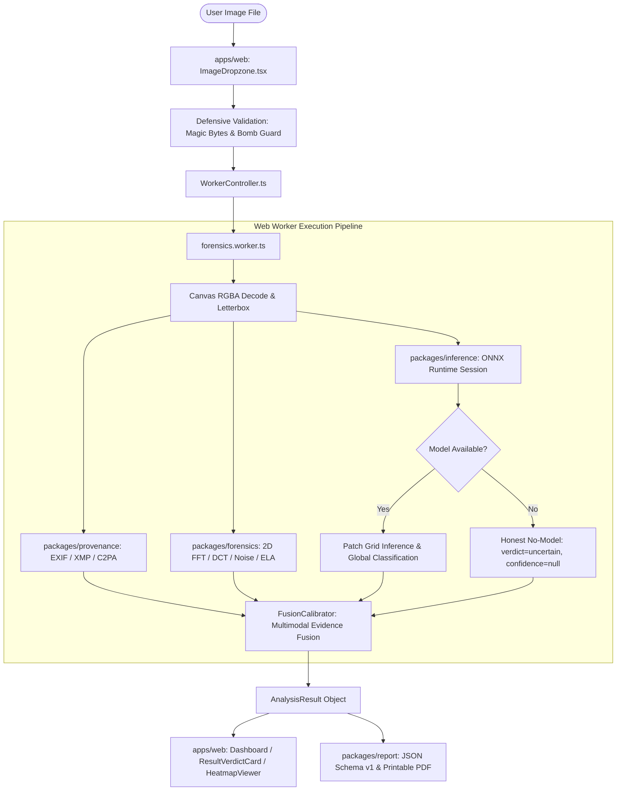

# Code Index: Forensics Web Lab

> **Thư mục**: `docs/continuity/CODE_INDEX.md`  
> **Mục đích**: Bản đồ kiến trúc, mã nguồn thực tế và định vị trách nhiệm module cho các phiên làm việc của AI.  
> **Quy ước**: Toàn bộ đường dẫn trong tài liệu đều là đường dẫn tương đối từ gốc repository.

---

## 1. Mục tiêu Hệ thống & Nguyên tắc Kiến trúc

* **Tên hiển thị giao diện**: `Forensics Web Lab`
* **Tên đề tài nghiên cứu**: *Nghiên cứu và xây dựng công cụ nhẹ phát hiện và định vị hình ảnh do AI tạo sinh và chỉnh sửa trên nền tảng web*
* **Nguyên tắc cốt lõi**:
  1. **Zero-Egress Client-Side**: Toàn bộ quá trình giải mã ảnh, phân tích DSP và suy luận ONNX diễn ra 100% trong trình duyệt (Web Worker), không gửi ảnh lên máy chủ.
  2. **WASM-First & WebGPU Optional**: Mặc định chạy CPU/WASM đa luồng SIMD; tự động tăng tốc WebGPU khi phần cứng hỗ trợ.
  3. **Dual-Track Data Isolation (ADR-0006)**: Tách biệt tuyệt đối Research Track (`data/research/`, `models/research/`) và Product Track (`data/product/`, `models/product/`).

---

## 2. Sơ đồ Luồng Xử lý Ảnh (Processing Flow Diagram)



---

## 3. Cấu trúc Monorepo & Vai trò Package

| Workspace / Package | Thư mục | Vai trò và Trách nhiệm Kỹ thuật | Entry Point |
| :--- | :--- | :--- | :--- |
| `@forensics/shared` | `packages/shared/` | Định nghĩa contracts, TypeScript types, schemas, registry validators, evidence validators | `packages/shared/src/index.ts` |
| `@forensics/provenance` | `packages/provenance/` | Trích xuất siêu dữ liệu EXIF, XMP, IPTC, kiểm tra chữ ký AI software, C2PA adapter | `packages/provenance/src/index.ts` |
| `@forensics/forensics` | `packages/forensics/` | Xử lý tín hiệu số 2D (FFT spectrum, DCT frequency energy, noise variance, JPEG block ELA) | `packages/forensics/src/index.ts` |
| `@forensics/inference` | `packages/inference/` | ONNX Runtime Web session loader, sliding patch inference, fusion calibrator, worker driver | `packages/inference/src/index.ts` |
| `@forensics/report` | `packages/report/` | Tạo báo cáo JSON chuẩn schema và render HTML printable view cho xuất PDF | `packages/report/src/index.ts` |
| `apps/web` | `apps/web/` | Giao diện người dùng React 18, Vite, CSS design tokens, Canvas heatmap viewer | `apps/web/src/main.tsx` |
| `ml` | `ml/` | Workspace Python cho dataset adapters, group splitting, PyTorch training, ONNX export | `ml/training/train.py` |

---

## 4. Định vị File Chịu trách nhiệm Cốt lõi (Core Responsibility Map)

| Nhiệm vụ chức năng | File chịu trách nhiệm chính | Trạng thái kỹ thuật |
| :--- | :--- | :--- |
| **Validation & Magic Bytes** | `packages/shared/src/validation.ts` | `implemented-and-tested` |
| **Metadata & Provenance** | `packages/provenance/src/exif-parser.ts`, `c2pa-adapter.ts` | `implemented-and-tested` |
| **DSP Frequency (FFT/DCT)** | `packages/forensics/src/fft2d.ts`, `dct2d.ts` | `implemented-and-tested` |
| **DSP Noise & JPEG Artifacts**| `packages/forensics/src/noise-residual.ts`, `jpeg-artifacts.ts` | `implemented-and-tested` |
| **Model Runtime Inference** | `packages/inference/src/session-loader.ts`, `patch-infer.ts` | `implemented-and-tested` |
| **Evidence Fusion & Calibration**| `packages/inference/src/fusion-calibrator.ts` | `implemented-and-tested` |
| **Web Worker Coordinator** | `apps/web/src/workers/forensics.worker.ts`, `WorkerController.ts` | `implemented-and-tested` |
| **Heatmap Visualization** | `apps/web/src/components/HeatmapViewer.tsx` | `implemented-and-tested` |
| **Report Generation** | `packages/report/src/report-generator.ts`, `html-print.ts` | `implemented-and-tested` |
| **Dataset Manifest & Adapters** | `ml/datasets/manifest.py`, `ml/datasets/adapters/` | `implemented-and-tested` |
| **Deduplication & Group Split** | `ml/datasets/dedup.py`, `ml/datasets/split.py` | `implemented-and-tested` |
| **Model Architecture (PyTorch)**| `ml/training/mobilenetv3_forensics.py` | `implemented-and-tested` |
| **Loss & Training Engine** | `ml/training/losses.py`, `ml/training/train.py` | `implemented-and-tested` |
| **Temperature Scaling** | `ml/evaluation/calibration.py` | `implemented-and-tested` |
| **Evaluation Metrics Harness** | `ml/evaluation/metrics.py`, `evaluate.py` | `implemented-and-tested` |
| **ONNX Export & Parity Test** | `ml/export/export_onnx.py`, `validate_contract.py` | `implemented-and-tested` |
| **Acquisition Guard CLI** | `ml/datasets/acquire.py` | `implemented-and-tested` |
| **Acquisition Safety & Execution Gate** | `ml/datasets/acquire.py` (free-disk, .part, resume, checksum, safe-extract, staging, receipt) | `implemented-and-tested` |
| **Acquisition Plan & Schema** | `docs/schemas/acquisition-plan.v1.schema.json`, `datasets/acquisition-plans/pilot-a-tgif.v1.json` | `implemented-and-tested` |
| **Paired Bootstrap Guard** | `ml/evaluation/bootstrap_guard.py` (stratified paired bootstrap 95% CI) | `implemented-and-tested` |
| **TGIF Cardinality Audit** | `research/evidence/phase-4a.4/tgif-cardinality-audit.json` | `audited-and-verified` |
| **Pilot Protocols & Configs** | `ml/configs/validator.py`, `pilot_tgif_edit.yaml`, `pilot_genimage_generated.yaml` | `implemented-and-tested` |
| **Continuity Checker CLI** | `scripts/continuity-check.mjs` | `implemented-and-tested` |
| **Continuity Checker Tests** | `scripts/__tests__/continuity-check.test.mjs` | `implemented-and-tested` |
| **Continuity Contract** | `AGENTS.md` (Mục 4: Continuity Contract) | `contract-enforced` |
| **CI Continuity Gate** | `.github/workflows/ci.yml` (Model-Agnostic Continuity Check) | `ci-enforced` |

---

## 5. Input / Output Contracts & Trạng thái Đầu ra

### 5.1. Bốn Trạng thái Kết luận Hệ thống (`AnalysisVerdict`)
1. `no_ai_evidence`: Không phát hiện dấu vết AI; siêu dữ liệu và tín hiệu số nhất quán với ảnh thông thường (tuyệt đối không khẳng định "ảnh thật 100%").
2. `fully_generated`: Phát hiện dấu vết nhất quán với ảnh do mô hình AI tạo sinh toàn phần (GAN/Diffusion).
3. `ai_edited`: Phát hiện vùng can thiệp cục bộ bằng AI (inpainting, thay thế đối tượng).
4. `uncertain`: Độ tin cậy dưới ngưỡng, hoặc tín hiệu mâu thuẫn, hoặc **chưa cài đặt model** (`confidence: null`).

### 5.2. AnalysisResult Schema Contract (`docs/schemas/analysis-output.v1.schema.json`)
```typescript
interface AnalysisResult {
  schemaVersion: "1.0.0";
  timestampUtc: string;
  image: { width: number; height: number; format: string; sha256: string };
  verdict: "no_ai_evidence" | "fully_generated" | "ai_edited" | "uncertain";
  confidence: number | null;                // null khi model chưa cài đặt
  probabilities: { authentic: number; fully_generated: number; ai_edited: number } | null;
  model: { available: boolean; modelId: string | null; version: string | null };
  forensicSignals: ForensicSignal[];        // DSP metrics: FFT, DCT, Noise, ELA
  provenance: ProvenanceResult;             // EXIF/XMP/C2PA tags
  localization: LocalizationResult;         // Heatmap matrix & bounding boxes
  evidence: { supporting: string[]; refuting: string[]; limitations: string[] };
}
```

---

## 6. Sổ Quản lý Metadata (Registries)

* **Model Registry**: `models/registry.json`  
  - Schema: `docs/schemas/model-registry.v1.schema.json`.  
  - Trạng thái hiện tại: `status: "not-trained"`, `path: ""`, `sizeBytes: 0`.  
  - Kiểm tra toàn vẹn: 7 tiêu chí bắt buộc qua `validateModelRegistry` trong `@forensics/shared`.
* **Dataset Registry**: `datasets/registry.json`  
  - Schema: `docs/schemas/dataset-registry.v1.schema.json`.  
  - 7 datasets đã đăng ký (`genimage`, `tgif`, `tgif2`, `synthetic-smoke`, `sagi-d`, `raid`, `realhd`).  
  - Phân luồng: `fixture-only`, `research-only`, `product-eligible`, `blocked`.

---

## 7. Liên hệ giữa Module Phần mềm và Câu hỏi Nghiên cứu (RQs)

| Câu hỏi Nghiên cứu | Module / Package chịu trách nhiệm | File kiểm chứng thực nghiệm |
| :--- | :--- | :--- |
| **RQ1 (3-Class Generalization)** | `ml/training/`, `ml/datasets/` | `ml/training/train.py`, `ml/evaluation/evaluate.py` |
| **RQ2 (Multimodal Evidence Fusion)** | `packages/inference/`, `packages/forensics/` | `packages/inference/src/fusion-calibrator.ts` |
| **RQ3 (ONNX INT8 Quantization)** | `ml/export/`, `packages/shared/` | `ml/export/export_onnx.py`, `quantize.py` |
| **RQ4 (Browser WASM Runtime)** | `packages/inference/`, `apps/web/` | `packages/inference/src/session-loader.ts`, `forensics.worker.ts` |
| **Auxiliary RQ5 (Localization)** | `apps/web/src/components/`, `packages/inference/` | `apps/web/src/components/HeatmapViewer.tsx`, `patch-infer.ts` |

---

## 8. Sổ tay Lệnh Thao tác Kỹ thuật (Key Commands)

```bash
# 1. Kiểm thử TypeScript toàn bộ 6 packages
pnpm test

# 2. Build production web bundle (Vite + TS strict)
pnpm build

# 3. Kiểm thử Python ML pipeline
ml/.venv/Scripts/python -m pytest ml/tests -v

# 4. Xác thực tính toàn vẹn của Dataset Registry
ml/.venv/Scripts/python -m ml.datasets.acquire --validate-registry

# 5. Kiểm tra metadata dataset GenImage (0 byte tải content)
ml/.venv/Scripts/python -m ml.datasets.acquire --dataset genimage --track research --metadata-only

# 6. Sinh fixture hình học nội bộ (0 network, 0 external bytes)
ml/.venv/Scripts/python -m ml.datasets.acquire --dataset synthetic-smoke --track fixture-only --execute

# 7. Kiểm tra tính toàn vẹn và hợp đồng continuity (cross-platform)
pnpm continuity:check
pnpm continuity:check -- --staged
pnpm continuity:check -- --base <PR_BASE_SHA> --head <PR_HEAD_SHA>
```
