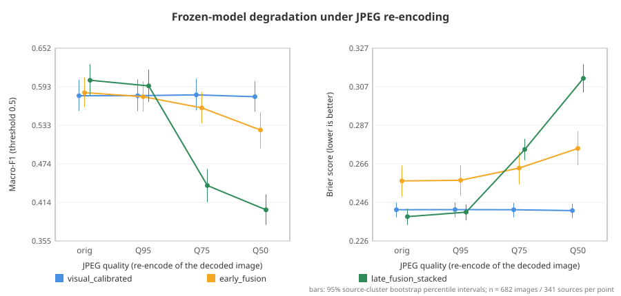

# Development Robustness — Analysis Report

> **Data origin**: `development_real` · **Evidence class**: `development_exploratory` (no confirmatory claim; locked test not accessed) 
> **Scope**: 341 sources / 682 images per condition; frozen 4C.3B fold models; 0 fits 
> **Primary endpoint** (`late_fusion_stacked`, Macro-F1, `jpeg_q75 − original`): Δ = -0.1625, 95% interval [-0.1971, -0.1292] 
> **Verdict**: `EXPLORATORY_JPEG75_MACRO_F1_DROP_RESOLVED`

## Conditions

| Condition | Operations (applied to the decoded RGB image before model preprocessing) |
| :--- | :--- |
| `original` | decoded file, no transform |
| `jpeg_q95` | JPEG q95 (4:2:0) |
| `jpeg_q75` | JPEG q75 (4:2:0) |
| `jpeg_q50` | JPEG q50 (4:2:0) |
| `resize_0.5` | bicubic resize x0.5 |
| `resize_0.5_jpeg_q75` | bicubic resize x0.5 → JPEG q75 (4:2:0) |

## Metrics per condition (threshold 0.5; coverage/selective accuracy at τ = 0.65)

| Condition | Recipe | Macro-F1 | AUROC | Brier | ECE | FPR | FNR | Coverage | Sel. acc |
| :--- | :--- | ---: | ---: | ---: | ---: | ---: | ---: | ---: | ---: |
| `original` | `visual_calibrated` | 0.5787 | 0.6058 | 0.2422 | 0.0102 | 0.3871 | 0.4545 | 0.1349 | 0.6630 |
| `original` | `early_fusion` | 0.5835 | 0.5920 | 0.2573 | 0.0895 | 0.4018 | 0.4311 | 0.3167 | 0.6250 |
| `original` | `late_fusion_stacked` | 0.6026 | 0.6249 | 0.2386 | 0.0426 | 0.3871 | 0.4076 | 0.1877 | 0.6719 |
| `jpeg_q95` | `visual_calibrated` | 0.5788 | 0.6054 | 0.2423 | 0.0123 | 0.3900 | 0.4516 | 0.1378 | 0.6702 |
| `jpeg_q95` | `early_fusion` | 0.5773 | 0.5922 | 0.2577 | 0.0815 | 0.3900 | 0.4545 | 0.3094 | 0.6209 |
| `jpeg_q95` | `late_fusion_stacked` | 0.5939 | 0.6140 | 0.2409 | 0.0462 | 0.3460 | 0.4633 | 0.1862 | 0.6693 |
| `jpeg_q75` | `visual_calibrated` | 0.5801 | 0.6046 | 0.2422 | 0.0133 | 0.3842 | 0.4545 | 0.1320 | 0.6889 |
| `jpeg_q75` | `early_fusion` | 0.5600 | 0.5908 | 0.2641 | 0.1039 | 0.2639 | 0.5924 | 0.3710 | 0.5850 |
| `jpeg_q75` | `late_fusion_stacked` | 0.4401 | 0.5795 | 0.2739 | 0.1637 | 0.0762 | 0.8680 | 0.5894 | 0.5597 |
| `jpeg_q50` | `visual_calibrated` | 0.5772 | 0.6076 | 0.2418 | 0.0168 | 0.3871 | 0.4575 | 0.1320 | 0.6889 |
| `jpeg_q50` | `early_fusion` | 0.5257 | 0.5836 | 0.2744 | 0.1382 | 0.1496 | 0.7214 | 0.4179 | 0.5684 |
| `jpeg_q50` | `late_fusion_stacked` | 0.4026 | 0.5654 | 0.3112 | 0.2431 | 0.0352 | 0.9238 | 0.7742 | 0.5227 |
| `resize_0.5` | `visual_calibrated` | 0.5787 | 0.6056 | 0.2422 | 0.0119 | 0.3871 | 0.4545 | 0.1378 | 0.6702 |
| `resize_0.5` | `early_fusion` | 0.5628 | 0.5815 | 0.2600 | 0.0758 | 0.5191 | 0.3490 | 0.3182 | 0.5899 |
| `resize_0.5` | `late_fusion_stacked` | 0.4300 | 0.5806 | 0.2689 | 0.1486 | 0.8798 | 0.0762 | 0.5044 | 0.5727 |
| `resize_0.5_jpeg_q75` | `visual_calibrated` | 0.5815 | 0.6058 | 0.2420 | 0.0161 | 0.3783 | 0.4575 | 0.1246 | 0.6588 |
| `resize_0.5_jpeg_q75` | `early_fusion` | 0.5547 | 0.5868 | 0.2608 | 0.0804 | 0.3138 | 0.5630 | 0.3431 | 0.6111 |
| `resize_0.5_jpeg_q75` | `late_fusion_stacked` | 0.4500 | 0.5729 | 0.2677 | 0.1452 | 0.0909 | 0.8504 | 0.5191 | 0.5508 |

## Condition − original (Macro-F1 and Brier; full table in paired_deltas.csv)

| Recipe | Condition | ΔMacro-F1 [95%] | ΔBrier [95%] |
| :--- | :--- | :---: | :---: |
| `visual_calibrated` | `jpeg_q95` | +0.0001 [-0.0057, +0.0059] | +0.0000 [-0.0000, +0.0001] |
| `visual_calibrated` | `jpeg_q75` | +0.0014 [-0.0061, +0.0089] | -0.0000 [-0.0003, +0.0002] |
| `visual_calibrated` | `jpeg_q50` | -0.0015 [-0.0147, +0.0117] | -0.0004 [-0.0008, -0.0001] |
| `visual_calibrated` | `resize_0.5` | +0.0000 [-0.0073, +0.0073] | -0.0000 [-0.0002, +0.0001] |
| `visual_calibrated` | `resize_0.5_jpeg_q75` | +0.0028 [-0.0121, +0.0175] | -0.0003 [-0.0008, +0.0003] |
| `early_fusion` | `jpeg_q95` | -0.0062 [-0.0167, +0.0038] | +0.0003 [-0.0001, +0.0008] |
| `early_fusion` | `jpeg_q75` | -0.0235 [-0.0488, +0.0012] | +0.0068 [+0.0023, +0.0112] |
| `early_fusion` | `jpeg_q50` | -0.0577 [-0.0902, -0.0260] | +0.0171 [+0.0106, +0.0235] |
| `early_fusion` | `resize_0.5` | -0.0207 [-0.0399, -0.0021] | +0.0026 [-0.0003, +0.0056] |
| `early_fusion` | `resize_0.5_jpeg_q75` | -0.0288 [-0.0497, -0.0083] | +0.0035 [+0.0003, +0.0065] |
| `late_fusion_stacked` | `jpeg_q95` | -0.0087 [-0.0252, +0.0075] | +0.0023 [+0.0019, +0.0027] |
| `late_fusion_stacked` | `jpeg_q75` **(primary)** | -0.1625 [-0.1971, -0.1292] | +0.0353 [+0.0307, +0.0398] |
| `late_fusion_stacked` | `jpeg_q50` | -0.2000 [-0.2334, -0.1667] | +0.0726 [+0.0655, +0.0795] |
| `late_fusion_stacked` | `resize_0.5` | -0.1726 [-0.2053, -0.1395] | +0.0303 [+0.0263, +0.0342] |
| `late_fusion_stacked` | `resize_0.5_jpeg_q75` | -0.1526 [-0.1874, -0.1191] | +0.0291 [+0.0253, +0.0329] |

## Interpretation limits

- Only the primary endpoint was prespecified; every other condition, metric and contrast is exploratory and not multiplicity-adjusted.
- Intervals resample the 341 sources; fitted models, folds and transformed images are held fixed, so model-fitting and fold-assignment variability are not represented. Folds, image variants and the two images of a source are not treated as independent observations.
- Same 341 development sources as all prior development analyses; not comparable with the retired Phase 4C.2G locked test and not a confirmatory or product claim.
- An interval that contains 0 is not evidence of robustness; it only means the change is not resolved at this sample size.

