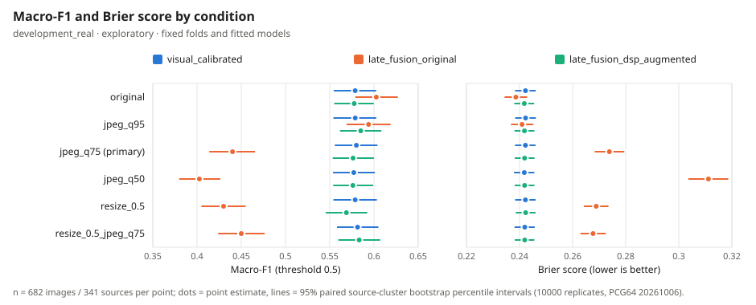
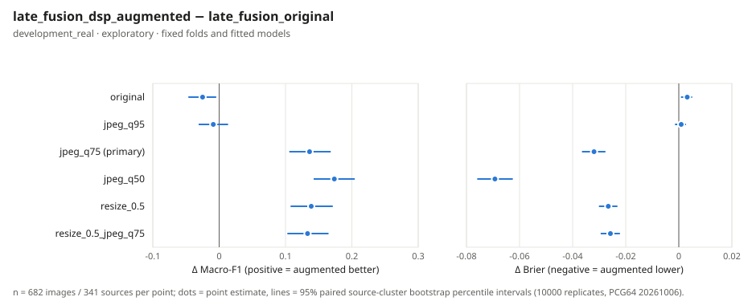

# Controlled DSP Augmentation — Analysis Report (Phase 4C.6)

> **Data origin**: `development_real` · **Findings status**: `MEASURED_DEVELOPMENT_EXPLORATORY` · **Evidence class**: `development_exploratory` 
> **Scope**: 341 sources / 682 images × 6 conditions × 3 recipes; fits 460 (planned 460) 
> **Primary** (`late_fusion_dsp_augmented_minus_late_fusion_original`, `jpeg_q75`, Macro-F1): Δ = +0.1363, 95% interval [+0.1057, +0.1681] 
> **Verdict**: `EXPLORATORY_JPEG75_IMPROVEMENT`

## Metrics per condition (threshold 0.5; τ_conf = 0.65)

| Condition | Recipe | Macro-F1 | AUROC | Brier | ECE | FPR | FNR | Coverage | Sel. acc | High-conf errors |
| :--- | :--- | ---: | ---: | ---: | ---: | ---: | ---: | ---: | ---: | ---: |
| `original` | `visual_calibrated` | 0.5787 | 0.6058 | 0.2422 | 0.0102 | 0.3871 | 0.4545 | 0.1349 | 0.6630 | 31 |
| `original` | `late_fusion_original` | 0.6026 | 0.6249 | 0.2386 | 0.0426 | 0.3871 | 0.4076 | 0.1877 | 0.6719 | 42 |
| `original` | `late_fusion_dsp_augmented` | 0.5777 | 0.6067 | 0.2418 | 0.0145 | 0.4340 | 0.4106 | 0.1232 | 0.6548 | 29 |
| `jpeg_q95` | `visual_calibrated` | 0.5788 | 0.6054 | 0.2423 | 0.0123 | 0.3900 | 0.4516 | 0.1378 | 0.6702 | 31 |
| `jpeg_q95` | `late_fusion_original` | 0.5939 | 0.6140 | 0.2409 | 0.0462 | 0.3460 | 0.4633 | 0.1862 | 0.6693 | 42 |
| `jpeg_q95` | `late_fusion_dsp_augmented` | 0.5850 | 0.6068 | 0.2418 | 0.0148 | 0.4194 | 0.4106 | 0.1261 | 0.6395 | 31 |
| `jpeg_q75` | `visual_calibrated` | 0.5801 | 0.6046 | 0.2422 | 0.0133 | 0.3842 | 0.4545 | 0.1320 | 0.6889 | 28 |
| `jpeg_q75` | `late_fusion_original` | 0.4401 | 0.5795 | 0.2739 | 0.1637 | 0.0762 | 0.8680 | 0.5894 | 0.5597 | 177 |
| `jpeg_q75` | `late_fusion_dsp_augmented` | 0.5764 | 0.6059 | 0.2419 | 0.0180 | 0.3666 | 0.4780 | 0.1290 | 0.6591 | 30 |
| `jpeg_q50` | `visual_calibrated` | 0.5772 | 0.6076 | 0.2418 | 0.0168 | 0.3871 | 0.4575 | 0.1320 | 0.6889 | 28 |
| `jpeg_q50` | `late_fusion_original` | 0.4026 | 0.5654 | 0.3112 | 0.2431 | 0.0352 | 0.9238 | 0.7742 | 0.5227 | 252 |
| `jpeg_q50` | `late_fusion_dsp_augmented` | 0.5762 | 0.6079 | 0.2419 | 0.0227 | 0.3372 | 0.5044 | 0.1422 | 0.6598 | 33 |
| `resize_0.5` | `visual_calibrated` | 0.5787 | 0.6056 | 0.2422 | 0.0119 | 0.3871 | 0.4545 | 0.1378 | 0.6702 | 31 |
| `resize_0.5` | `late_fusion_original` | 0.4300 | 0.5806 | 0.2689 | 0.1486 | 0.8798 | 0.0762 | 0.5044 | 0.5727 | 147 |
| `resize_0.5` | `late_fusion_dsp_augmented` | 0.5688 | 0.6042 | 0.2423 | 0.0145 | 0.4487 | 0.4135 | 0.1276 | 0.6552 | 30 |
| `resize_0.5_jpeg_q75` | `visual_calibrated` | 0.5815 | 0.6058 | 0.2420 | 0.0161 | 0.3783 | 0.4575 | 0.1246 | 0.6588 | 29 |
| `resize_0.5_jpeg_q75` | `late_fusion_original` | 0.4500 | 0.5729 | 0.2677 | 0.1452 | 0.0909 | 0.8504 | 0.5191 | 0.5508 | 159 |
| `resize_0.5_jpeg_q75` | `late_fusion_dsp_augmented` | 0.5832 | 0.6060 | 0.2419 | 0.0260 | 0.3490 | 0.4809 | 0.1188 | 0.6420 | 29 |

## Augmented − original late fusion (original-image cost and robustness, reported for every condition)

| Condition | ΔMacro-F1 [95%] | ΔBrier [95%] | ΔECE [95%] | ΔFPR [95%] | ΔFNR [95%] |
| :--- | :---: | :---: | :---: | :---: | :---: |
| `original` (original-image cost) | -0.0249 [-0.0464, -0.0045] | +0.0032 [+0.0008, +0.0051] | -0.0281 [-0.0497, +0.0086] | +0.0469 [+0.0117, +0.0821] | +0.0029 [-0.0352, +0.0411] |
| `jpeg_q95` | -0.0089 [-0.0309, +0.0135] | +0.0009 [-0.0014, +0.0027] | -0.0315 [-0.0513, +0.0054] | +0.0733 [+0.0381, +0.1085] | -0.0528 [-0.0938, -0.0146] |
| `jpeg_q75` **(primary)** | +0.1363 [+0.1057, +0.1681] | -0.0320 [-0.0365, -0.0276] | -0.1458 [-0.1538, -0.1121] | +0.2903 [+0.2434, +0.3372] | -0.3900 [-0.4428, -0.3372] |
| `jpeg_q50` | +0.1736 [+0.1424, +0.2044] | -0.0693 [-0.0759, -0.0625] | -0.2204 [-0.2296, -0.1913] | +0.3021 [+0.2522, +0.3519] | -0.4194 [-0.4721, -0.3666] |
| `resize_0.5` | +0.1388 [+0.1077, +0.1713] | -0.0266 [-0.0301, -0.0231] | -0.1340 [-0.1401, -0.0990] | -0.4311 [-0.4839, -0.3812] | +0.3372 [+0.2874, +0.3871] |
| `resize_0.5_jpeg_q75` | +0.1332 [+0.1027, +0.1649] | -0.0258 [-0.0294, -0.0222] | -0.1192 [-0.1358, -0.0852] | +0.2581 [+0.2111, +0.3050] | -0.3695 [-0.4223, -0.3196] |

## Interpretation limits

- Development / exploratory only: the same 341 development sources and 5x4 folds used by every prior development phase; not confirmatory, not an independent validation; locked test not accessed.
- Only the primary endpoint (jpeg_q75, augmented - original late fusion, Macro-F1) was prespecified; all other conditions, metrics and contrasts are exploratory and not multiplicity-adjusted.
- Intervals resample sources with fitted models and folds held fixed: training variability is not represented, and repeated development reuse can still bias selection.
- Conditions, folds and the two images of a source are not independent experiments or observations.
- An interval that contains 0 is not equivalence; a lower Brier score alone is not evidence of better calibration; higher coverage is not higher quality.
- jpeg_q75 (primary) is one of the augmentation variants; jpeg_q50 and resize_0.5_jpeg_q75 are the only conditions never seen in augmented training.
- A primary improvement would not make the recipe production-eligible; the web UI stays uncertain / Model not installed.

