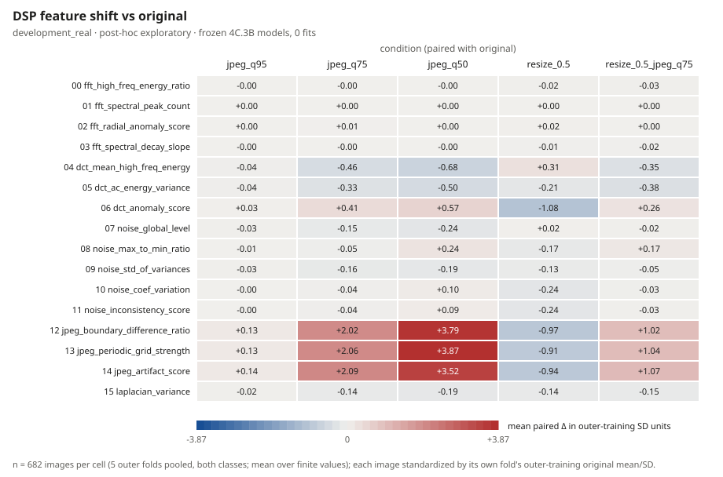
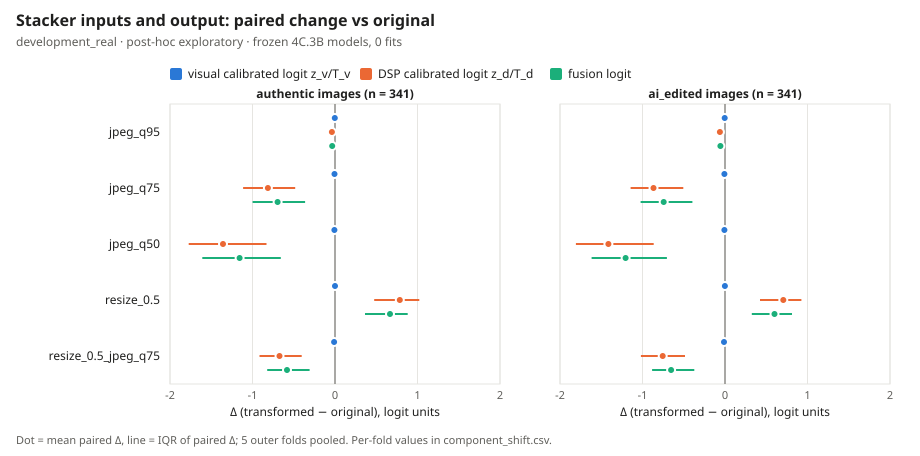
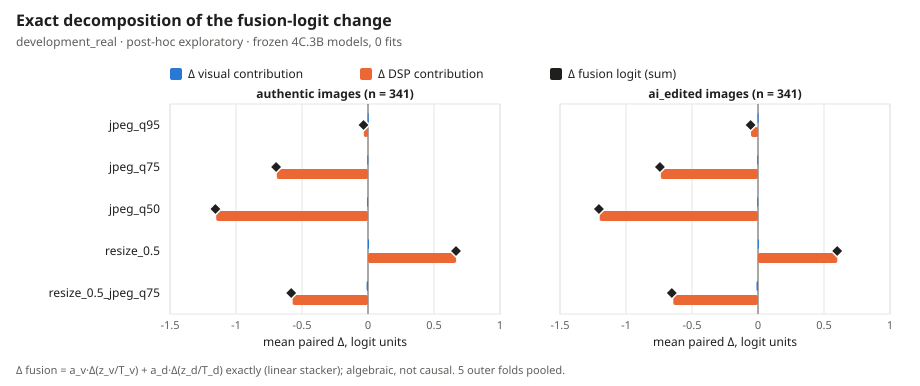
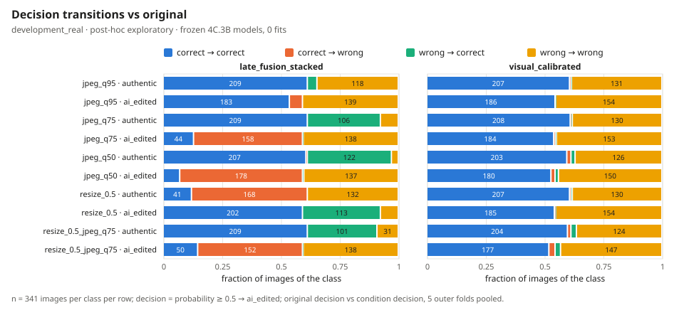
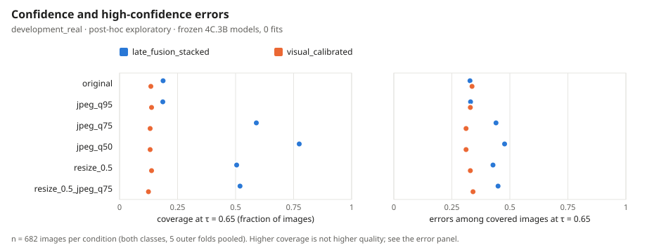

# Fusion Shift Diagnostics — Report (Phase 4C.5A)

> **Data origin**: `development_real` · **Findings status**: `MEASURED_POST_HOC_EXPLORATORY` · **Evidence class**: `post_hoc_exploratory` 
> **Scope**: 341 sources / 682 images × 6 conditions; frozen 4C.3B fold models; 0 fits 
> **Reconstruction**: max |Δlogit| 0, max |Δp| 0, decision mismatches 0; decomposition residual 4.44e-16

Stacker inputs (from `fold_model.json`): `visual_calibrated_logit`, `dsp_calibrated_logit`. Decision: `probability >= 0.5 -> ai_edited`; τ_conf = 0.65.

## Per-fold mean paired Δ (all images), logit units

| Condition | Fold | Δ fusion | Δ visual contribution | Δ DSP contribution |
| :--- | :---: | ---: | ---: | ---: |
| `jpeg_q95` | 0 | -0.0425 | -0.0022 | -0.0403 |
| `jpeg_q95` | 1 | -0.0492 | -0.0022 | -0.0470 |
| `jpeg_q95` | 2 | -0.0714 | -0.0044 | -0.0670 |
| `jpeg_q95` | 3 | -0.0192 | -0.0033 | -0.0159 |
| `jpeg_q95` | 4 | -0.0436 | -0.0025 | -0.0411 |
| `jpeg_q95` | all | -0.0452 | -0.0029 | -0.0423 |
| `jpeg_q75` | 0 | -0.6875 | -0.0039 | -0.6837 |
| `jpeg_q75` | 1 | -0.8776 | -0.0025 | -0.8750 |
| `jpeg_q75` | 2 | -1.0785 | -0.0101 | -1.0684 |
| `jpeg_q75` | 3 | -0.2862 | -0.0060 | -0.2802 |
| `jpeg_q75` | 4 | -0.6685 | -0.0061 | -0.6624 |
| `jpeg_q75` | all | -0.7196 | -0.0057 | -0.7139 |
| `jpeg_q50` | 0 | -1.2024 | -0.0018 | -1.2006 |
| `jpeg_q50` | 1 | -1.6392 | -0.0025 | -1.6367 |
| `jpeg_q50` | 2 | -1.4475 | -0.0120 | -1.4355 |
| `jpeg_q50` | 3 | -0.4695 | -0.0062 | -0.4634 |
| `jpeg_q50` | 4 | -1.1448 | -0.0097 | -1.1351 |
| `jpeg_q50` | all | -1.1808 | -0.0064 | -1.1743 |
| `resize_0.5` | 0 | +0.5987 | +0.0043 | +0.5944 |
| `resize_0.5` | 1 | +0.8030 | -0.0002 | +0.8033 |
| `resize_0.5` | 2 | +0.8807 | -0.0030 | +0.8836 |
| `resize_0.5` | 3 | +0.2396 | -0.0024 | +0.2421 |
| `resize_0.5` | 4 | +0.6460 | -0.0007 | +0.6467 |
| `resize_0.5` | all | +0.6335 | -0.0004 | +0.6339 |
| `resize_0.5_jpeg_q75` | 0 | -0.5813 | -0.0013 | -0.5799 |
| `resize_0.5_jpeg_q75` | 1 | -0.7321 | +0.0029 | -0.7351 |
| `resize_0.5_jpeg_q75` | 2 | -0.9092 | -0.0213 | -0.8879 |
| `resize_0.5_jpeg_q75` | 3 | -0.2624 | -0.0161 | -0.2463 |
| `resize_0.5_jpeg_q75` | 4 | -0.6022 | -0.0185 | -0.5837 |
| `resize_0.5_jpeg_q75` | all | -0.6173 | -0.0108 | -0.6065 |

## Pooled by class: mean paired Δ, logit units

| Condition | Class | Δ fusion | Δ visual contribution | Δ DSP contribution |
| :--- | :--- | ---: | ---: | ---: |
| `jpeg_q95` | authentic | -0.0343 | -0.0025 | -0.0318 |
| `jpeg_q95` | ai_edited | -0.0561 | -0.0033 | -0.0527 |
| `jpeg_q75` | authentic | -0.6960 | -0.0050 | -0.6910 |
| `jpeg_q75` | ai_edited | -0.7431 | -0.0064 | -0.7367 |
| `jpeg_q50` | authentic | -1.1562 | -0.0065 | -1.1497 |
| `jpeg_q50` | ai_edited | -1.2053 | -0.0063 | -1.1990 |
| `resize_0.5` | authentic | +0.6669 | -0.0002 | +0.6672 |
| `resize_0.5` | ai_edited | +0.6001 | -0.0006 | +0.6007 |
| `resize_0.5_jpeg_q75` | authentic | -0.5819 | -0.0104 | -0.5714 |
| `resize_0.5_jpeg_q75` | ai_edited | -0.6528 | -0.0112 | -0.6416 |

## Largest DSP feature terms in Δ DSP contribution (pooled, all images)

| Condition | Feature | mean Δ contribution (logit) | mean Δ / train SD | frac. outside train range |
| :--- | :--- | ---: | ---: | ---: |
| `jpeg_q95` | `dct_mean_high_freq_energy` | -0.0732 | -0.044 | 0.004 |
| `jpeg_q95` | `noise_global_level` | +0.0385 | -0.025 | 0.004 |
| `jpeg_q95` | `jpeg_periodic_grid_strength` | -0.0287 | +0.134 | 0.001 |
| `jpeg_q95` | `jpeg_boundary_difference_ratio` | +0.0088 | +0.134 | 0.007 |
| `jpeg_q95` | `dct_ac_energy_variance` | +0.0045 | -0.038 | 0.006 |
| `jpeg_q75` | `dct_mean_high_freq_energy` | -0.7647 | -0.464 | 0.010 |
| `jpeg_q75` | `jpeg_periodic_grid_strength` | -0.4353 | +2.056 | 0.007 |
| `jpeg_q75` | `noise_global_level` | +0.2347 | -0.153 | 0.007 |
| `jpeg_q75` | `jpeg_boundary_difference_ratio` | +0.1452 | +2.020 | 0.007 |
| `jpeg_q75` | `jpeg_artifact_score` | +0.0433 | +2.086 | 0.000 |
| `jpeg_q50` | `dct_mean_high_freq_energy` | -1.1310 | -0.682 | 0.044 |
| `jpeg_q50` | `jpeg_periodic_grid_strength` | -0.8542 | +3.869 | 0.066 |
| `jpeg_q50` | `noise_global_level` | +0.3645 | -0.237 | 0.007 |
| `jpeg_q50` | `jpeg_boundary_difference_ratio` | +0.2672 | +3.793 | 0.066 |
| `jpeg_q50` | `jpeg_artifact_score` | +0.1002 | +3.519 | 0.000 |
| `resize_0.5` | `dct_mean_high_freq_energy` | +0.4942 | +0.306 | 0.000 |
| `resize_0.5` | `jpeg_periodic_grid_strength` | +0.1913 | -0.907 | 0.000 |
| `resize_0.5` | `jpeg_boundary_difference_ratio` | -0.0731 | -0.967 | 0.019 |
| `resize_0.5` | `laplacian_variance` | +0.0297 | -0.143 | 0.000 |
| `resize_0.5` | `dct_ac_energy_variance` | +0.0247 | -0.213 | 0.000 |
| `resize_0.5_jpeg_q75` | `dct_mean_high_freq_energy` | -0.5919 | -0.354 | 0.004 |
| `resize_0.5_jpeg_q75` | `jpeg_periodic_grid_strength` | -0.2480 | +1.036 | 0.003 |
| `resize_0.5_jpeg_q75` | `jpeg_boundary_difference_ratio` | +0.0661 | +1.019 | 0.009 |
| `resize_0.5_jpeg_q75` | `jpeg_artifact_score` | +0.0556 | +1.069 | 0.000 |
| `resize_0.5_jpeg_q75` | `noise_global_level` | +0.0462 | -0.025 | 0.001 |

## Decisions of `late_fusion_stacked` vs original (pooled)

| Condition | Class | correct→wrong | wrong→correct | coverage orig → cond | high-conf errors orig → cond |
| :--- | :--- | ---: | ---: | :---: | :---: |
| `jpeg_q95` | all | 19 | 14 | 0.188 → 0.186 | 42 → 42 |
| `jpeg_q95` | authentic | 0 | 14 | 0.182 → 0.191 | 25 → 21 |
| `jpeg_q95` | ai_edited | 19 | 0 | 0.194 → 0.182 | 17 → 21 |
| `jpeg_q75` | all | 158 | 107 | 0.188 → 0.589 | 42 → 177 |
| `jpeg_q75` | authentic | 0 | 106 | 0.182 → 0.645 | 25 → 2 |
| `jpeg_q75` | ai_edited | 158 | 1 | 0.194 → 0.534 | 17 → 175 |
| `jpeg_q50` | all | 180 | 124 | 0.188 → 0.774 | 42 → 252 |
| `jpeg_q50` | authentic | 2 | 122 | 0.182 → 0.812 | 25 → 6 |
| `jpeg_q50` | ai_edited | 178 | 2 | 0.194 → 0.736 | 17 → 246 |
| `resize_0.5` | all | 168 | 113 | 0.188 → 0.504 | 42 → 147 |
| `resize_0.5` | authentic | 168 | 0 | 0.182 → 0.437 | 25 → 145 |
| `resize_0.5` | ai_edited | 0 | 113 | 0.194 → 0.572 | 17 → 2 |
| `resize_0.5_jpeg_q75` | all | 152 | 102 | 0.188 → 0.519 | 42 → 159 |
| `resize_0.5_jpeg_q75` | authentic | 0 | 101 | 0.182 → 0.566 | 25 → 3 |
| `resize_0.5_jpeg_q75` | ai_edited | 152 | 1 | 0.194 → 0.472 | 17 → 156 |

## Interpretation limits

- Post-hoc exploratory diagnostics on the same 341 development sources; not confirmatory, not a product claim; locked test not accessed.
- The decomposition of the fusion logit is algebraic (the stacker is linear in its two inputs); it is not causal evidence that a component caused a decision change.
- Paired differences hold models, folds and transformed images fixed; no interval or test is reported, so differences are descriptive only.
- The two images of a source and the six conditions are not independent observations.

