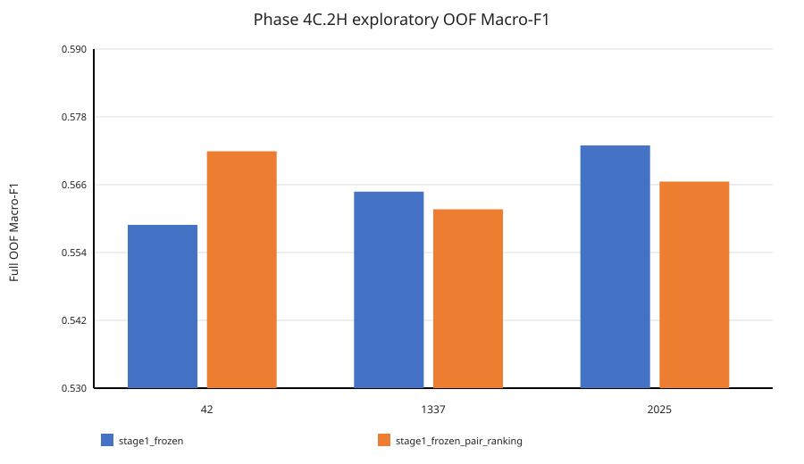
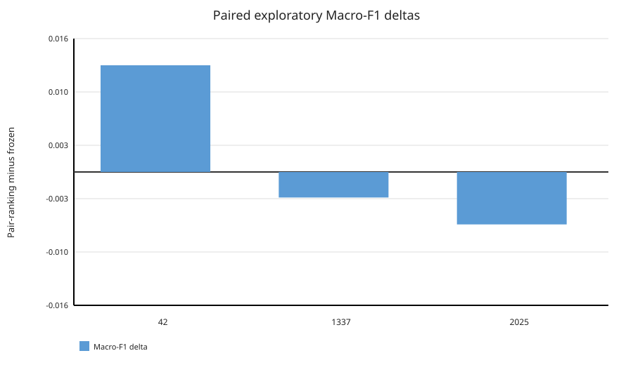
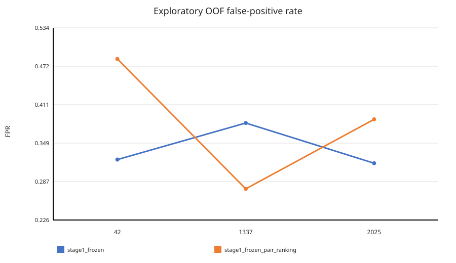
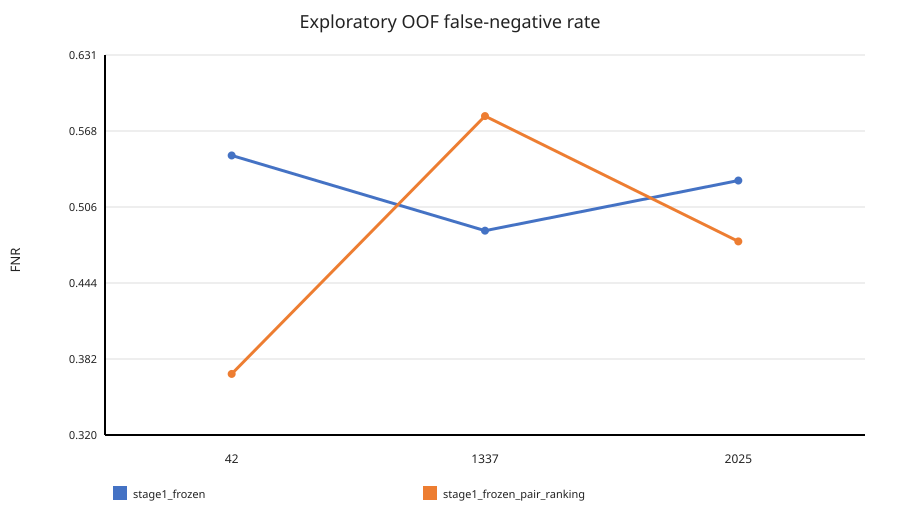

# Phase 4C.2H.2 — Development Nested-CV Artifact Audit and Exploratory OOF Analysis

## Verdict

`NO_CONSISTENT_EXPLORATORY_PAIR_RANKING_IMPROVEMENT`

All 120 inner fits and 30 outer refits passed binding, declared checksum, checkpoint, history, fold-membership, and frozen-state validation. All 30 outer epochs equal the round-half-up median of the four corresponding inner-validation best epochs. No training or model inference was run during this analysis.

## Artifact and execution audit

- Exact source commit: `75568d1c03d89e02ad654df75c969924b857ee78`
- Exact code archive SHA-256: `2bd393873be3291084f86a329a34566bd9aa46c0efd8aa9f155e47571b132c18`
- Protocol SHA-256: `87d36c11d08e0f0637c9a2f53770dadce9c9f0ccbf6970d163db1d1c621d3471`
- Files streamed and hashed: `636`; inventory commitment: `9bbb80d39351fae56c4bacce663b572edd8c105a2ae13e5a5e17b59c814a99db`
- Declared fit-artifact hashes matched: `480/480`; receipt and checkpoint bindings recomputed: `150/150`
- Inner fits: `120/120`; outer refits: `30/30`; outer epoch selections: `30/30`
- Recorded runtime: `Tesla T4`, Python `3.13.15`, Torch `2.11.0+cu130`
- Recorded summed fit time: inner `90.954s`; outer training `11.672s`; outer prediction `0.278s`. These are sums of receipt durations, not an independently measured end-to-end wall clock.

## Per-seed full OOF metrics

| Recipe | Seed | Macro-F1 | Balanced accuracy | AUROC | Brier | ECE | FPR | FNR |
| --- | --- | --- | --- | --- | --- | --- | --- | --- |
| stage1_frozen | 42 | 0.558893 | 0.564516 | 0.591511 | 0.245000 | 0.025985 | 0.322581 | 0.548387 |
| stage1_frozen | 1337 | 0.564770 | 0.565982 | 0.597879 | 0.243926 | 0.024618 | 0.381232 | 0.486804 |
| stage1_frozen | 2025 | 0.572953 | 0.577713 | 0.592823 | 0.244570 | 0.044272 | 0.316716 | 0.527859 |
| stage1_frozen_pair_ranking | 42 | 0.571914 | 0.573314 | 0.593614 | 0.243746 | 0.020424 | 0.483871 | 0.369501 |
| stage1_frozen_pair_ranking | 1337 | 0.561654 | 0.571848 | 0.593175 | 0.244031 | 0.034849 | 0.275660 | 0.580645 |
| stage1_frozen_pair_ranking | 2025 | 0.566553 | 0.567449 | 0.597587 | 0.243188 | 0.009553 | 0.387097 | 0.478006 |

Each row contains exactly 682 unique predictions from 341 sources assembled from five disjoint outer folds; every source contributes one authentic and one edited sample exactly once.

## Mean ± sample SD across three paired seeds

| Recipe | Macro-F1 | Balanced accuracy | AUROC | Brier | ECE | FPR | FNR |
| --- | --- | --- | --- | --- | --- | --- | --- |
| stage1_frozen | 0.565539 ± 0.007061 | 0.569404 ± 0.007233 | 0.594071 ± 0.003363 | 0.244499 ± 0.000540 | 0.031625 ± 0.010974 | 0.340176 ± 0.035676 | 0.521017 ± 0.031357 |
| stage1_frozen_pair_ranking | 0.566707 ± 0.005132 | 0.570870 ± 0.003052 | 0.594792 ± 0.002430 | 0.243655 ± 0.000429 | 0.021608 ± 0.012689 | 0.382209 ± 0.104192 | 0.476051 ± 0.105585 |

## Paired deltas: pair-ranking minus frozen

| Seed | Macro-F1 | Balanced accuracy | AUROC | Brier | ECE | FPR | FNR |
| --- | --- | --- | --- | --- | --- | --- | --- |
| 42 | +0.013021 | +0.008798 | +0.002103 | -0.001254 | -0.005561 | +0.161290 | -0.178886 |
| 1337 | -0.003115 | +0.005865 | -0.004704 | +0.000105 | +0.010231 | -0.105572 | +0.093842 |
| 2025 | -0.006400 | -0.010264 | +0.004764 | -0.001382 | -0.034719 | +0.070381 | -0.049853 |
| Mean ± SD | +0.001168 ± 0.010395 | +0.001466 ± 0.010264 | +0.000721 ± 0.004883 | -0.000844 ± 0.000824 | -0.010016 ± 0.022804 | +0.042033 ± 0.135671 | -0.044966 ± 0.136429 |

Pair-ranking minus frozen Macro-F1 deltas by seed are `[0.01302062, -0.003115491, -0.006399865]`. Their exploratory mean is `0.001168421` with sample SD `0.010394842`; 1 seed(s) positive and 2 negative. The sign of the mean is not supported by consistency across the three fixed paired seeds (verdict `NO_CONSISTENT_EXPLORATORY_PAIR_RANKING_IMPROVEMENT`). These three paired seed results are the comparison units; the 30 outer refits are folds used to build OOF predictions, not 30 independent observations.

Positive deltas mean a numerically higher value for pair-ranking. Lower values are preferable for Brier, ECE, FPR, and FNR, so their signs must be interpreted in the opposite direction. Error-rate changes are strongly seed-dependent rather than a stable shift.

## Figures

## Relationship to the historical locked test (Phase 4C.2G)

The numbers above are grouped nested-CV out-of-fold results on the 341 development sources (682 images), produced by Phase 4C.2H runs that were not part of Phase 4C.2G. They are development/exploratory and are **not** comparable to the Phase 4C.2G locked-test result (five Stage 1 N=250 checkpoints on 343 independent locked-test sources: mean Macro-F1 `0.513835085980773`, source-cluster 95% CI `[0.49976282750638307, 0.5273360991798881]`, verdict `INSUFFICIENT_CONFIRMATORY_EVIDENCE`). The population, protocol, and training procedure differ, the locked test is retired, and nothing here revises that confirmatory verdict. A higher development OOF Macro-F1 must not be read as evidence of locked-test or out-of-distribution performance.

## Scope

This is development-only exploratory analysis. It does not revise Phase 4C.2G, does not make a confirmatory claim, and does not authorize reuse of the retired locked test. Raw predictions, checkpoints, source identifiers, and local absolute paths remain outside Git.
