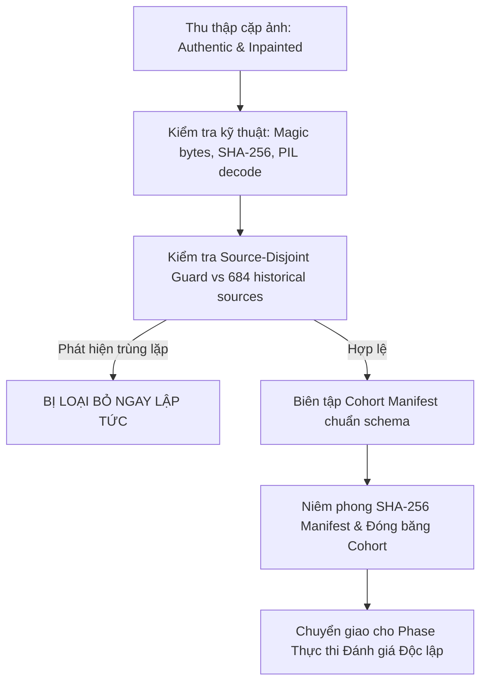

# Cohort Acquisition Plan: Independent Validation Cohort

> **Phase**: 4C.7A — Independent Validation Preparation 
> **Status**: `PLANNING_PRE_ACQUISITION` 
> **Task Scope**: Binary classification (`authentic` = 0 vs. `ai_edited` = 1) 
> **Three-Class Note**: Evaluation of `fully_generated` (3-class classification, RQ1) remains incomplete within the broader project and is excluded from this cohort design due to the absence of three-class data.

---

## 1. Mục tiêu và Nguyên tắc Thiết kế Cohort

Mục tiêu của cohort này là cung cấp một tập dữ liệu kiểm định độc lập, chưa từng xuất hiện trong quá trình phát triển (development training, validation tuning, threshold selection) hay trong tập locked-test lịch sử (`SEALED_AND_RETIRED`), nhằm đối sánh khách quan hai mô hình:
1. `visual_calibrated`: Mô hình thị giác đối chứng (MobileNetV3-Small linear probe + Temperature Scaling).
2. `late_fusion_dsp_augmented`: Mô hình kết hợp đặc trưng DSP được huấn luyện qua kỹ thuật augmentation đa biến (Phase 4C.6B).

### 1.1. Nguyên tắc Bắt buộc (Non-Negotiable Constraints)
1. **Source-Disjoint Tuyệt đối**:
   - Mọi `source_id` trong cohort độc lập mới phải hoàn toàn tách biệt khỏi 684 nguồn lịch sử trong `data/research/tgif/manifests/manifest_pilot_a_option_p.csv` (250 `development_train` + 91 `inner_validation` + 343 `locked_test`).
   - Tuyệt đối không tái sử dụng, không đổi tên, và không truy cập lại tập `locked_test` đã niêm phong (`SEALED_AND_RETIRED`).
2. **Cấu trúc Cặp Nguồn (Source-Paired Structure)**:
   - Mỗi source $S_i$ phải đại diện cho một cảnh chụp gốc duy nhất.
   - Mỗi source $S_i$ cung cấp chính xác 2 ảnh:
     * Ảnh authentic $A_i$ (nhãn 0): ảnh chụp thực tế nguyên bản từ thiết bị.
     * Ảnh ai_edited $E_i$ (nhãn 1): ảnh chỉnh sửa cục bộ sinh ra trực tiếp từ $A_i$ bằng công cụ AI inpainting/generative fill.
3. **Không Lựa chọn Mẫu theo Sai số Mô hình (No Outcome-Based Selection)**:
   - Việc thu thập và chấp thuận ảnh phải hoàn toàn độc lập với điểm số dự đoán hay lỗi của các mô hình candidate.
   - Tuyệt đối cấm "chọn lọc ảnh" để làm đẹp kết quả hay định hướng kết luận.

---

## 2. Quần thể Đích (Target Population) và Đặc tính Ảnh

### 2.1. Nguồn Ảnh Authentic ($A_i$)
- **Thiết bị thu nhận**: Thiết bị chụp đa dạng (smartphone phổ thông và cao cấp từ nhiều hãng, máy ảnh DSLR/Mirrorless).
- **Chủ đề**: Phong cảnh tự nhiên, kiến trúc đô thị, chân dung người, đồ vật hàng ngày, văn bản/biển báo.
- **Độ phân giải & Tỷ lệ**: Độ phân giải từ $512 \times 512$ đến $4000 \times 3000$; tỷ lệ khung hình 1:1, 4:3, 16:9, 3:2.
- **Định dạng gốc**: JPEG (nhiều mức nén từ camera), PNG, WebP. Không chấp nhận ảnh đã qua nén nhiều lần trên mạng xã hội trước khi chỉnh sửa nếu không kiểm soát được provenance.

### 2.2. Nguồn Ảnh AI-Edited ($E_i$)
- **Công nghệ chỉnh sửa**: Sử dụng các pipeline generative inpainting phổ biến và hiện đại:
  1. *Stable Diffusion 2 Inpainting* (SD2 Inpainting checkpoint).
  2. *SDXL Inpainting* / *FLUX.1-Fill*.
  3. *Adobe Firefly / Photoshop Generative Fill* (đại diện cho công cụ thương mại đóng).
- **Thao tác chỉnh sửa**:
  * Thay thế vật thể (object replacement).
  * Xóa bỏ vật thể và tái tạo nền (object removal & background completion).
  * Chèn thêm vật thể mới phù hợp ngữ cảnh (object insertion).
- **Phân bố diện tích vùng chỉnh sửa (Mask Coverage)**:
  * Vùng nhỏ ($< 10\%$ diện tích ảnh).
  * Vùng vừa ($10\% - 30\%$ diện tích ảnh).
  * Vùng lớn ($> 30\%$ diện tích ảnh).
  Mỗi ảnh $E_i$ đi kèm binary mask ground-truth lưu vết vị trí chỉnh sửa.

---

## 3. Tiêu chuẩn Pháp lý, Bản quyền và Provenance

Mỗi mẫu trong manifest bắt buộc phải có thông tin xác thực xuất xứ:
1. **Bản quyền ảnh**:
   - Sử dụng ảnh do nhóm nghiên cứu tự chụp thực tế (Full copyright retained, cấp phép cho nghiên cứu), HOẶC
   - Ảnh nguồn mở có giấy phép cho phép nghiên cứu và phân phối khoa học minh bạch (CC0, CC-BY 4.0, Unsplash License).
2. **Bảo mật và Quyền riêng tư**:
   - Không chứa thông tin định danh cá nhân nhạy cảm (PII), khuôn mặt trẻ em chưa có đồng thuận, hoặc nội dung vi phạm pháp luật.
3. **Audit Provenance Tự động**:
   - Tính toán và lưu trữ mã băm SHA-256 cho từng file ảnh nhị phân.
   - Ghi nhận công cụ sinh ảnh, prompt chỉnh sửa, seed (nếu có), và ngày khởi tạo.
   - Kiểm tra định dạng bằng magic bytes nhị phân; từ chối ảnh lỗi không thể mở bằng PIL hoặc kích thước vượt ngưỡng an toàn (decompression bomb guard).

---

## 4. Schema của Independent Cohort Manifest

File manifest chính thức của cohort độc lập (`independent_cohort_manifest.csv` hoặc JSON) phải tuân thủ schema sau:

| Trường | Kiểu dữ liệu | Mô tả |
| :--- | :--- | :--- |
| `source_id` | string | Định danh duy nhất của nguồn ảnh (bắt buộc tiền tố phân biệt, vd `IND_0001`) |
| `authentic_relpath` | string | Đường dẫn tương đối tới ảnh authentic |
| `authentic_sha256` | string (64 hex) | Mã SHA-256 của file ảnh authentic |
| `edited_relpath` | string | Đường dẫn tương đối tới ảnh ai_edited tương ứng |
| `edited_sha256` | string (64 hex) | Mã SHA-256 của file ảnh ai_edited |
| `mask_relpath` | string | Đường dẫn tới mask nhị phân ghi nhận vùng chỉnh sửa |
| `mask_sha256` | string (64 hex) | Mã SHA-256 của mask |
| `category` | string | Thể loại cảnh (landscape, portrait, object, indoor, v.v.) |
| `inpaint_tool` | string | Tên pipeline inpainting (vd `sd2_inpaint`, `sdxl_inpaint`, `firefly`) |
| `mask_area_ratio` | float | Tỷ lệ diện tích vùng chỉnh sửa trên toàn ảnh $[0.0, 1.0]$ |
| `license` | string | Giấy phép nguồn (vd `CC0`, `CC-BY-4.0`, `PROPRIETARY_RESEARCH_COLLECTION`) |

---

## 5. Quy trình Tiếp nhận và Đóng băng (Acquisition Workflow)

*Ghi chú*: Trong Phase 4C.7A hiện tại, cohort chưa được tải về máy hay đánh giá thực tế. Tài liệu này đóng vai trò là đặc tả chuẩn mực cho bước thu thập dữ liệu tiếp theo.
